# M1: Chapter 2

## Question 1:

### For each of parts (a) through (d), indicate whether we would generally expect the performance of a flexible statistical learning method to be better or worse than an inflexible method. Justify your answer.

### (a) The sample size n is extremely large, and the number of predictors p is small.

Flexible: Less chance of overtraining with less predictors and larger sample size.

### (b) The number of predictors p is extremely large, and the number of observations n is small.

Inflexible: Higher chance of overtraining with more predictors and smaller sample size.

### (c) The relationship between the predictors and response is highly non-linear.

Flexible: High risk of bias with inflexible models, variance is less of a concern.

### (d) The variance of the error terms, i.e. σ2 = Var(ϵ), is extremely High.

Inflexible: Better at reducing variance, bias is less of a concern

## Question 2:

### Explain whether each scenario is a classification or regression problem, and indicate whether we are most interested in inference or prediction. Finally, provide n and p.

### (a) We collect a set of data on the top 500 firms in the US. For each firm we record profit, number of employees, industry and the CEO salary. We are interested in understanding which factors affect CEO salary.

Scenario is regression, we are interested in inference, N = 500, p=3

### (b) We are considering launching a new product and wish to know whether it will be a success or a failure. We collect data on 20 similar products that were previously launched. For each product we have recorded whether it was a success or failure, price charged for the product, marketing budget, competition price, and ten other variables.

Scenario is classification, we are interested in prediction, n=20, p=13

### (c) We are interested in predicting the % change in the USD/Euro exchange rate in relation to the weekly changes in the world stock markets. Hence we collect weekly data for all of 2012. For each week we record the % change in the USD/Euro, the % change in the US market, the % change in the British market, and the % change in the German market.

Scenario is regression, we are interested in prediction, n=52, p=3

## Question 4:

### You will now think of some real-life applications for statistical learning.

### (a) Describe three real-life applications in which classification might be useful. Describe the response, as well as the predictors. Is the goal of each application inference or prediction? Explain your answer.

1. Email spam filter: Response is if an email is spam, predictors are example emails and whether it is spam or not, goal is prediction.
2. Credit card fraud detection: Response is whether a transaction is fraudulent or legitimate, predictors are transaction amount, location, time, merchant type, and past transactions, goal is prediction.
3. College admission: Response is whether a student is admitted or not, predictors are GPA, test scores, coursework, and extracurriculars, goal is inference to understand what affects admission.

### (b) Describe three real-life applications in which regression might be useful. Describe the response, as well as the predictors. Is the goal of each application inference or prediction? Explain your answer.

1. Housing prices: Response is trend of housing markets, predictors are previous housing sale prices and sale date, goal is prediction.
2. Sales forecasting: Response is weekly sales revenue, predictors are price, season, and local economic data, goal is prediction.
3. Fuel efficiency analysis: Response is mpg, predictors are engine size, weight, horsepower, and year, goal is inference to understand which factors most affect mpg.

### (c) Describe three real-life applications in which cluster analysis might be useful.

1. Customer segmentation: Cluster customers using predictors like purchase frequency, average order value, and product categories to find groups with similar buying behavior.
2. Gene expression analysis: Cluster genes or patients using expression levels to identify biologically similar groups and possible disease subtypes.
3. News article grouping: Cluster articles using word frequency or embedding features to automatically group stories by topic.

## Question 5:

### What are the advantages and disadvantages of a very flexible (versus a less flexible) approach for regression or classification? Under what circumstances might a more flexible approach be preferred to a less flexible approach? When might a less flexible approach be preferred?

Inflexible models can be interpreted when inference is desired, have less variance, and are less prone to overfitting, and flexible models tend to have lower bias, higher accuracy, and fewer assumptions. In regression problems, flexibility generally allows a model to fit a more non-linear line but can become unstable if it becomes overfitted, and in classification problems flexible models can learn more complex boundaries but they could become more jagged and unclear when overfitting happens. In both scenarios a more flexible model will perform better with larger sample sizes, nonlinear relationships, and when the goal is accuracy, and inflexible models perform better with small sample sizes, linear relationships, and interpretability is desired.

## Question 6: 

### Describe the differences between a parametric and a non-parametric statistical learning approach. What are the advantages of a parametric approach to regression or classification (as opposed to a non-parametric approach)? What are its disadvantages?

Parametric approaches assume a specific functional form for f, then estimate a fixed number of parameters from the training data. Non-parametric approaches do not assume a fixed functional form and instead let the data determine the shape of f, which makes them more flexible. Advantages of parametric methods are that they are usually simpler to interpret, faster to fit, and often perform well with smaller data sets because fewer parameters are estimated. They are also useful when inference is important, since model coefficients can be interpreted directly. Disadvantages are that if the assumed form of f is wrong, parametric models can have high bias and poor predictive performance. Because of their stronger assumptions, they may fail to capture complex nonlinear relationships that non-parametric methods can model.

## Question 8:

### This exercise relates to the College data set, which can be found in the file College.csv on the book website. It contains a number of variables for 777 different universities and colleges in the US. The variables are...
### Before reading the data into R, it can be viewed in Excel or a text editor.

### a. Use the read.csv() function to read the data into R. Call the loaded data college. Make sure that you have the directory set to the correct location for the data

```r
library(ISLR2)
View(College)
```

### b. Look at the data using the View() function. You should notice that the first column is just the name of each university. We don’t really want R to treat this as data. However, it may be handy to have these names for later. Try the following commands:

> rownames(college) <- college[, 1]
> 
> View(college)
> 
### You should see that there is now a row.names column with the name of each university recorded. This means that R has given each row a name corresponding to the appropriate university. R will not try to perform calculations on the row names. However, we still need to eliminate the first column in the data where the names are stored. Try
> college <- college[, -1]
> 
> View(college)
> 
### Now you should see that the first data column is Private. Note that another column labeled row.names now appears before the Private column. However, this is not a data column but rather the name that R is giving to each row.

```r
rownames(College) <- College[, 1]
View(College)
College <- College[,-1]
View(College)
```

### c.

### i. Use the summary() function to produce a numerical summary of the variables in the data set.

```r
summary(College)
```

<font size="1">      Apps           Accept          Enroll       Top10perc       Top25perc      F.Undergrad     P.Undergrad         Outstate       Room.Board  
 Min.   :   81   Min.   :   72   Min.   :  35   Min.   : 1.00   Min.   :  9.0   Min.   :  139   Min.   :    1.0   Min.   : 2340   Min.   :1780  
 1st Qu.:  776   1st Qu.:  604   1st Qu.: 242   1st Qu.:15.00   1st Qu.: 41.0   1st Qu.:  992   1st Qu.:   95.0   1st Qu.: 7320   1st Qu.:3597  
 Median : 1558   Median : 1110   Median : 434   Median :23.00   Median : 54.0   Median : 1707   Median :  353.0   Median : 9990   Median :4200  
 Mean   : 3002   Mean   : 2019   Mean   : 780   Mean   :27.56   Mean   : 55.8   Mean   : 3700   Mean   :  855.3   Mean   :10441   Mean   :4358  
 3rd Qu.: 3624   3rd Qu.: 2424   3rd Qu.: 902   3rd Qu.:35.00   3rd Qu.: 69.0   3rd Qu.: 4005   3rd Qu.:  967.0   3rd Qu.:12925   3rd Qu.:5050  
 Max.   :48094   Max.   :26330   Max.   :6392   Max.   :96.00   Max.   :100.0   Max.   :31643   Max.   :21836.0   Max.   :21700   Max.   :8124  
     Books           Personal         PhD            Terminal       S.F.Ratio      perc.alumni        Expend        Grad.Rate      Elite    
 Min.   :  96.0   Min.   : 250   Min.   :  8.00   Min.   : 24.0   Min.   : 2.50   Min.   : 0.00   Min.   : 3186   Min.   : 10.00   No :699  
 1st Qu.: 470.0   1st Qu.: 850   1st Qu.: 62.00   1st Qu.: 71.0   1st Qu.:11.50   1st Qu.:13.00   1st Qu.: 6751   1st Qu.: 53.00   Yes: 78  
 Median : 500.0   Median :1200   Median : 75.00   Median : 82.0   Median :13.60   Median :21.00   Median : 8377   Median : 65.00            
 Mean   : 549.4   Mean   :1341   Mean   : 72.66   Mean   : 79.7   Mean   :14.09   Mean   :22.74   Mean   : 9660   Mean   : 65.46            
 3rd Qu.: 600.0   3rd Qu.:1700   3rd Qu.: 85.00   3rd Qu.: 92.0   3rd Qu.:16.50   3rd Qu.:31.00   3rd Qu.:10830   3rd Qu.: 78.00            
 Max.   :2340.0   Max.   :6800   Max.   :103.00   Max.   :100.0   Max.   :39.80   Max.   :64.00   Max.   :56233   Max.   :118.00   </font><br />

### ii. Use the pairs() function to produce a scatterplot matrix of the first ten columns or variables of the data. Recall that you can reference the first ten columns of a matrix A using A[,1:10].

```r
pairs(College[,2:10])
```

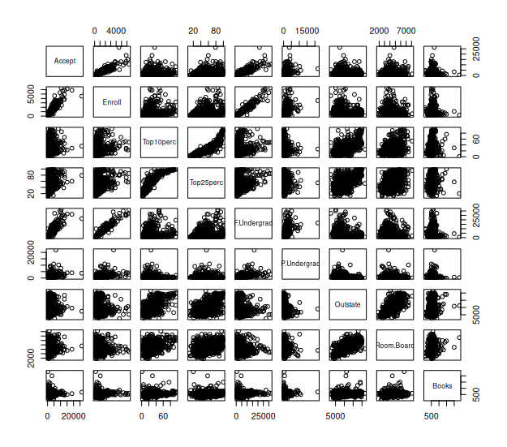

### iii. Use the plot() function to produce side-by-side boxplots of Outstate versus Private.

```r
plot(College$Outstate ~ factor(College$Private))
```

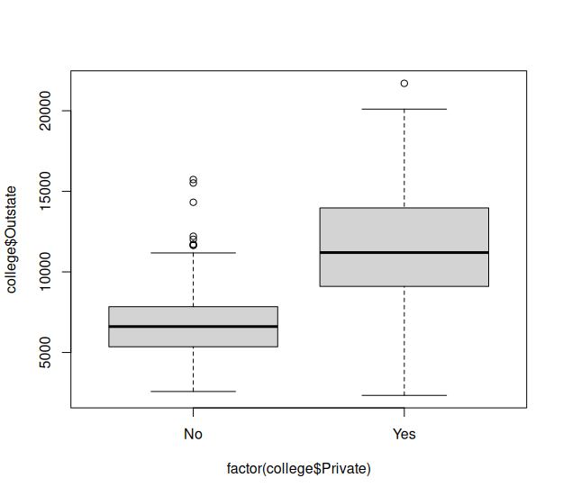

### iv. Create a new qualitative variable, called Elite, by binningthe Top10perc variable. We are going to divide universities into two groups based on whether or not the proportion of students coming from the top 10 % of their high school classes exceeds 50 %.

> Elite <- rep("No", nrow(college))
> 
> Elite[college$Top10perc > 50] <- "Yes"
> 
> Elite <- as.factor(Elite)
> 
> college <- data.frame(college , Elite)
> 
## Use the summary() function to see how many elite universities there are. Now use the plot() function to produce side-by-side boxplots of Outstate versus Elite.

```r
# create variable tracking if most students are top 10
Elite <- rep("No", nrow(College))
Elite[College$Top10perc > 50] <- "Yes"
Elite <- as.factor(Elite)
College <- data.frame(College, Elite)
summary(College$Elite)
#  No Yes 
# 699  78 

plot(college$Outstate ~ factor(college$Elite))
```

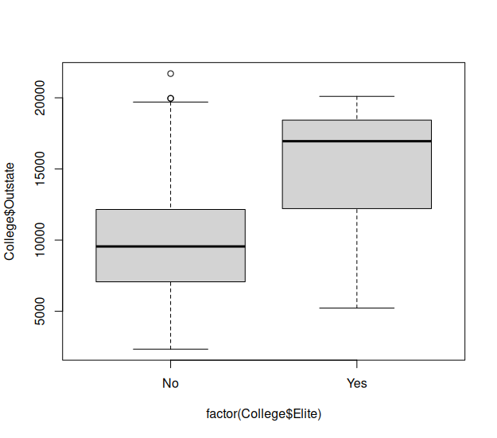

### v. Use the hist() function to produce some histograms with differing numbers of bins for a few of the quantitative variables. You may find the command par(mfrow = c(2, 2)) useful: it will divide the print window into four regions so that four plots can be made simultaneously. Modifying the arguments to this function will divide the screen in other ways.

```r
hist(college$F.Undergrad, breaks = 10, main='full time undergrads')
```

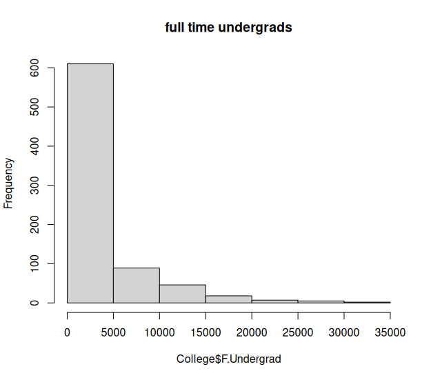

```r
hist(college$Outstate, breaks = 15, main='out of state tuition')
```

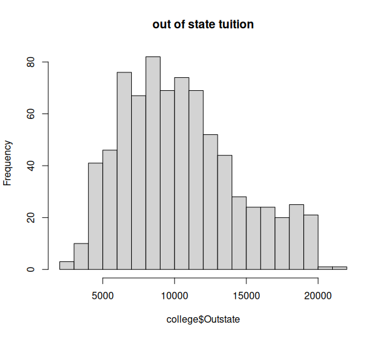

```r
hist(college$Terminal, breaks = 5, main='terminal degree staff')
```

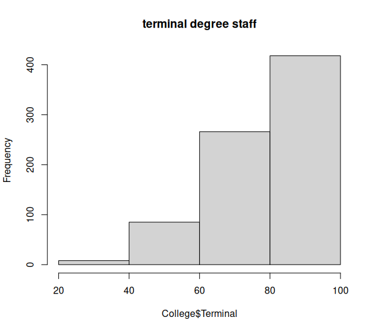

### vi. Continue exploring the data, and provide a brief summary of what you discover.

```r
plot(college$Outstate ~ factor(college$Elite))
plot(college$Grad.Rate ~ factor(college$Elite))
```

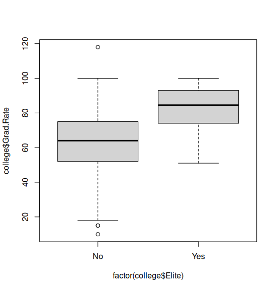


Schools with elite students cost more and have higher graduation rates

```r
hist(College$F.Undergrad, breaks = 10, main='full time undergrads')

hist(College$Outstate, breaks = 15, main='out of state tuition')

hist(College$Terminal, breaks = 5, main='terminal degree staff')

plot(College$Outstate ~ factor(College$Elite))

plot(College$Grad.Rate ~ factor(College$Elite))
```
Schools with elite students cost more and have higher graduation rates

## Question 9:

### This exercise involves the Auto data set studied in the lab. Make sure that the missing values have been removed from the data.

```r
auto <- read.csv('~/Documents/Auto.csv', na.strings = '?')
auto <- na.omit(auto)
summary(auto)
```

### a. Which of the predictors are quantitative, and which are qualitative?

```r
names(auto)[sapply(auto, is.numeric)] # Quantitative
# "mpg"          "cylinders"    "displacement" "horsepower"   "weight"       "acceleration" "year"         "origin"  
names(auto)[!sapply(auto, is.numeric)] # Qualitative
# "name"
```

### b. What is the range of each quantitative predictor? You can answer this using the range() function.

```r
sapply(auto[, 1:7], range)
#       mpg cylinders displacement horsepower weight acceleration year
#[1,]  9.0         3           68         46   1613          8.0   70
#[2,] 46.6         8          455        230   5140         24.8   82
```

### c. What is the mean and standard deviation of each quantitative predictor?

```r
sapply(auto[, 1:7], mean)
#         mpg    cylinders displacement   horsepower       weight acceleration         year 
#   23.445918     5.471939   194.411990   104.469388  2977.584184    15.541327    75.979592 
sapply(auto[, 1:7], sd)
#         mpg    cylinders displacement   horsepower       weight acceleration         year 
#    7.805007     1.705783   104.644004    38.491160   849.402560     2.758864     3.683737 
```

### d. Now remove the 10th through 85th observations. What is the range, mean, and standard deviation of each predictor in the subset of the data that remains?

```r
auto2 <- auto[-(10:85),]
sapply(auto2[, 1:7], range)
      mpg cylinders displacement horsepower weight acceleration year
# [1,] 11.0         3           68         46   1649          8.5   70
# [2,] 46.6         8          455        230   4997         24.8   82
sapply(auto2[, 1:7], mean)
#         mpg    cylinders displacement   horsepower       weight acceleration         year 
#   24.404430     5.373418   187.240506   100.721519  2935.971519    15.726899    77.145570 
sapply(auto2[, 1:7], sd)
#         mpg    cylinders displacement   horsepower       weight acceleration         year 
#    7.867283     1.654179    99.678367    35.708853   811.300208     2.693721     3.106217 

```

### e. Using the full data set, investigate the predictors graphically, using scatterplots or other tools of your choice. Create some plots highlighting the relationships among the predictors. Comment on your findings.

```r
plot(auto$mpg, auto$weight)
```

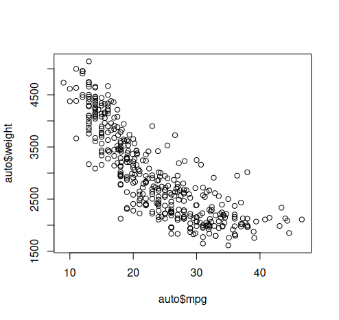

```r
plot(auto$mpg, auto$displacement)
```

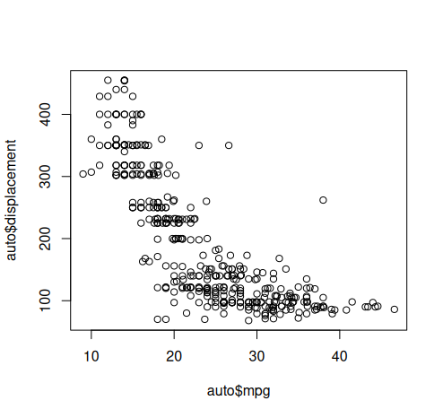

```r
plot(auto$mpg, auto$horsepower)
```

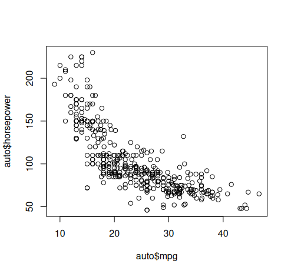

Higher weight, engine displacement, and horsepower all consistently result in lower mpg

```r
plot(auto$displacement, auto$horsepower)
```

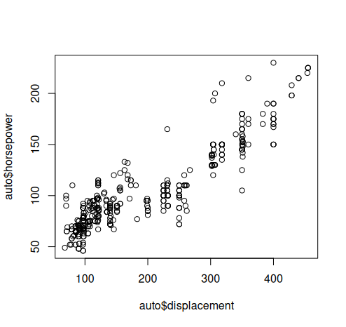

Displacement and horsepower are correlated, a majority of cars have low on both

```r
is_gm <- grepl("^(chevrolet|gmc|buick|cadillac)", 
               tolower(auto$name))
gm_mean <- mean(auto$mpg[is_gm])
other_mean <- mean(auto$mpg[!is_gm])
barplot(c(other_mean, gm_mean), names.arg = c("Others", "GM"), ylab = "mpg")
```

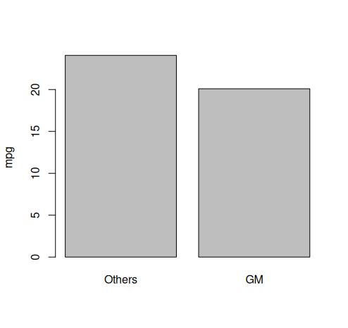

GM vehicles are less fuel efficient

### f. Suppose that we wish to predict gas mileage (mpg) on the basis of the other variables. Do your plots suggest that any of the other variables might be useful in predicting mpg? Justify your answer.

All predictors correlate with mpg

## Question 10

### a. To begin, load in the Boston data set. The Boston data set is part of the ISLR2 library. How many rows are in this data set? How many columns? What do the rows and columns represent?

```r
Boston
View(Boston)
?Boston
```

506 rows, 13 columns. The columns represent common statistics about cities, like crime rates, home values, and age of houses, as well as some Boston specific statistics like Charles river adjacency and distance from specific Boston employment centers.

### b. Make some pairwise scatterplots of the predictors (columns) in this data set. Describe your findings

```r
pairs(Boston)
```

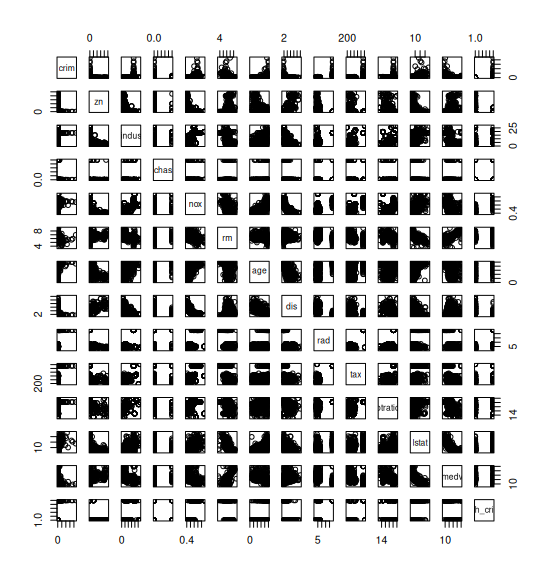

Most categories correlate in some way, some categories like nitrogen oxide concentration and distance to employment centres or number of rooms per dwelling and percentage of lower status of the population are strongly correlated

### c. Are any of the predictors associated with per capita crime rate? If so, explain the relationship.

Most predictors have some relationship with crime rates, some like age of homes, property value tax rates, and pupil teacher ratios have a strong correlation.

### d. Do any of the census tracts of Boston appear to have particularly high crime rates? Tax rates? Pupil-teacher ratios? Comment on the range of each predictor.

```r
hist(Boston[Boston$crim>1,]$crim, breaks=20) 
```

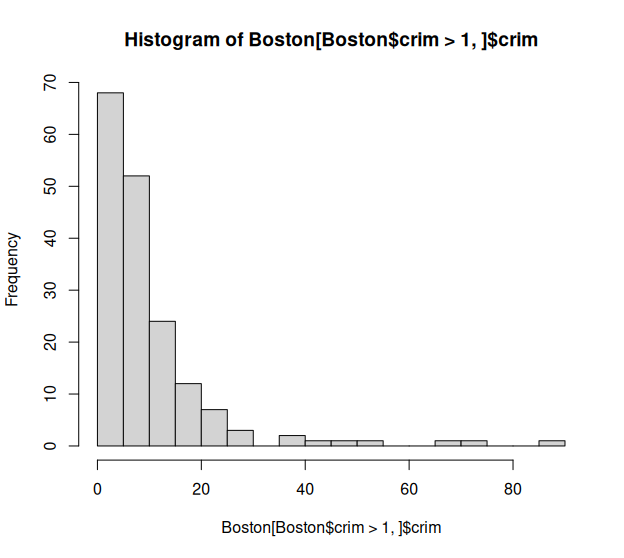

Lot of low numbers, drops off quite a bit after the first few

```r
sortbycrime <- Boston[order(Boston$crim, decreasing = TRUE), ]
head(sortbycrime, 20)
       crim zn indus chas   nox    rm   age    dis rad tax ptratio lstat medv high_crime
# 381 88.9762  0  18.1    0 0.671 6.968  91.9 1.4165  24 666    20.2 17.21 10.4        Yes
# 419 73.5341  0  18.1    0 0.679 5.957 100.0 1.8026  24 666    20.2 20.62  8.8        Yes
# 406 67.9208  0  18.1    0 0.693 5.683 100.0 1.4254  24 666    20.2 22.98  5.0        Yes
# 411 51.1358  0  18.1    0 0.597 5.757 100.0 1.4130  24 666    20.2 10.11 15.0        Yes
# 415 45.7461  0  18.1    0 0.693 4.519 100.0 1.6582  24 666    20.2 36.98  7.0        Yes
# 405 41.5292  0  18.1    0 0.693 5.531  85.4 1.6074  24 666    20.2 27.38  8.5        Yes
# 399 38.3518  0  18.1    0 0.693 5.453 100.0 1.4896  24 666    20.2 30.59  5.0        Yes
# 428 37.6619  0  18.1    0 0.679 6.202  78.7 1.8629  24 666    20.2 14.52 10.9        Yes
# 414 28.6558  0  18.1    0 0.597 5.155 100.0 1.5894  24 666    20.2 20.08 16.3        Yes
# 418 25.9406  0  18.1    0 0.679 5.304  89.1 1.6475  24 666    20.2 26.64 10.4        Yes
# 401 25.0461  0  18.1    0 0.693 5.987 100.0 1.5888  24 666    20.2 26.77  5.6        Yes
# 404 24.8017  0  18.1    0 0.693 5.349  96.0 1.7028  24 666    20.2 19.77  8.3        Yes
# 387 24.3938  0  18.1    0 0.700 4.652 100.0 1.4672  24 666    20.2 28.28 10.5        Yes
# 379 23.6482  0  18.1    0 0.671 6.380  96.2 1.3861  24 666    20.2 23.69 13.1        Yes
# 388 22.5971  0  18.1    0 0.700 5.000  89.5 1.5184  24 666    20.2 31.99  7.4        Yes
# 441 22.0511  0  18.1    0 0.740 5.818  92.4 1.8662  24 666    20.2 22.11 10.5        Yes
# 407 20.7162  0  18.1    0 0.659 4.138 100.0 1.1781  24 666    20.2 23.34 11.9        Yes
# 385 20.0849  0  18.1    0 0.700 4.368  91.2 1.4395  24 666    20.2 30.63  8.8        Yes
# 376 19.6091  0  18.1    0 0.671 7.313  97.9 1.3163  24 666    20.2 13.44 15.0        Yes
# 413 18.8110  0  18.1    0 0.597 4.628 100.0 1.5539  24 666    20.2 34.37 17.9        Yes
```

The data points aren't labeled but the top 3 are much higher than the rest, 381 is highest with a rating of 88.9 compared to the median 0.26.

```r
hist(Boston[Boston$tax>1,]$tax, breaks=20)
```

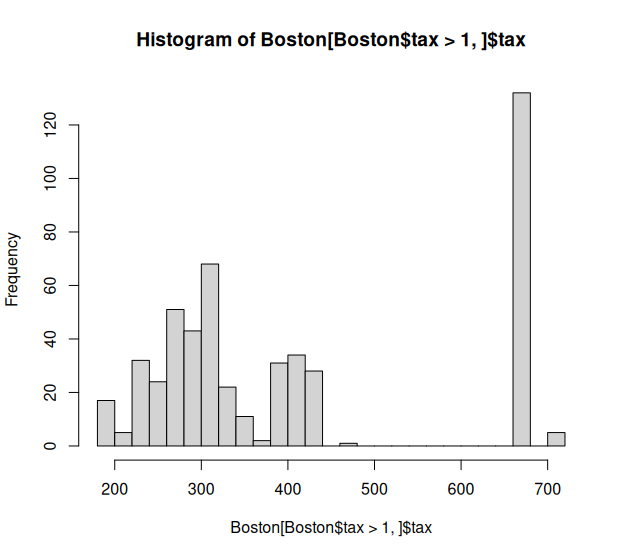

```r
sortbytax <- Boston[order(Boston$tax, decreasing = TRUE), ]
head(sortbytax, 20)
#         crim zn indus chas   nox    rm   age    dis rad tax ptratio lstat medv high_crime
# 489  0.15086  0 27.74    0 0.609 5.454  92.7 1.8209   4 711    20.1 18.06 15.2         No
# 490  0.18337  0 27.74    0 0.609 5.414  98.3 1.7554   4 711    20.1 23.97  7.0         No
# 491  0.20746  0 27.74    0 0.609 5.093  98.0 1.8226   4 711    20.1 29.68  8.1         No
# 492  0.10574  0 27.74    0 0.609 5.983  98.8 1.8681   4 711    20.1 18.07 13.6         No
# 493  0.11132  0 27.74    0 0.609 5.983  83.5 2.1099   4 711    20.1 13.35 20.1         No
# 357  8.98296  0 18.10    1 0.770 6.212  97.4 2.1222  24 666    20.2 17.60 17.8        Yes
# 358  3.84970  0 18.10    1 0.770 6.395  91.0 2.5052  24 666    20.2 13.27 21.7        Yes
# 359  5.20177  0 18.10    1 0.770 6.127  83.4 2.7227  24 666    20.2 11.48 22.7        Yes
# 360  4.26131  0 18.10    0 0.770 6.112  81.3 2.5091  24 666    20.2 12.67 22.6        Yes
# 361  4.54192  0 18.10    0 0.770 6.398  88.0 2.5182  24 666    20.2  7.79 25.0        Yes
# 362  3.83684  0 18.10    0 0.770 6.251  91.1 2.2955  24 666    20.2 14.19 19.9        Yes
# 363  3.67822  0 18.10    0 0.770 5.362  96.2 2.1036  24 666    20.2 10.19 20.8        Yes
# 364  4.22239  0 18.10    1 0.770 5.803  89.0 1.9047  24 666    20.2 14.64 16.8        Yes
# 365  3.47428  0 18.10    1 0.718 8.780  82.9 1.9047  24 666    20.2  5.29 21.9        Yes
# 366  4.55587  0 18.10    0 0.718 3.561  87.9 1.6132  24 666    20.2  7.12 27.5        Yes
# 367  3.69695  0 18.10    0 0.718 4.963  91.4 1.7523  24 666    20.2 14.00 21.9        Yes
# 368 13.52220  0 18.10    0 0.631 3.863 100.0 1.5106  24 666    20.2 13.33 23.1        Yes
# 369  4.89822  0 18.10    0 0.631 4.970 100.0 1.3325  24 666    20.2  3.26 50.0        Yes
# 370  5.66998  0 18.10    1 0.631 6.683  96.8 1.3567  24 666    20.2  3.73 50.0        Yes
# 371  6.53876  0 18.10    1 0.631 7.016  97.5 1.2024  24 666    20.2  2.96 50.0        Yes
```

The highest tax rates fall well outside of the normal range, either with a tax rate of 711 or 666 compared to the median 330

```r
hist(Boston[Boston$ptratio>1,]$ptratio, breaks=20)
sortbypt <- Boston[order(Boston$ptratio, decreasing = TRUE), ]
```

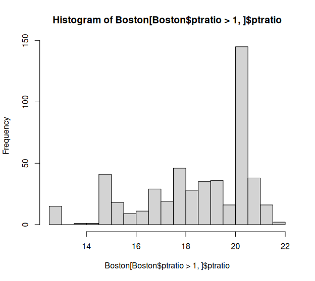

```r
head(sortbypt, 20)
#        crim zn indus chas   nox    rm   age     dis rad tax ptratio lstat medv high_crime
# 355 0.04301 80  1.91    0 0.413 5.663  21.9 10.5857   4 334    22.0  8.05 18.2         No
# 356 0.10659 80  1.91    0 0.413 5.936  19.5 10.5857   4 334    22.0  5.57 20.6         No
# 128 0.25915  0 21.89    0 0.624 5.693  96.0  1.7883   4 437    21.2 17.19 16.2        Yes
# 129 0.32543  0 21.89    0 0.624 6.431  98.8  1.8125   4 437    21.2 15.39 18.0        Yes
# 130 0.88125  0 21.89    0 0.624 5.637  94.7  1.9799   4 437    21.2 18.34 14.3        Yes
# 131 0.34006  0 21.89    0 0.624 6.458  98.9  2.1185   4 437    21.2 12.60 19.2        Yes
# 132 1.19294  0 21.89    0 0.624 6.326  97.7  2.2710   4 437    21.2 12.26 19.6        Yes
# 133 0.59005  0 21.89    0 0.624 6.372  97.9  2.3274   4 437    21.2 11.12 23.0        Yes
# 134 0.32982  0 21.89    0 0.624 5.822  95.4  2.4699   4 437    21.2 15.03 18.4        Yes
# 135 0.97617  0 21.89    0 0.624 5.757  98.4  2.3460   4 437    21.2 17.31 15.6        Yes
# 136 0.55778  0 21.89    0 0.624 6.335  98.2  2.1107   4 437    21.2 16.96 18.1        Yes
# 137 0.32264  0 21.89    0 0.624 5.942  93.5  1.9669   4 437    21.2 16.90 17.4        Yes
# 138 0.35233  0 21.89    0 0.624 6.454  98.4  1.8498   4 437    21.2 14.59 17.1        Yes
# 139 0.24980  0 21.89    0 0.624 5.857  98.2  1.6686   4 437    21.2 21.32 13.3         No
# 140 0.54452  0 21.89    0 0.624 6.151  97.9  1.6687   4 437    21.2 18.46 17.8        Yes
# 141 0.29090  0 21.89    0 0.624 6.174  93.6  1.6119   4 437    21.2 24.16 14.0        Yes
# 142 1.62864  0 21.89    0 0.624 5.019 100.0  1.4394   4 437    21.2 34.41 14.4        Yes
# 55  0.01360 75  4.00    0 0.410 5.888  47.6  7.3197   3 469    21.1 14.80 18.9         No
# 14  0.62976  0  8.14    0 0.538 5.949  61.8  4.7075   4 307    21.0  8.26 20.4        Yes
# 15  0.63796  0  8.14    0 0.538 6.096  84.5  4.4619   4 307    21.0 10.26 18.2        Yes
```

Most ratios are in the low 20s by a large margin, the rest of the results are scattered.

### e. How many of the census tracts in this data set bound the Charles river?

```r
sum(Boston$chas)
```

35 near the Charles River

### f. What is the median pupil-teacher ratio among the towns in this data set?

```r
median(Boston$ptratio)
```

19.05 pupil/teacher ratio

### g. Which census tract of Boston has lowest median value of owner-occupied homes? What are the values of the other predictors for that census tract, and how do those values compare to the overall ranges for those predictors? Comment on your findings

```r
summary(Boston$medv)
#    Min. 1st Qu.  Median    Mean 3rd Qu.    Max. 
#    5.00   17.02   21.20   22.53   25.00   50.00 
Boston[Boston$medv == min(Boston$medv), ]
       crim zn indus chas   nox    rm age    dis rad tax ptratio lstat medv high_crime
# 399 38.3518  0  18.1    0 0.693 5.453 100 1.4896  24 666    20.2 30.59    5        Yes
# 406 67.9208  0  18.1    0 0.693 5.683 100 1.4254  24 666    20.2 22.98    5        Yes
```

399 and 406 are tied for the lowest home values at 5, compared to the median at 21.2. Crime rate is pretty bad compared to the average in these cities but it's not the worst.

### h. In this data set, how many of the census tracts average more than seven rooms per dwelling? More than eight rooms per dwelling? Comment on the census tracts that average more than eight rooms per dwelling.

```r
summary(Boston)
summary(Boston[Boston$rm > 7, ])
#       crim                zn            indus             chas            nox               rm             age              dis             rad        
#  Min.   : 0.00906   Min.   : 0.00   Min.   : 0.460   Min.   :0.000   Min.   :0.3940   Min.   :7.007   Min.   :  8.40   Min.   :1.202   Min.   : 1.000  
#  1st Qu.: 0.04502   1st Qu.: 0.00   1st Qu.: 2.460   1st Qu.:0.000   1st Qu.:0.4303   1st Qu.:7.183   1st Qu.: 36.00   1st Qu.:2.445   1st Qu.: 3.000  
#  Median : 0.09786   Median :20.00   Median : 3.970   Median :0.000   Median :0.4880   Median :7.414   Median : 63.80   Median :3.495   Median : 5.000  
#  Mean   : 0.97911   Mean   :28.17   Mean   : 5.776   Mean   :0.125   Mean   :0.5045   Mean   :7.570   Mean   : 60.64   Mean   :4.200   Mean   : 5.984  
#  3rd Qu.: 0.54289   3rd Qu.:45.00   3rd Qu.: 6.200   3rd Qu.:0.000   3rd Qu.:0.5825   3rd Qu.:7.859   3rd Qu.: 85.03   3rd Qu.:5.463   3rd Qu.: 7.000  
#  Max.   :19.60910   Max.   :95.00   Max.   :19.580   Max.   :1.000   Max.   :0.7180   Max.   :8.780   Max.   :100.00   Max.   :9.223   Max.   :24.000  
#       tax           ptratio          lstat             medv       high_crime
#  Min.   :193.0   Min.   :12.60   Min.   : 1.730   Min.   :15.00   No :35    
#  1st Qu.:244.8   1st Qu.:14.70   1st Qu.: 3.555   1st Qu.:32.98   Yes:29    
#  Median :273.0   Median :17.40   Median : 4.775   Median :36.45             
#  Mean   :312.2   Mean   :16.26   Mean   : 5.474   Mean   :38.40             
#  3rd Qu.:329.0   3rd Qu.:17.93   3rd Qu.: 6.590   3rd Qu.:46.17             
#  Max.   :666.0   Max.   :20.20   Max.   :16.740   Max.   :50.00 
```

Crime is lower in >7 average room per dwelling areas, average age is lower, there are more 25k sq ft residential lots, average property tax is lower.

```r
# summary(Boston[Boston$rm > 8, ])
#       crim               zn            indus             chas             nox               rm             age             dis             rad        
#  Min.   :0.02009   Min.   : 0.00   Min.   : 2.680   Min.   :0.0000   Min.   :0.4161   Min.   :8.034   Min.   : 8.40   Min.   :1.801   Min.   : 2.000  
#  1st Qu.:0.33147   1st Qu.: 0.00   1st Qu.: 3.970   1st Qu.:0.0000   1st Qu.:0.5040   1st Qu.:8.247   1st Qu.:70.40   1st Qu.:2.288   1st Qu.: 5.000  
#  Median :0.52014   Median : 0.00   Median : 6.200   Median :0.0000   Median :0.5070   Median :8.297   Median :78.30   Median :2.894   Median : 7.000  
#  Mean   :0.71880   Mean   :13.62   Mean   : 7.078   Mean   :0.1538   Mean   :0.5392   Mean   :8.349   Mean   :71.54   Mean   :3.430   Mean   : 7.462  
#  3rd Qu.:0.57834   3rd Qu.:20.00   3rd Qu.: 6.200   3rd Qu.:0.0000   3rd Qu.:0.6050   3rd Qu.:8.398   3rd Qu.:86.50   3rd Qu.:3.652   3rd Qu.: 8.000  
#  Max.   :3.47428   Max.   :95.00   Max.   :19.580   Max.   :1.0000   Max.   :0.7180   Max.   :8.780   Max.   :93.90   Max.   :8.907   Max.   :24.000  
#       tax           ptratio          lstat           medv      high_crime
#  Min.   :224.0   Min.   :13.00   Min.   :2.47   Min.   :21.9   No : 2    
#  1st Qu.:264.0   1st Qu.:14.70   1st Qu.:3.32   1st Qu.:41.7   Yes:11    
#  Median :307.0   Median :17.40   Median :4.14   Median :48.3             
#  Mean   :325.1   Mean   :16.36   Mean   :4.31   Mean   :44.2             
#  3rd Qu.:307.0   3rd Qu.:17.40   3rd Qu.:5.12   3rd Qu.:50.0             
#  Max.   :666.0   Max.   :20.20   Max.   :7.44   Max.   :50.0      
```

There are much fewer results with 8 than with 7, crime is higher, average age is higher, there are more 25k sq ft lots, and property tax is lower compared to the average.

There is a big difference in the variables between 7 and 8.