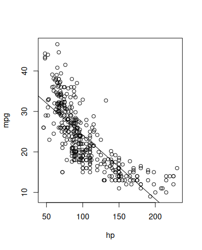
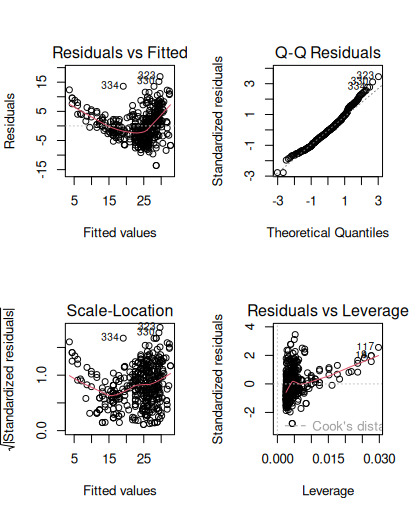
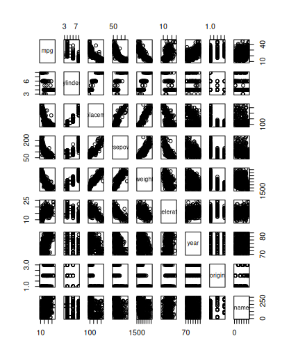
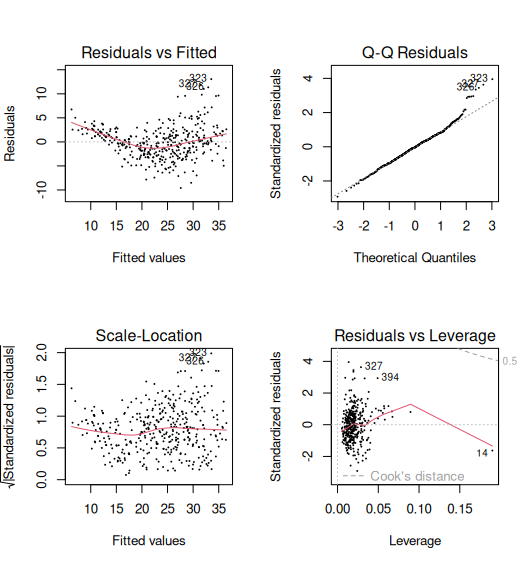
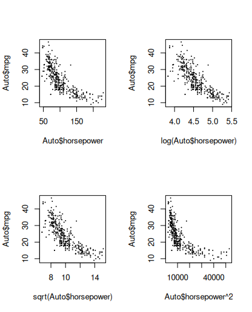
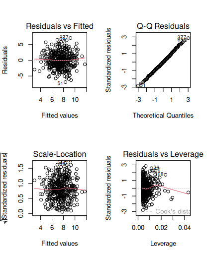
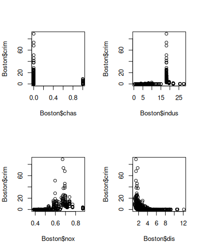
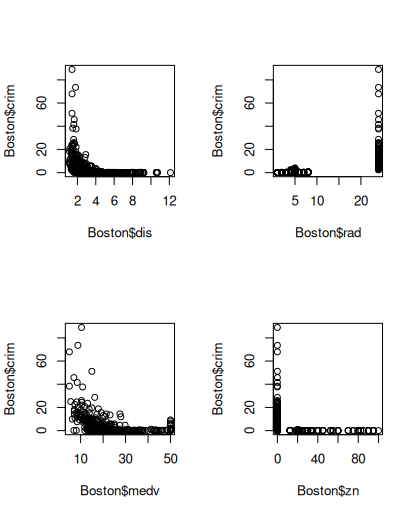
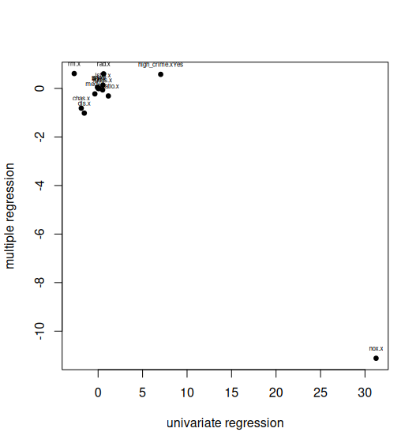

## Question 1:
### Describe the null hypotheses to which the p-values given in Table 3.4 correspond. Explain what conclusions you can draw based on these p-values. Your explanation should be phrased in terms of sales, TV, radio, and newspaper, rather than in terms of the coefficients of the linear model.

We can reject the null hypothesis for Intercept, TV, and radio because their p values are <0.0001, but not for newspaper which has a p value of 0.8599. This means sales can be significantly associated with spending on TV and radio, some sales are associated with no spending at all, and newspaper advertising is not significantly associated with sales.

## Question 2:
### Carefully explain the differences between the KNN classifier and KNN regression methods

KNN classification and regression models differ in the goal of the model and the type of output they generate. The KNN classifier assigns classes to data using the classes of it's nearest neighbors, and KNN regression models smooth values by assigning them the average of its nearest neighbors.

## Question 3:
### Suppose we have a data set with five predictors, X1 = GPA, X2 = IQ, X3 = Level (1 for College and 0 for High School), X4 = Interaction between GPA and IQ, and X5 = Interaction between GPA and Level. The response is starting salary after graduation (in thousands of dollars). Suppose we use least squares to fit the model, and get β̂0 = 50, β̂1 = 20, β̂2 = 0.07, β̂3 = 35, β̂4 = 0.01, β̂5 = −10.
### (a) Which answer is correct, and why?
### i. For a fixed value of IQ and GPA, high school graduates earn more, on average, than college graduates.
### ii. For a fixed value of IQ and GPA, college graduates earn more, on average, than high school graduates.
### iii. For a fixed value of IQ and GPA, high school graduates earn more, on average, than college graduates provided that the GPA is high enough.
### iv. For a fixed value of IQ and GPA, college graduates earn more, on average, than high school graduates provided that the GPA is high enough.

iii: 

The model equation can be written out as:
50 + 20 * GPA + .07 * IQ + 35 * level + .01 * gpa * IQ - 10 * gpa * level. There is a negative relationship between college education and starting salary(-10*gpa*level), and when GPA is fixed we can reduce the equation to level = 35 - 10 * GPA . Therefore 3.5 GPA is the minimum for high school graduates to have a higher starting salary than college.

### (b) Predict the salary of a college graduate with IQ of 110 and a GPA of 4.0.

$137,100:

50 + 20 * 4 + .07 * 110 + 35 * 1 + .01 * 4 * 110 - 10 * 4 * 1 = 137.1, 137.1 in thousands of dollars is $137,100

### (c) True or false: Since the coefficient for the GPA/IQ interaction term is very small, there is very little evidence of an interaction effect. Justify your answer.

False:

Since IQ is typically around 100 and gpa can be expected to be around 3-4, multiplying them gives a value much higher than the rest of the values in the model, and the small value for the relationship adjusts for this. The actual value of the relationship can only be considered its significance relative to the other values if all the values are on the same scale.

## Question 8:

```r
library(ISLR2)
```

### a.

```r
autompg <- lm(mpg ~ horsepower, data = Auto)
summary(autompg)
# Call:
# lm(formula = mpg ~ horsepower, data = Auto)

# Residuals:
#      Min       1Q   Median       3Q      Max 
# -13.5710  -3.2592  -0.3435   2.7630  16.9240 

# Coefficients:
#              Estimate Std. Error t value Pr(>|t|)    
# (Intercept) 39.935861   0.717499   55.66   <2e-16 ***
# horsepower  -0.157845   0.006446  -24.49   <2e-16 ***
# ---
# Signif. codes:  0 ‘***’ 0.001 ‘**’ 0.01 ‘*’ 0.05 ‘.’ 0.1 ‘ ’ 1

# Residual standard error: 4.906 on 390 degrees of freedom
# Multiple R-squared:  0.6059,	Adjusted R-squared:  0.6049 
# F-statistic: 599.7 on 1 and 390 DF,  p-value: < 2.2e-16
```

### i. 

The p value of 2.2e-16 indicates a strong correlation between horsepower and mpg

### ii. 

The multiple R-squared of .6059 indicates that 60.59% of the variance in mpg can be explained by horsepower. This indicates a relatively strong relationship.

### iii. 

The relationship between horsepower and mpg is negative, as indicated by horsepower's -.15 estimate. This means as horsepower increases mpg is expected to decrease.

### iv.

```r
predict(autompg, data.frame(horsepower = 98), interval = "prediction")
#        fit     lwr      upr
# 1 24.46708 14.8094 34.12476
predict(autompg, data.frame(horsepower = 98), interval = "confidence")
#        fit      lwr      upr
# 1 24.46708 23.97308 24.96108
```

The predicted mpg is 24.48 with a confidence interval of (23.97, 24.96) and a prediction interval of (14.80, 34.12).

### b.

```r
plot(Auto$horsepower, Auto$mpg, xlab = "hp", ylab = "mpg")
abline(autompg)
```



### c.

```r
par(mfrow=c(2,2))
plot(autompg)
```



The strong pattern seen in the residuals indicates non-linearity in the data. Linear relationships shouldn't have any discernible pattern.

## Question 9:

### a.

```r
pairs(Auto)
```



### b.

```r
no_name = subset(Auto, select = -name)
cor(no_name)
#                     mpg  cylinders displacement horsepower     weight acceleration       year     origin
# mpg           1.0000000 -0.7776175   -0.8051269 -0.7784268 -0.8322442    0.4233285  0.5805410  0.5652088
# cylinders    -0.7776175  1.0000000    0.9508233  0.8429834  0.8975273   -0.5046834 -0.3456474 -0.5689316
# displacement -0.8051269  0.9508233    1.0000000  0.8972570  0.9329944   -0.5438005 -0.3698552 -0.6145351
# horsepower   -0.7784268  0.8429834    0.8972570  1.0000000  0.8645377   -0.6891955 -0.4163615 -0.4551715
# weight       -0.8322442  0.8975273    0.9329944  0.8645377  1.0000000   -0.4168392 -0.3091199 -0.5850054
# acceleration  0.4233285 -0.5046834   -0.5438005 -0.6891955 -0.4168392    1.0000000  0.2903161  0.2127458
# year          0.5805410 -0.3456474   -0.3698552 -0.4163615 -0.3091199    0.2903161  1.0000000  0.1815277
# origin        0.5652088 -0.5689316   -0.6145351 -0.4551715 -0.5850054    0.2127458  0.1815277  1.0000000
```

### c.

```r
mpglreg <- lm(mpg ~ ., data = no_name)
summary(mpglreg)
# Call:
# lm(formula = mpg ~ ., data = no_name)

# Residuals:
#     Min      1Q  Median      3Q     Max 
# -9.5903 -2.1565 -0.1169  1.8690 13.0604 

# Coefficients:
#                Estimate Std. Error t value Pr(>|t|)    
# (Intercept)  -17.218435   4.644294  -3.707  0.00024 ***
# cylinders     -0.493376   0.323282  -1.526  0.12780    
# displacement   0.019896   0.007515   2.647  0.00844 ** 
# horsepower    -0.016951   0.013787  -1.230  0.21963    
# weight        -0.006474   0.000652  -9.929  < 2e-16 ***
# acceleration   0.080576   0.098845   0.815  0.41548    
# year           0.750773   0.050973  14.729  < 2e-16 ***
# origin         1.426141   0.278136   5.127 4.67e-07 ***
# ---
# Signif. codes:  0 ‘***’ 0.001 ‘**’ 0.01 ‘*’ 0.05 ‘.’ 0.1 ‘ ’ 1

# Residual standard error: 3.328 on 384 degrees of freedom
# Multiple R-squared:  0.8215,	Adjusted R-squared:  0.8182 
# F-statistic: 252.4 on 7 and 384 DF,  p-value: < 2.2e-16
```

Yes, some predictors have a relationship, particularly displacement, weight, year, and origin. The coefficient for year, .75, suggests mpg increases by .75 every year.

### d.

```r
par(mfrow = c(2, 2))
plot(mpglreg, cex = .1)
```



Yes, there are some outliers in the residuals data and there are some observations with abnormally high leverage. Observation 334 and 323 are the biggest outliers in the residuals data, and 117 has the highest leverage in the data.

### e.

```r
summary(lm(formula = mpg ~ . * ., data = no_name))
# Call:
# lm(formula = mpg ~ . * ., data = no_name)

# Residuals:
#     Min      1Q  Median      3Q     Max 
# -7.6303 -1.4481  0.0596  1.2739 11.1386 

# Coefficients:
#                             Estimate Std. Error t value Pr(>|t|)   
# (Intercept)                3.548e+01  5.314e+01   0.668  0.50475   
# cylinders                  6.989e+00  8.248e+00   0.847  0.39738   
# displacement              -4.785e-01  1.894e-01  -2.527  0.01192 * 
# horsepower                 5.034e-01  3.470e-01   1.451  0.14769   
# weight                     4.133e-03  1.759e-02   0.235  0.81442   
# acceleration              -5.859e+00  2.174e+00  -2.696  0.00735 **
# year                       6.974e-01  6.097e-01   1.144  0.25340   
# origin                    -2.090e+01  7.097e+00  -2.944  0.00345 **
# cylinders:displacement    -3.383e-03  6.455e-03  -0.524  0.60051   
# cylinders:horsepower       1.161e-02  2.420e-02   0.480  0.63157   
# cylinders:weight           3.575e-04  8.955e-04   0.399  0.69000   
# cylinders:acceleration     2.779e-01  1.664e-01   1.670  0.09584 . 
# cylinders:year            -1.741e-01  9.714e-02  -1.793  0.07389 . 
# cylinders:origin           4.022e-01  4.926e-01   0.816  0.41482   
# displacement:horsepower   -8.491e-05  2.885e-04  -0.294  0.76867   
# displacement:weight        2.472e-05  1.470e-05   1.682  0.09342 . 
# displacement:acceleration -3.479e-03  3.342e-03  -1.041  0.29853   
# displacement:year          5.934e-03  2.391e-03   2.482  0.01352 * 
# displacement:origin        2.398e-02  1.947e-02   1.232  0.21875   
# horsepower:weight         -1.968e-05  2.924e-05  -0.673  0.50124   
# horsepower:acceleration   -7.213e-03  3.719e-03  -1.939  0.05325 . 
# horsepower:year           -5.838e-03  3.938e-03  -1.482  0.13916   
# horsepower:origin          2.233e-03  2.930e-02   0.076  0.93931   
# weight:acceleration        2.346e-04  2.289e-04   1.025  0.30596   
# weight:year               -2.245e-04  2.127e-04  -1.056  0.29182   
# weight:origin             -5.789e-04  1.591e-03  -0.364  0.71623   
# acceleration:year          5.562e-02  2.558e-02   2.174  0.03033 * 
# acceleration:origin        4.583e-01  1.567e-01   2.926  0.00365 **
# year:origin                1.393e-01  7.399e-02   1.882  0.06062 . 
# ---
# Signif. codes:  0 ‘***’ 0.001 ‘**’ 0.01 ‘*’ 0.05 ‘.’ 0.1 ‘ ’ 1

# Residual standard error: 2.695 on 363 degrees of freedom
# Multiple R-squared:  0.8893,	Adjusted R-squared:  0.8808 
# F-statistic: 104.2 on 28 and 363 DF,  p-value: < 2.2e-16
```

acceleration:origin, displacement:year, and acceleration:year are the most significant relationships.

```r
summary(lm(formula = mpg~acceleration*origin+displacement*year+acceleration*year, data = no_name))
# Call:
# lm(formula = mpg ~ acceleration * origin + displacement * year + 
#     acceleration * year, data = no_name)

# Residuals:
#      Min       1Q   Median       3Q      Max 
# -10.0348  -1.7920  -0.2005   1.7387  16.3952 

# Coefficients:
#                       Estimate Std. Error t value Pr(>|t|)    
# (Intercept)          2.725e+01  3.110e+01   0.876  0.38145    
# acceleration        -4.941e+00  1.613e+00  -3.063  0.00234 ** 
# origin              -1.118e+01  1.740e+00  -6.424 3.94e-10 ***
# displacement         9.830e-02  4.801e-02   2.047  0.04129 *  
# year                 3.322e-01  4.049e-01   0.820  0.41250    
# acceleration:origin  7.420e-01  1.051e-01   7.063 7.70e-12 ***
# displacement:year   -2.051e-03  6.349e-04  -3.230  0.00134 ** 
# acceleration:year    4.877e-02  2.116e-02   2.305  0.02168 *  
# ---
# Signif. codes:  0 ‘***’ 0.001 ‘**’ 0.01 ‘*’ 0.05 ‘.’ 0.1 ‘ ’ 1

# Residual standard error: 3.436 on 384 degrees of freedom
# Multiple R-squared:  0.8097,	Adjusted R-squared:  0.8062 
# F-statistic: 233.4 on 7 and 384 DF,  p-value: < 2.2e-16
```

### f.

Horsepower seems to be the most significant variable

```R
par(mfrow = c(2, 2))
plot(Auto$horsepower, Auto$mpg, cex = .1)
plot(log(Auto$horsepower), Auto$mpg, cex = .1)
plot(sqrt(Auto$horsepower), Auto$mpg, cex = .1)
plot(Auto$horsepower^2, Auto$mpg, cex = .1)
```



log plot looks the flattest

```r
summary(lm(mpg ~ horsepower, data = Auto))
# Call:
# lm(formula = mpg ~ horsepower, data = Auto)

# Residuals:
#      Min       1Q   Median       3Q      Max 
# -13.5710  -3.2592  -0.3435   2.7630  16.9240 

# Coefficients:
#              Estimate Std. Error t value Pr(>|t|)    
# (Intercept) 39.935861   0.717499   55.66   <2e-16 ***
# horsepower  -0.157845   0.006446  -24.49   <2e-16 ***
# ---
# Signif. codes:  0 ‘***’ 0.001 ‘**’ 0.01 ‘*’ 0.05 ‘.’ 0.1 ‘ ’ 1

# Residual standard error: 4.906 on 390 degrees of freedom
# Multiple R-squared:  0.6059,	Adjusted R-squared:  0.6049 
# F-statistic: 599.7 on 1 and 390 DF,  p-value: < 2.2e-16

summary(lm(mpg ~ log(horsepower), data = Auto))
# Call:
# lm(formula = mpg ~ log(horsepower), data = Auto)

# Residuals:
#      Min       1Q   Median       3Q      Max 
# -14.2299  -2.7818  -0.2322   2.6661  15.4695 

# Coefficients:
#                 Estimate Std. Error t value Pr(>|t|)    
# (Intercept)     108.6997     3.0496   35.64   <2e-16 ***
# log(horsepower) -18.5822     0.6629  -28.03   <2e-16 ***
# ---
# Signif. codes:  0 ‘***’ 0.001 ‘**’ 0.01 ‘*’ 0.05 ‘.’ 0.1 ‘ ’ 1

# Residual standard error: 4.501 on 390 degrees of freedom
# Multiple R-squared:  0.6683,	Adjusted R-squared:  0.6675 
# F-statistic: 785.9 on 1 and 390 DF,  p-value: < 2.2e-16
```

fitment gives .66 R^2 with log vs .61 without

## Question 10:

### a.

```r
summary(Carseats)
#      Sales          CompPrice       Income        Advertising       Population        Price        ShelveLoc        Age       
#  Min.   : 0.000   Min.   : 77   Min.   : 21.00   Min.   : 0.000   Min.   : 10.0   Min.   : 24.0   Bad   : 96   Min.   :25.00  
#  1st Qu.: 5.390   1st Qu.:115   1st Qu.: 42.75   1st Qu.: 0.000   1st Qu.:139.0   1st Qu.:100.0   Good  : 85   1st Qu.:39.75  
#  Median : 7.490   Median :125   Median : 69.00   Median : 5.000   Median :272.0   Median :117.0   Medium:219   Median :54.50  
#  Mean   : 7.496   Mean   :125   Mean   : 68.66   Mean   : 6.635   Mean   :264.8   Mean   :115.8                Mean   :53.32  
#  3rd Qu.: 9.320   3rd Qu.:135   3rd Qu.: 91.00   3rd Qu.:12.000   3rd Qu.:398.5   3rd Qu.:131.0                3rd Qu.:66.00  
#  Max.   :16.270   Max.   :175   Max.   :120.00   Max.   :29.000   Max.   :509.0   Max.   :191.0                Max.   :80.00  
#    Education    Urban       US     
#  Min.   :10.0   No :118   No :142  
#  1st Qu.:12.0   Yes:282   Yes:258  
#  Median :14.0                      
#  Mean   :13.9                      
#  3rd Qu.:16.0                      
#  Max.   :18.0 
seatsfit <- lm(Sales ~ Price + Urban + US, data = Carseats)
```

### b.

```r
summary(seatsfit)
# Call:
# lm(formula = Sales ~ Price + Urban + US, data = Carseats)

# Residuals:
#     Min      1Q  Median      3Q     Max 
# -6.9206 -1.6220 -0.0564  1.5786  7.0581 

# Coefficients:
#              Estimate Std. Error t value Pr(>|t|)    
# (Intercept) 13.043469   0.651012  20.036  < 2e-16 ***
# Price       -0.054459   0.005242 -10.389  < 2e-16 ***
# UrbanYes    -0.021916   0.271650  -0.081    0.936    
# USYes        1.200573   0.259042   4.635 4.86e-06 ***
# ---
# Signif. codes:  0 ‘***’ 0.001 ‘**’ 0.01 ‘*’ 0.05 ‘.’ 0.1 ‘ ’ 1

# Residual standard error: 2.472 on 396 degrees of freedom
# Multiple R-squared:  0.2393,	Adjusted R-squared:  0.2335 
# F-statistic: 41.52 on 3 and 396 DF,  p-value: < 2.2e-16
```

It is statistically proven that price increases lead to a .05 decrease in sales per unit of price, and being in the US leads to an expected increase in sales of 1.2 units.

The data suggests that being in an urban environment decreases sales by .02, but given the high P value there is no evidence of a correlation.

### c.

Sales = 13.04 + -0.05 * Price - 0.02 * UrbanYes + 1.20 * USYes

### d.

We can reject the null hypothesis for Price and USYes, but not for UrbanYes

### e.

```r
seatssmall <- lm(Sales ~ Price + US, data = Carseats)
summary(seatssmall)
# Call:
# lm(formula = Sales ~ Price + US, data = Carseats)

# Residuals:
#     Min      1Q  Median      3Q     Max 
# -6.9269 -1.6286 -0.0574  1.5766  7.0515 

# Coefficients:
#             Estimate Std. Error t value Pr(>|t|)    
# (Intercept) 13.03079    0.63098  20.652  < 2e-16 ***
# Price       -0.05448    0.00523 -10.416  < 2e-16 ***
# USYes        1.19964    0.25846   4.641 4.71e-06 ***
# ---
# Signif. codes:  0 ‘***’ 0.001 ‘**’ 0.01 ‘*’ 0.05 ‘.’ 0.1 ‘ ’ 1

# Residual standard error: 2.469 on 397 degrees of freedom
# Multiple R-squared:  0.2393,	Adjusted R-squared:  0.2354 
# F-statistic: 62.43 on 2 and 397 DF,  p-value: < 2.2e-16
```

### f.

a: R^2 .2393, adjusted R^2 .2335

e: R^@ .2393, adjusted R^2 .2354

both models perform similarly, both had the same R^2 but e had a slightly higher adjusted R^2, which adjusts for model size.

### g.

```r
confint(seatssmall, level = .95)
#                   2.5 %      97.5 %
# (Intercept) 11.79032020 14.27126531
# Price       -0.06475984 -0.04419543
# USYes        0.69151957  1.70776632
```

### h.

```r
par(mfrow=c(2,2))
plot(seatssmall)
```



There's a few points that could be called outliers or high leverage, but much less so than the outliers in the Auto dataset.

## Question 15:

```r
bostoncrim <- subset(Boston, select = -crim)
summary(bostoncrim)
#        zn             indus            chas              nox               rm             age              dis        
#  Min.   :  0.00   Min.   : 0.46   Min.   :0.00000   Min.   :0.3850   Min.   :3.561   Min.   :  2.90   Min.   : 1.130  
#  1st Qu.:  0.00   1st Qu.: 5.19   1st Qu.:0.00000   1st Qu.:0.4490   1st Qu.:5.886   1st Qu.: 45.02   1st Qu.: 2.100  
#  Median :  0.00   Median : 9.69   Median :0.00000   Median :0.5380   Median :6.208   Median : 77.50   Median : 3.207  
#  Mean   : 11.36   Mean   :11.14   Mean   :0.06917   Mean   :0.5547   Mean   :6.285   Mean   : 68.57   Mean   : 3.795  
#  3rd Qu.: 12.50   3rd Qu.:18.10   3rd Qu.:0.00000   3rd Qu.:0.6240   3rd Qu.:6.623   3rd Qu.: 94.08   3rd Qu.: 5.188  
#  Max.   :100.00   Max.   :27.74   Max.   :1.00000   Max.   :0.8710   Max.   :8.780   Max.   :100.00   Max.   :12.127  
#       rad              tax           ptratio          lstat            medv       high_crime
#  Min.   : 1.000   Min.   :187.0   Min.   :12.60   Min.   : 1.73   Min.   : 5.00   No :253   
#  1st Qu.: 4.000   1st Qu.:279.0   1st Qu.:17.40   1st Qu.: 6.95   1st Qu.:17.02   Yes:253   
#  Median : 5.000   Median :330.0   Median :19.05   Median :11.36   Median :21.20             
#  Mean   : 9.549   Mean   :408.2   Mean   :18.46   Mean   :12.65   Mean   :22.53             
#  3rd Qu.:24.000   3rd Qu.:666.0   3rd Qu.:20.20   3rd Qu.:16.95   3rd Qu.:25.00             
#  Max.   :24.000   Max.   :711.0   Max.   :22.00   Max.   :37.97   Max.   :50.00  
```

### a.

```r
linearcrim <- lapply(bostoncrim, function(x) lm(Boston$crim ~ x))
printCoefmat(do.call(rbind, lapply(linearcrim, function(x) coef(summary(x))[2, ])))
#              Estimate Std. Error t value  Pr(>|t|)    
# zn         -0.0739350  0.0160946 -4.5938 5.506e-06 ***
# indus       0.5097763  0.0510243  9.9908 < 2.2e-16 ***
# chas       -1.8927766  1.5061155 -1.2567    0.2094    
# nox        31.2485312  2.9991904 10.4190 < 2.2e-16 ***
# rm         -2.6840512  0.5320411 -5.0448 6.347e-07 ***
# age         0.1077862  0.0127364  8.4628 2.855e-16 ***
# dis        -1.5509017  0.1683300 -9.2135 < 2.2e-16 ***
# rad         0.6179109  0.0343318 17.9982 < 2.2e-16 ***
# tax         0.0297423  0.0018474 16.0994 < 2.2e-16 ***
# ptratio     1.1519828  0.1693736  6.8014 2.943e-11 ***
# lstat       0.5488048  0.0477610 11.4907 < 2.2e-16 ***
# medv       -0.3631599  0.0383902 -9.4597 < 2.2e-16 ***
# high_crime  7.0359041  0.6984357 10.0738 < 2.2e-16 ***
# ---
# Signif. codes:  0 ‘***’ 0.001 ‘**’ 0.01 ‘*’ 0.05 ‘.’ 0.1 ‘ ’ 1
```

all predictors except for "chas" have a statistically significant association

```r
plot(Boston$chas, Boston$crim)
plot(Boston$indus, Boston$crim)
plot(Boston$nox, Boston$crim)
plot(Boston$dis, Boston$crim)
```



plot for chas appears to be less correlated than the first three predictors with the lowest p values

### b.

```r
regcrim <- lm(crim ~ ., data = Boston)
summary(regcrim)
# Call:
# lm(formula = crim ~ ., data = Boston)

# Residuals:
#    Min     1Q Median     3Q    Max 
# -8.617 -2.300 -0.310  1.082 73.911 

# Coefficients:
#                 Estimate Std. Error t value Pr(>|t|)    
# (Intercept)    14.688223   7.230102   2.032 0.042737 *  
# zn              0.046464   0.018839   2.466 0.013990 *  
# indus          -0.060203   0.083737  -0.719 0.472509    
# chas           -0.815008   1.184228  -0.688 0.491639    
# nox           -11.118066   5.600850  -1.985 0.047692 *  
# rm              0.612403   0.608019   1.007 0.314329    
# age            -0.002405   0.018126  -0.133 0.894502    
# dis            -1.017548   0.282763  -3.599 0.000352 ***
# rad             0.601696   0.089222   6.744 4.34e-11 ***
# tax            -0.003653   0.005179  -0.705 0.480875    
# ptratio        -0.310545   0.186752  -1.663 0.096975 .  
# lstat           0.136434   0.075859   1.799 0.072709 .  
# medv           -0.225006   0.060368  -3.727 0.000216 ***
# high_crimeYes   0.579473   0.914388   0.634 0.526553    
# ---
# Signif. codes:  0 ‘***’ 0.001 ‘**’ 0.01 ‘*’ 0.05 ‘.’ 0.1 ‘ ’ 1

# Residual standard error: 6.464 on 492 degrees of freedom
# Multiple R-squared:  0.4498,	Adjusted R-squared:  0.4352 
# F-statistic: 30.94 on 13 and 492 DF,  p-value: < 2.2e-16
```

dis, rad, medv, and zn are the predictors with a statistically significant correlation

```r
plot(Boston$dis, Boston$crim)
plot(Boston$rad, Boston$crim)
plot(Boston$medv, Boston$crim)
plot(Boston$zn, Boston$crim)
```



No linear looking relationships but clear correlation

### c.

Predictors have much lower significance when used together vs on their own. 

```r
uni_coef <- sapply(linearcrim, function(m) coef(m)[2])
multi_coef <- coef(regcrim)[-1]

par(mfrow=c(1,1))
plot(uni_coef, multi_coef,
     xlab = "univariate regression",
     ylab = "multiple regression",
     pch = 19, cex = 0.8)
text(uni_coef, multi_coef, labels = names(uni_coef), pos = 3, cex = 0.5)
```



Coefficients are different between both, nox is a clear outlier

### d.

```r
# print fitments of each predictor
qualonly <- setdiff(names(Boston), c("chas", "crim"))
fits <- lapply(qualonly, function(p) {
  lm(crim ~ poly(get(p), 3, raw = TRUE), data = Boston)
})
for (fit in fits) printCoefmat(coef(summary(fit)))
#                                 Estimate  Std. Error t value  Pr(>|t|)    
# (Intercept)                   4.8461e+00  4.3298e-01 11.1922 < 2.2e-16 ***
# poly(get(p), 3, raw = TRUE)1 -3.3219e-01  1.0981e-01 -3.0252  0.002612 ** 
# poly(get(p), 3, raw = TRUE)2  6.4826e-03  3.8607e-03  1.6791  0.093750 .  
# poly(get(p), 3, raw = TRUE)3 -3.7758e-05  3.1386e-05 -1.2030  0.229539    
# ---
# Signif. codes:  0 ‘***’ 0.001 ‘**’ 0.01 ‘*’ 0.05 ‘.’ 0.1 ‘ ’ 1
#                                 Estimate  Std. Error t value  Pr(>|t|)    
# (Intercept)                   3.66256828  1.57398333  2.3269   0.02037 *  
# poly(get(p), 3, raw = TRUE)1 -1.96521293  0.48199006 -4.0773 5.297e-05 ***
# poly(get(p), 3, raw = TRUE)2  0.25193730  0.03932212  6.4070 3.420e-10 ***
# poly(get(p), 3, raw = TRUE)3 -0.00697601  0.00095666 -7.2920 1.196e-12 ***
# ---
# Signif. codes:  0 ‘***’ 0.001 ‘**’ 0.01 ‘*’ 0.05 ‘.’ 0.1 ‘ ’ 1
#                               Estimate Std. Error t value  Pr(>|t|)    
# (Intercept)                    233.087     33.643  6.9282 1.312e-11 ***
# poly(get(p), 3, raw = TRUE)1 -1279.371    170.397 -7.5082 2.758e-13 ***
# poly(get(p), 3, raw = TRUE)2  2248.544    279.899  8.0334 6.811e-15 ***
# poly(get(p), 3, raw = TRUE)3 -1245.703    149.282 -8.3446 6.961e-16 ***
# ---
# Signif. codes:  0 ‘***’ 0.001 ‘**’ 0.01 ‘*’ 0.05 ‘.’ 0.1 ‘ ’ 1
#                               Estimate Std. Error t value Pr(>|t|)  
# (Intercept)                  112.62460   64.51724  1.7457  0.08148 .
# poly(get(p), 3, raw = TRUE)1 -39.15014   31.31149 -1.2503  0.21176  
# poly(get(p), 3, raw = TRUE)2   4.55090    5.00986  0.9084  0.36411  
# poly(get(p), 3, raw = TRUE)3  -0.17448    0.26375 -0.6615  0.50858  
# ---
# Signif. codes:  0 ‘***’ 0.001 ‘**’ 0.01 ‘*’ 0.05 ‘.’ 0.1 ‘ ’ 1
#                                 Estimate  Std. Error t value Pr(>|t|)   
# (Intercept)                  -2.5488e+00  2.7691e+00 -0.9204  0.35780   
# poly(get(p), 3, raw = TRUE)1  2.7365e-01  1.8638e-01  1.4683  0.14266   
# poly(get(p), 3, raw = TRUE)2 -7.2296e-03  3.6370e-03 -1.9878  0.04738 * 
# poly(get(p), 3, raw = TRUE)3  5.7453e-05  2.1094e-05  2.7237  0.00668 **
# ---
# Signif. codes:  0 ‘***’ 0.001 ‘**’ 0.01 ‘*’ 0.05 ‘.’ 0.1 ‘ ’ 1
#                               Estimate Std. Error t value  Pr(>|t|)    
# (Intercept)                   30.04761    2.44587 12.2850 < 2.2e-16 ***
# poly(get(p), 3, raw = TRUE)1 -15.55435    1.73597 -8.9600 < 2.2e-16 ***
# poly(get(p), 3, raw = TRUE)2   2.45207    0.34642  7.0783 4.941e-12 ***
# poly(get(p), 3, raw = TRUE)3  -0.11860    0.02040 -5.8135 1.089e-08 ***
# ---
# Signif. codes:  0 ‘***’ 0.001 ‘**’ 0.01 ‘*’ 0.05 ‘.’ 0.1 ‘ ’ 1
#                               Estimate Std. Error t value Pr(>|t|)
# (Intercept)                  -0.605545   2.050108 -0.2954   0.7678
# poly(get(p), 3, raw = TRUE)1  0.512736   1.043597  0.4913   0.6234
# poly(get(p), 3, raw = TRUE)2 -0.075177   0.148543 -0.5061   0.6130
# poly(get(p), 3, raw = TRUE)3  0.003209   0.004564  0.7031   0.4823
#                                 Estimate  Std. Error t value Pr(>|t|)
# (Intercept)                   1.9184e+01  1.1796e+01  1.6263   0.1045
# poly(get(p), 3, raw = TRUE)1 -1.5331e-01  9.5678e-02 -1.6023   0.1097
# poly(get(p), 3, raw = TRUE)2  3.6083e-04  2.4255e-04  1.4877   0.1375
# poly(get(p), 3, raw = TRUE)3 -2.2037e-07  1.8887e-07 -1.1668   0.2439
#                                Estimate Std. Error t value Pr(>|t|)   
# (Intercept)                  477.184046 156.794978  3.0434 0.002462 **
# poly(get(p), 3, raw = TRUE)1 -82.360538  27.643942 -2.9793 0.003029 **
# poly(get(p), 3, raw = TRUE)2   4.635347   1.608321  2.8821 0.004120 **
# poly(get(p), 3, raw = TRUE)3  -0.084760   0.030897 -2.7433 0.006301 **
# ---
# Signif. codes:  0 ‘***’ 0.001 ‘**’ 0.01 ‘*’ 0.05 ‘.’ 0.1 ‘ ’ 1
#                                 Estimate  Std. Error t value Pr(>|t|)  
# (Intercept)                   1.20096558  2.02864516  0.5920  0.55411  
# poly(get(p), 3, raw = TRUE)1 -0.44906559  0.46489111 -0.9660  0.33453  
# poly(get(p), 3, raw = TRUE)2  0.05577942  0.03011561  1.8522  0.06459 .
# poly(get(p), 3, raw = TRUE)3 -0.00085737  0.00056517 -1.5170  0.12989  
# ---
# Signif. codes:  0 ‘***’ 0.001 ‘**’ 0.01 ‘*’ 0.05 ‘.’ 0.1 ‘ ’ 1
#                                 Estimate  Std. Error  t value  Pr(>|t|)    
# (Intercept)                  53.16553809  3.35631054  15.8405 < 2.2e-16 ***
# poly(get(p), 3, raw = TRUE)1 -5.09483054  0.43383205 -11.7438 < 2.2e-16 ***
# poly(get(p), 3, raw = TRUE)2  0.15549649  0.01719044   9.0455 < 2.2e-16 ***
# poly(get(p), 3, raw = TRUE)3 -0.00149010  0.00020379  -7.3120 1.047e-12 ***
# ---
# Signif. codes:  0 ‘***’ 0.001 ‘**’ 0.01 ‘*’ 0.05 ‘.’ 0.1 ‘ ’ 1
#                              Estimate Std. Error t value  Pr(>|t|)    
# (Intercept)                  -6.94033    1.10432 -6.2847 7.116e-10 ***
# poly(get(p), 3, raw = TRUE)1  7.03590    0.69844 10.0738 < 2.2e-16 ***
# ---
# Signif. codes:  0 ‘***’ 0.001 ‘**’ 0.01 ‘*’ 0.05 ‘.’ 0.1 ‘ ’ 1
```

Yes, the cubic association is significant in indus, nox, age, dis, ptratio, and medv