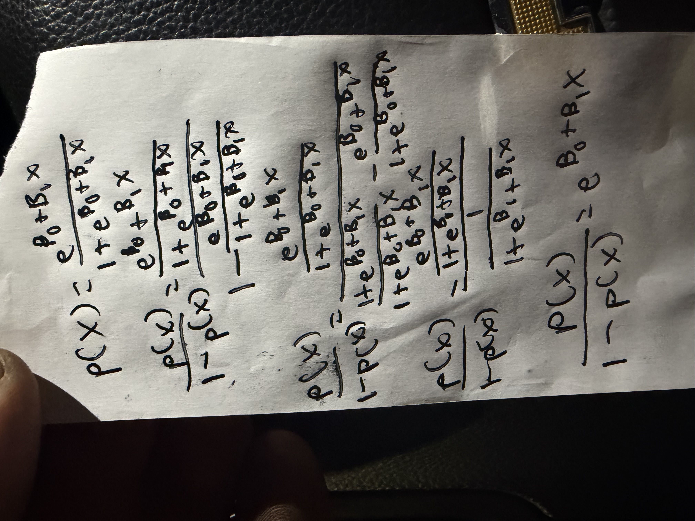
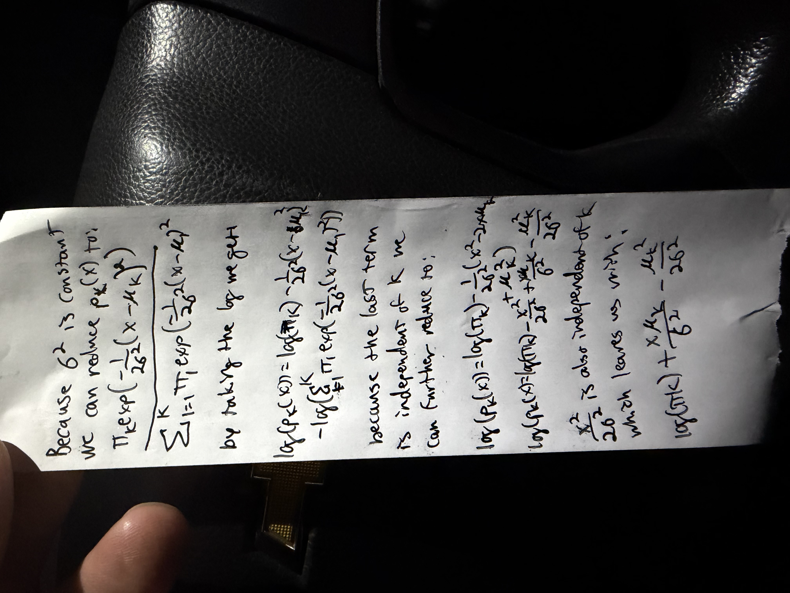
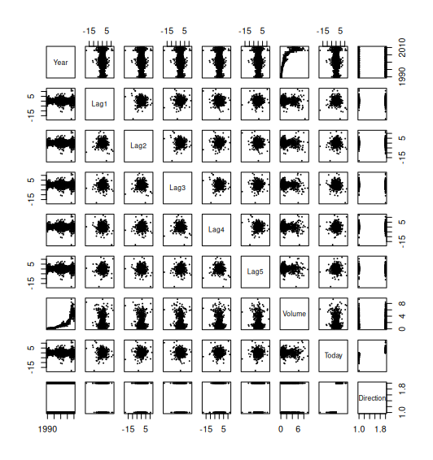
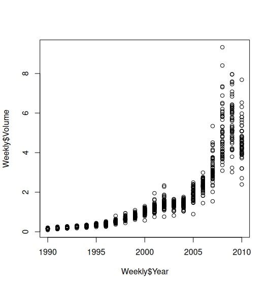

## Question 1: 

### Using a little bit of algebra, prove that (4.2) is equivalent to (4.3). In other words, the logistic function representation and logit representation for the logistic regression model are equivalent.



## Question 2:

### It was stated in the text that classifying an observation to the class for which (4.17) is largest is equivalent to classifying an observation to the class for which (4.18) is largest. Prove that this is the case. In other words, under the assumption that the observations in the kth class are drawn from a N (μk, σ2) distribution, the Bayes classifier assigns an observation to the class for which the discriminant function is maximized.



## Question 4:

### 4. When the number of features p is large, there tends to be a deterioration in the performance of KNN and other local approaches that perform prediction using only observations that are near the test observation for which a prediction must be made. This phenomenon is known as the curse of dimensionality, and it ties into the fact that curse of dimensionality non-parametric approaches often perform poorly when p is large. We will now investigate this curse.

### (a) Suppose that we have a set of observations, each with measurements on p = 1 feature, X. We assume that X is uniformly (evenly) distributed on [0, 1]. Associated with each observation is a response value. Suppose that we wish to predict a test observation’s response using only observations that are within 10 % of the range of X closest to that test observation. For instance, in order to predict the response for a test observation with X = 0.6, we will use observations in the range [0.55, 0.65]. On average, what fraction of the available observations will we use to make the prediction?

10%: Being in a uniform distribution means on average 10% of the range will include approximately 10% of the observations.

### (b) Now suppose that we have a set of observations, each with measurements on p = 2 features, X1 and X2. We assume that (X1, X2) are uniformly distributed on [0, 1] × [0, 1]. We wish to predict a test observation’s response using only observations that are within 10 % of the range of X1 and within 10 % of the range of X2 closest to that test observation. For instance, in order to predict the response for a test observation with X1 = 0.6 and X2 = 0.35, we will use observations in the range [0.55, 0.65] for X1 and in the range [0.3, 0.4] for X2. On average, what fraction of the available observations will we use to make the prediction?

1%: 10% of X1 * 10% of X2

### (c) Now suppose that we have a set of observations on p = 100 features. Again the observations are uniformly distributed on each feature, and again each feature ranges in value from 0 to 1. We wish to predict a test observation’s response using observations within the 10 % of each feature’s range that is closest to that test observation. What fraction of the available observations will we use to make the prediction?

.1^100 * 100, or 10^-98%

### (d) Using your answers to parts (a)–(c), argue that a drawback of KNN when p is large is that there are very few training observations “near” any given test observation.

Any given observation will have fewer nearby observations as p increases, and if there aren't enough nearby observations KNN doesn't work.

## Question 13

```r
library(MASS)
library(ISLR2)
library(class)
library(e1071)
```

### a: Produce some numerical and graphical summaries of the Weekly data. Do there appear to be any patterns?

```r
summary(Weekly)
#       Year           Lag1               Lag2               Lag3               Lag4               Lag5              Volume            Today          Direction 
#  Min.   :1990   Min.   :-18.1950   Min.   :-18.1950   Min.   :-18.1950   Min.   :-18.1950   Min.   :-18.1950   Min.   :0.08747   Min.   :-18.1950   Down:484  
#  1st Qu.:1995   1st Qu.: -1.1540   1st Qu.: -1.1540   1st Qu.: -1.1580   1st Qu.: -1.1580   1st Qu.: -1.1660   1st Qu.:0.33202   1st Qu.: -1.1540   Up  :605  
#  Median :2000   Median :  0.2410   Median :  0.2410   Median :  0.2410   Median :  0.2380   Median :  0.2340   Median :1.00268   Median :  0.2410             
#  Mean   :2000   Mean   :  0.1506   Mean   :  0.1511   Mean   :  0.1472   Mean   :  0.1458   Mean   :  0.1399   Mean   :1.57462   Mean   :  0.1499             
#  3rd Qu.:2005   3rd Qu.:  1.4050   3rd Qu.:  1.4090   3rd Qu.:  1.4090   3rd Qu.:  1.4090   3rd Qu.:  1.4050   3rd Qu.:2.05373   3rd Qu.:  1.4050             
#  Max.   :2010   Max.   : 12.0260   Max.   : 12.0260   Max.   : 12.0260   Max.   : 12.0260   Max.   : 12.0260   Max.   :9.32821   Max.   : 12.0260     

plot(Weekly, cex=.1)
```



Year and volume have a particularly strong association

```r
plot(Weekly$Year, Weekly$Volume)
```

