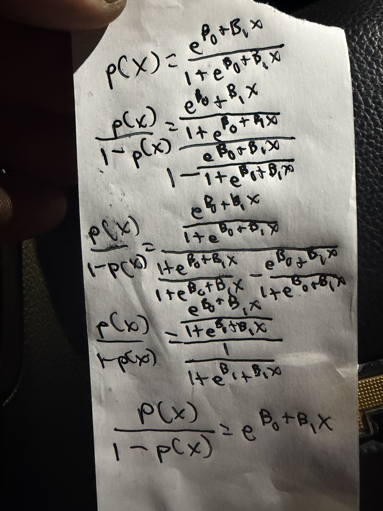
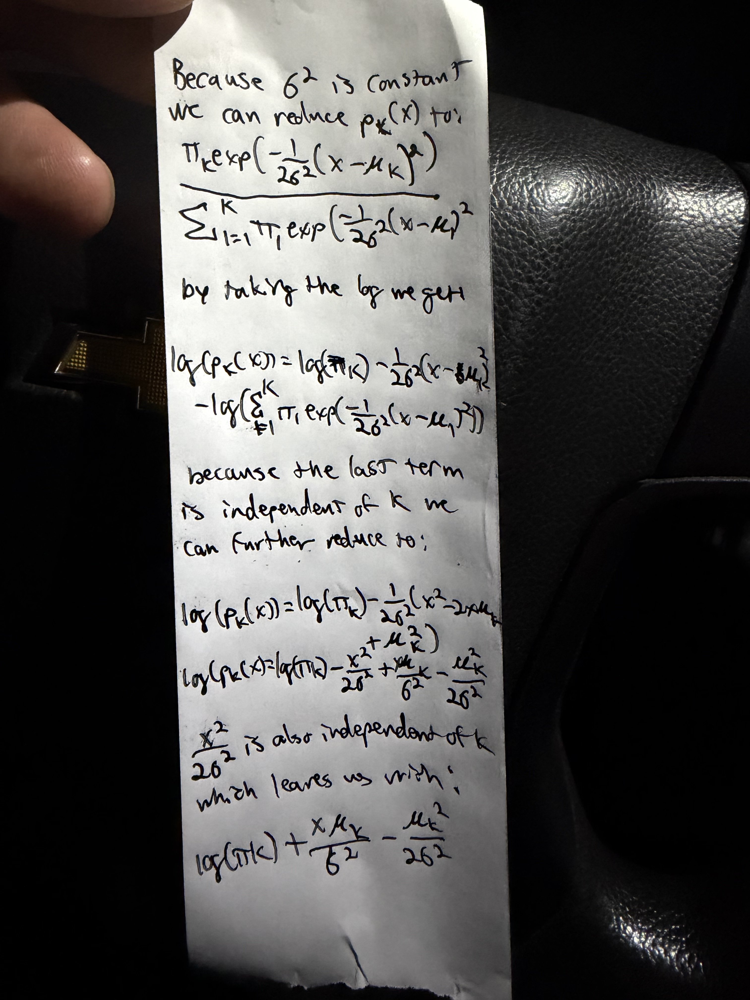

# M3: Chapter 4

## Question 1: 

### Using a little bit of algebra, prove that (4.2) is equivalent to (4.3). In other words, the logistic function representation and logit representation for the logistic regression model are equivalent.



## Question 2:

### It was stated in the text that classifying an observation to the class for which (4.17) is largest is equivalent to classifying an observation to the class for which (4.18) is largest. Prove that this is the case. In other words, under the assumption that the observations in the kth class are drawn from a N (μk, σ2) distribution, the Bayes classifier assigns an observation to the class for which the discriminant function is maximized.



## Question 4:

### 4. When the number of features p is large, there tends to be a deterioration in the performance of KNN and other local approaches that perform prediction using only observations that are near the test observation for which a prediction must be made. This phenomenon is known as the curse of dimensionality, and it ties into the fact that curse of dimensionality non-parametric approaches often perform poorly when p is large. We will now investigate this curse.

### (a) Suppose that we have a set of observations, each with measurements on p = 1 feature, X. We assume that X is uniformly (evenly) distributed on [0, 1]. Associated with each observation is a response value. Suppose that we wish to predict a test observation’s response using only observations that are within 10 % of the range of X closest to that test observation. For instance, in order to predict the response for a test observation with X = 0.6, we will use observations in the range [0.55, 0.65]. On average, what fraction of the available observations will we use to make the prediction?

10%: Being in a uniform distribution means on average 10% of the range will include approximately 10% of the observations.

### (b) Now suppose that we have a set of observations, each with measurements on p = 2 features, X1 and X2. We assume that (X1, X2) are uniformly distributed on [0, 1] × [0, 1]. We wish to predict a test observation’s response using only observations that are within 10 % of the range of X1 and within 10 % of the range of X2 closest to that test observation. For instance, in order to predict the response for a test observation with X1 = 0.6 and X2 = 0.35, we will use observations in the range [0.55, 0.65] for X1 and in the range [0.3, 0.4] for X2. On average, what fraction of the available observations will we use to make the prediction?

1%: 10% of X1 * 10% of X2

### (c) Now suppose that we have a set of observations on p = 100 features. Again the observations are uniformly distributed on each feature, and again each feature ranges in value from 0 to 1. We wish to predict a test observation’s response using observations within the 10 % of each feature’s range that is closest to that test observation. What fraction of the available observations will we use to make the prediction?

.1^100 * 100, or 10^-98%

### (d) Using your answers to parts (a)–(c), argue that a drawback of KNN when p is large is that there are very few training observations “near” any given test observation.

Any given observation will have fewer nearby observations as p increases, and if there aren't enough nearby observations KNN doesn't work.

## Question 13

```r
library(MASS)
library(ISLR2)
library(class)
library(e1071)
```

### (a) Produce some numerical and graphical summaries of the Weekly data. Do there appear to be any patterns?

```r
summary(Weekly)
#       Year           Lag1               Lag2               Lag3               Lag4               Lag5              Volume            Today          Direction 
#  Min.   :1990   Min.   :-18.1950   Min.   :-18.1950   Min.   :-18.1950   Min.   :-18.1950   Min.   :-18.1950   Min.   :0.08747   Min.   :-18.1950   Down:484  
#  1st Qu.:1995   1st Qu.: -1.1540   1st Qu.: -1.1540   1st Qu.: -1.1580   1st Qu.: -1.1580   1st Qu.: -1.1660   1st Qu.:0.33202   1st Qu.: -1.1540   Up  :605  
#  Median :2000   Median :  0.2410   Median :  0.2410   Median :  0.2410   Median :  0.2380   Median :  0.2340   Median :1.00268   Median :  0.2410             
#  Mean   :2000   Mean   :  0.1506   Mean   :  0.1511   Mean   :  0.1472   Mean   :  0.1458   Mean   :  0.1399   Mean   :1.57462   Mean   :  0.1499             
#  3rd Qu.:2005   3rd Qu.:  1.4050   3rd Qu.:  1.4090   3rd Qu.:  1.4090   3rd Qu.:  1.4090   3rd Qu.:  1.4050   3rd Qu.:2.05373   3rd Qu.:  1.4050             
#  Max.   :2010   Max.   : 12.0260   Max.   : 12.0260   Max.   : 12.0260   Max.   : 12.0260   Max.   : 12.0260   Max.   :9.32821   Max.   : 12.0260     

plot(Weekly, cex=.1)
```


Year and volume have a particularly strong association

```r
par(mfrow=c(1,1))
plot(Weekly$Year, Weekly$Volume)
```


### (b) Use the full data set to perform a logistic regression with Direction as the response and the five lag variables plus Volume as predictors. Use the summary function to print the results. Do any of the predictors appear to be statistically significant? If so, which ones?

```r
direction_reg <- glm(Direction ~ Lag1 + Lag2 + Lag3 + Lag4 + Lag5 + Volume, data = Weekly, family = binomial)
summary(direction_reg)
# Call:
# glm(formula = Direction ~ Lag1 + Lag2 + Lag3 + Lag4 + Lag5 + 
#     Volume, family = binomial, data = Weekly)

# Coefficients:
#             Estimate Std. Error z value Pr(>|z|)   
# (Intercept)  0.26686    0.08593   3.106   0.0019 **
# Lag1        -0.04127    0.02641  -1.563   0.1181   
# Lag2         0.05844    0.02686   2.175   0.0296 * 
# Lag3        -0.01606    0.02666  -0.602   0.5469   
# Lag4        -0.02779    0.02646  -1.050   0.2937   
# Lag5        -0.01447    0.02638  -0.549   0.5833   
# Volume      -0.02274    0.03690  -0.616   0.5377   
# ---
# Signif. codes:  0 ‘***’ 0.001 ‘**’ 0.01 ‘*’ 0.05 ‘.’ 0.1 ‘ ’ 1

# (Dispersion parameter for binomial family taken to be 1)

#     Null deviance: 1496.2  on 1088  degrees of freedom
# Residual deviance: 1486.4  on 1082  degrees of freedom
# AIC: 1500.4

# Number of Fisher Scoring iterations: 4
```

Lag2 is the only significant predictor, Lag1 is the next closest

### (c) Compute the confusion matrix and overall fraction of correct predictions. Explain what the confusion matrix is telling you about the types of mistakes made by logistic regression.

```r
cm <- predict(direction_reg, type = "response") > .5
cm
direction_table <- table(cm, Weekly$Direction)
direction_table
sum(diag(direction_table)/sum(direction_table))
# cm      Down  Up
#   FALSE   54  48
#   TRUE   430 557
```

56.11% predictions correct, slightly better than random, very high false positive rate

### (d) Now fit the logistic regression model using a training data period from 1990 to 2008, with Lag2 as the only predictor. Compute the confusion matrix and the overall fraction of correct predictions for the held out data (that is, the data from 2009 and 2010).

```r
b4_09 <- Weekly$Year < 2009
Lag2_train <- Weekly[b4_09,]
Lag2_test <- Weekly[!b4_09,]

lag2_reg <- glm(Direction ~ Lag2, data = Lag2_train, family = binomial)
lag2_pred <- predict(lag2_reg, Lag2_test, type = "response") > 0.5
lag2_table <- table(lag2_pred, Lag2_test$Direction)
lag2_table
# lag2_pred Down Up
#     FALSE    9  5
#     TRUE    34 56
sum(diag(lag2_table))/sum(lag2_table)
# 0.625
```

.625 is better but still high false positive rate, and the data has more positives in this case

### (e) Repeat (d) using LDA.

```r
lag2_lda <- lda(Direction ~ Lag2, data = Lag2_train)
lag2_ldapred <- predict(lag2_lda, Lag2_test, type = "response")$class
lag2_ldatable <- table(lag2_ldapred, Lag2_test$Direction)
lag2_ldatable
# lag2_ldapred Down Up
#         Down    9  5
#         Up     34 56
sum(diag(lag2_ldatable))/sum(lag2_ldatable)
# 0.625
```

same result

### (f) Repeat (d) using QDA.

```r
lag2_qda <- qda(Direction ~ Lag2, data = Lag2_train)
lag2_qdapred <- predict(lag2_qda, Lag2_test, type = "response")$class
lag2_qdatable <- table(lag2_qdapred,  Lag2_test$Direction)
lag2_qdatable
# lag2_qdapred Down Up
#         Down    0  0
#         Up     43 61
sum(diag(lag2_qdatable)/ sum(lag2_qdatable))
# 0.5865385
```

now it's all positives

### (g) Repeat (d) using KNN with K = 1.

```r
lag2_knn <- knn(Lag2_train[, "Lag2", drop=FALSE], Lag2_test[, "Lag2", drop=FALSE], Lag2_train$Direction, k=1)
lag2_knntable <- table(lag2_knn, Lag2_test$Direction)
lag2_knntable
# lag2_knn Down Up
#     Down   21 29
#     Up     22 32
sum(diag(lag2_knntable))/sum(lag2_knntable)
# 0.5096154
```

.509 but even distribution

### (h) Repeat (d) using naive Bayes.

```r
lag2_nb <- naiveBayes(Direction ~ Lag2, data = Lag2_train)
lag2_nbpred <- predict(lag2_nb, Lag2_test)
lag2_nbtable <- table(lag2_nbpred, Lag2_test$Direction)
lag2_nbtable
# lag2_nbpred Down Up
#        Down    0  0
#        Up     43 61
sum(diag(lag2_nbtable))/sum(lag2_nbtable)
# 0.5865385
```

all positive again

### (i) Which of these methods appears to provide the best results on this data?

Logistic regression and LDA had the best ratings, but KNN notably had the best distribution of positives and negatives.

### (j) Experiment with different combinations of predictors, including possible transformations and interactions, for each of the methods. Report the variables, method, and associated confusion matrix that appears to provide the best results on the held out data. Note that you should also experiment with values for K in the KNN classifier.

```r
# trying adding a predictor, transformation, and interaction
# 1. logistic regression, base .625
# add predictor
log2 <- glm(Direction ~ Lag1 + Lag2, data = Lag2_train, family = binomial)
log2_pred <- ifelse(predict(log2, Lag2_test, type = "response") > 0.5, "Up", "Down")
log2_tab <- table(log2_pred, Lag2_test$Direction)
log2_tab
sum(diag(log2_tab)) / sum(log2_tab)
# .577, worse

# transformation
log3 <- glm(Direction ~ Lag2 + I(Lag2^2), data = Lag2_train, family = binomial)
log3_pred <- ifelse(predict(log3, Lag2_test, type = "response") > 0.5, "Up", "Down")
log3_tab <- table(log3_pred, Lag2_test$Direction)
log3_tab
sum(diag(log3_tab)) / sum(log3_tab)
# .625, exact same score with almost identical distribution to base

# interaction
log4 <- glm(Direction ~ Lag2 * Volume, data = Lag2_train, family = binomial)
log4_pred <- ifelse(predict(log4, Lag2_test, type = "response") > 0.5, "Up", "Down")
log4_tab <- table(log4_pred, Lag2_test$Direction)
log4_tab
sum(diag(log4_tab)) / sum(log4_tab)
# .538, worse, better distribution though

# 2 LDA, base .625
# predictor
lda2 <- lda(Direction ~ Lag1 + Lag2, data = Lag2_train)
lda2_tab <- table(predict(lda2, Lag2_test)$class, Lag2_test$Direction)
lda2_tab
sum(diag(lda2_tab)) / sum(lda2_tab)
# .57 too many false positives

# transformation
lda3 <- lda(Direction ~ Lag2 + I(Lag2^2), data = Lag2_train)
lda3_tab <- table(predict(lda3, Lag2_test)$class, Lag2_test$Direction)
lda3_tab
sum(diag(lda3_tab)) / sum(lda3_tab)
# .615 still too many false positives

# interaction
lda4 <- lda(Direction ~ Lag2 * Volume, data = Lag2_train)
lda4_tab <- table(predict(lda4, Lag2_test)$class, Lag2_test$Direction)
lda4_tab
sum(diag(lda4_tab)) / sum(lda4_tab)
# .538 better distribution

# 3 QDA, base .587
# predictor
qda2 <- qda(Direction ~ Lag1 + Lag2, data = Lag2_train)
qda2_tab <- table(predict(qda2, Lag2_test)$class, Lag2_test$Direction)
qda2_tab
sum(diag(qda2_tab)) / sum(qda2_tab)
# .558, high false positives

# transformation
qda3 <- qda(Direction ~ Lag2 + I(Lag2^2), data = Lag2_train)
qda3_tab <- table(predict(qda3, Lag2_test)$class, Lag2_test$Direction)
qda3_tab
sum(diag(qda3_tab)) / sum(qda3_tab)
# .625, still high false positives

# interaction
qda4 <- qda(Direction ~ Lag2 * Volume, data = Lag2_train)
qda4_tab <- table(predict(qda4, Lag2_test)$class, Lag2_test$Direction)
qda4_tab
sum(diag(qda4_tab)) / sum(qda4_tab)
# .471, more false negatives now

# 4 naive bayes, base .587(all positive)
# predictor
nb2 <- naiveBayes(Direction ~ Lag1 + Lag2, data = Lag2_train)
nb2_tab <- table(predict(nb2, Lag2_test), Lag2_test$Direction)
nb2_tab
sum(diag(nb2_tab)) / sum(nb2_tab)
# .538
# transformation
nb3 <- naiveBayes(Direction ~ Lag2 + I(Lag2^2), data = Lag2_train)
nb3_tab <- table(predict(nb3, Lag2_test), Lag2_test$Direction)
nb3_tab
sum(diag(nb3_tab)) / sum(nb3_tab)
# .587, all positive
# interaction (Naive Bayes can't handle interaction terms, use additive instead)
nb4 <- naiveBayes(Direction ~ Lag2 + Volume, data = Lag2_train)
nb4_tab <- table(predict(nb4, Lag2_test), Lag2_test$Direction)
nb4_tab
sum(diag(nb4_tab)) / sum(nb4_tab)
# .452, almost all negatives

# KNN 
# standardize data
knn_formula <- Direction ~ Lag1 + Lag2
knn_train <- model.matrix(knn_formula, data = Lag2_train)[, -1, drop = FALSE]
knn_test <- model.matrix(knn_formula, data = Lag2_test)[, -1, drop = FALSE]
knn_train <- scale(knn_train)
knn_test <- scale(knn_test, center = attr(knn_train, "scaled:center"), scale = attr(knn_train, "scaled:scale"))

# 1
knn1 <- knn(knn_train, knn_test, Lag2_train$Direction, k = 1)
knn1_tab <- table(knn1, Lag2_test$Direction)
knn1_tab
sum(diag(knn1_tab)) / sum(knn1_tab)
# .481

# 3
knn3 <- knn(knn_train, knn_test, Lag2_train$Direction, k = 3)
knn3_tab <- table(knn3, Lag2_test$Direction)
knn3_tab
sum(diag(knn3_tab)) / sum(knn3_tab)
# .519

# 5
knn5 <- knn(knn_train, knn_test, Lag2_train$Direction, k = 5)
knn5_tab <- table(knn5, Lag2_test$Direction)
knn5_tab
sum(diag(knn5_tab)) / sum(knn5_tab)
# .490

# 7
knn7 <- knn(knn_train, knn_test, Lag2_train$Direction, k = 7)
knn7_tab <- table(knn7, Lag2_test$Direction)
knn7_tab
sum(diag(knn7_tab)) / sum(knn7_tab)
# .529

# 9
knn9 <- knn(knn_train, knn_test, Lag2_train$Direction, k = 9)
knn9_tab <- table(knn9, Lag2_test$Direction)
knn9_tab
sum(diag(knn9_tab)) / sum(knn9_tab)
# .538

# 16
# create binary response
crime_med <- median(Boston$crim)
crime_med
Boston$high_crime <- ifelse(Boston$crim > crime_med, "Yes", "No")
Boston$high_crime <- as.factor(Boston$high_crime)
# split into train/test
set.seed(1)
train_idx <- sample(1:nrow(Boston), nrow(Boston) * 0.7)
boston_train <- Boston[train_idx, ]
boston_test <- Boston[-train_idx, ]
table(boston_train$high_crime)
table(boston_test$high_crime)

# Logistic regression
# some predictors
log_boston1 <- glm(high_crime ~ nox + rad + dis + lstat, data = boston_train, family = binomial)
log_boston1_pred <- ifelse(predict(log_boston1, boston_test, type = "response") > 0.5, "Yes", "No")
log_boston1_tab <- table(log_boston1_pred, boston_test$high_crime)
log_boston1_tab
sum(diag(log_boston1_tab)) / sum(log_boston1_tab)
# .816, even distribution

# all predictors
log_boston2 <- glm(high_crime ~ . - crim, data = boston_train, family = binomial)
log_boston2_pred <- ifelse(predict(log_boston2, boston_test, type = "response") > 0.5, "Yes", "No")
log_boston2_tab <- table(log_boston2_pred, boston_test$high_crime)
log_boston2_tab
sum(diag(log_boston2_tab)) / sum(log_boston2_tab)
# .888

# LDA
lda_boston1 <- lda(high_crime ~ nox + rad + dis + lstat, data = boston_train)
lda_boston1_tab <- table(predict(lda_boston1, boston_test)$class, boston_test$high_crime)
lda_boston1_tab
sum(diag(lda_boston1_tab)) / sum(lda_boston1_tab)
# .855

lda_boston2 <- lda(high_crime ~ . - crim, data = boston_train)
lda_boston2_tab <- table(predict(lda_boston2, boston_test)$class, boston_test$high_crime)
lda_boston2_tab
sum(diag(lda_boston2_tab)) / sum(lda_boston2_tab)
# .849

# Naive Bayes
nb_boston1 <- naiveBayes(high_crime ~ nox + rad + dis + lstat, data = boston_train)
nb_boston1_tab <- table(predict(nb_boston1, boston_test), boston_test$high_crime)
nb_boston1_tab
sum(diag(nb_boston1_tab)) / sum(nb_boston1_tab)
# .815

nb_boston2 <- naiveBayes(high_crime ~ . - crim, data = boston_train)
nb_boston2_tab <- table(predict(nb_boston2, boston_test), boston_test$high_crime)
nb_boston2_tab
sum(diag(nb_boston2_tab)) / sum(nb_boston2_tab)
# .796

# KNN with different K values
knn_boston_train <- scale(boston_train[, c("nox", "rad", "dis", "lstat")])
knn_boston_test <- scale(boston_test[, c("nox", "rad", "dis", "lstat")],
                          center = attr(knn_boston_train, "scaled:center"),
                          scale = attr(knn_boston_train, "scaled:scale"))

knn_boston_k1 <- knn(knn_boston_train, knn_boston_test, boston_train$high_crime, k = 1)
knn_boston_k1_tab <- table(knn_boston_k1, boston_test$high_crime)
knn_boston_k1_tab
sum(diag(knn_boston_k1_tab)) / sum(knn_boston_k1_tab)
# .928

knn_boston_k5 <- knn(knn_boston_train, knn_boston_test, boston_train$high_crime, k = 5)
knn_boston_k5_tab <- table(knn_boston_k5, boston_test$high_crime)
knn_boston_k5_tab
sum(diag(knn_boston_k5_tab)) / sum(knn_boston_k5_tab)
# .921

knn_boston_k10 <- knn(knn_boston_train, knn_boston_test, boston_train$high_crime, k = 10)
knn_boston_k10_tab <- table(knn_boston_k10, boston_test$high_crime)
knn_boston_k10_tab
sum(diag(knn_boston_k10_tab)) / sum(knn_boston_k10_tab)
# .914
```

KNN best by far with .928 with k = 1

best outside of KNN is .625 on QDA with transformations, which had a high false positive rate


### Question 16

### Using the Boston data set, fit classification models in order to predict whether a given census tract has a crime rate above or below the median. Explore logistic regression, LDA, naive Bayes, and KNN models using various subsets of the predictors. Describe your findings.

```r
# convert data to above/below median crime
boston16 <- Boston
crime_median <- median(boston16$crim)
boston16$high_crime <- factor(ifelse(boston16$crim > crime_median, "Yes", "No"))

# split train and test
set.seed(16)
train16 <- sample(1:nrow(boston16), nrow(boston16) * 0.7)
train_b <- boston16[train16, ]
test_b <- boston16[-train16, ]

# logistic regression (small subset)
log16 <- glm(high_crime ~ nox + rad + dis + lstat, data = train_b, family = binomial)
log16_pred <- ifelse(predict(log16, test_b, type = "response") > 0.5, "Yes", "No")
log16_tab <- table(log16_pred, test_b$high_crime)
log16_tab
sum(diag(log16_tab)) / sum(log16_tab)
# .868

# LDA (same subset)
lda16 <- lda(high_crime ~ nox + rad + dis + lstat, data = train_b)
lda16_tab <- table(predict(lda16, test_b)$class, test_b$high_crime)
lda16_tab
sum(diag(lda16_tab)) / sum(lda16_tab)
# .842

# naive Bayes (same subset)
nb16 <- naiveBayes(high_crime ~ nox + rad + dis + lstat, data = train_b)
nb16_tab <- table(predict(nb16, test_b), test_b$high_crime)
nb16_tab
sum(diag(nb16_tab)) / sum(nb16_tab)
# .842

# KNN (scaled predictors), try a few k values
x_train16 <- scale(train_b[, c("nox", "rad", "dis", "lstat")])
x_test16 <- scale(test_b[, c("nox", "rad", "dis", "lstat")], center = attr(x_train16, "scaled:center"), scale = attr(x_train16, "scaled:scale"))

knn16_k1 <- knn(x_train16, x_test16, train_b$high_crime, k = 1)
knn16_k5 <- knn(x_train16, x_test16, train_b$high_crime, k = 5)
knn16_k10 <- knn(x_train16, x_test16, train_b$high_crime, k = 10)

knn16_k1_tab <- table(knn16_k1, test_b$high_crime)
knn16_k5_tab <- table(knn16_k5, test_b$high_crime)
knn16_k10_tab <- table(knn16_k10, test_b$high_crime)

knn16_k1_tab
sum(diag(knn16_k1_tab)) / sum(knn16_k1_tab)
# .928
knn16_k5_tab
sum(diag(knn16_k5_tab)) / sum(knn16_k5_tab)
# .908
knn16_k10_tab
sum(diag(knn16_k10_tab)) / sum(knn16_k10_tab)
# .901
```

KNN is still the best but not by as much