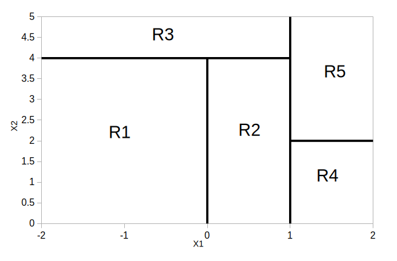
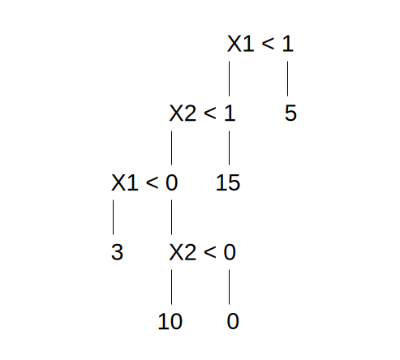
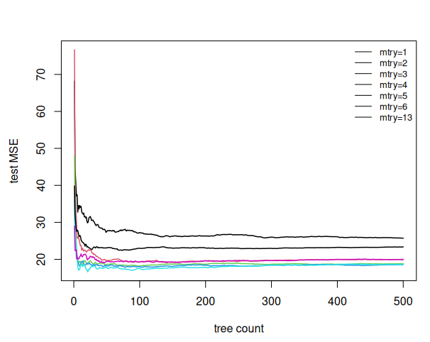
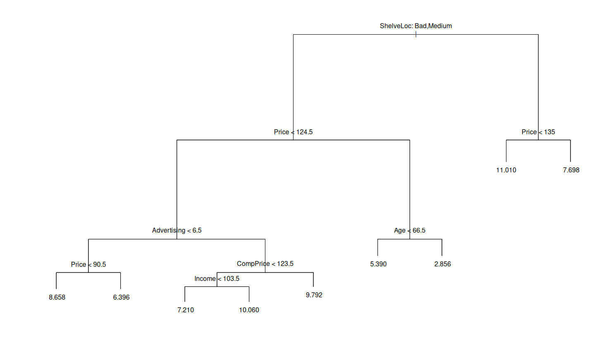
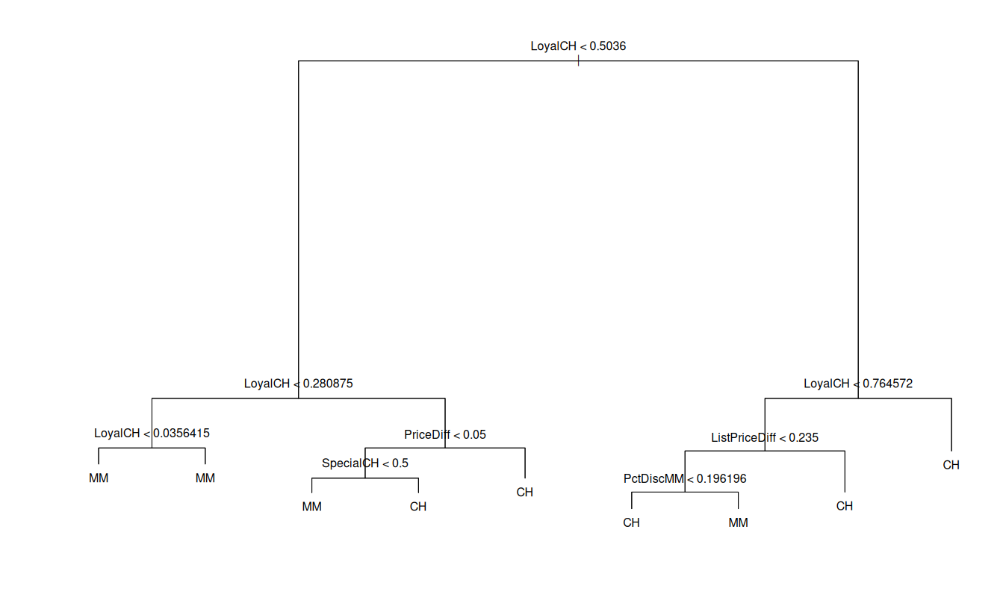
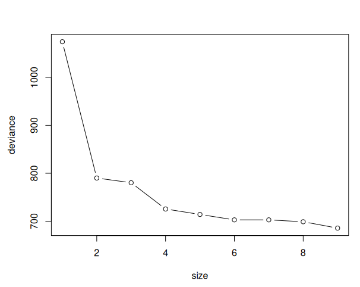
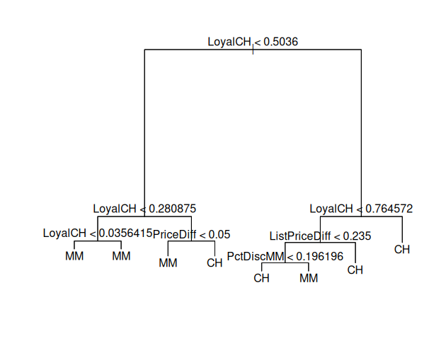
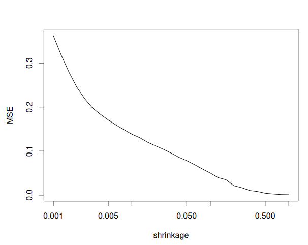
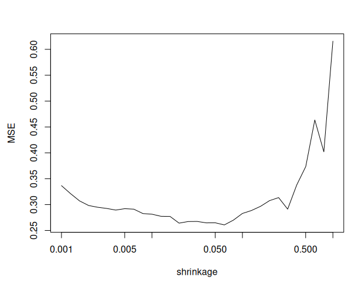
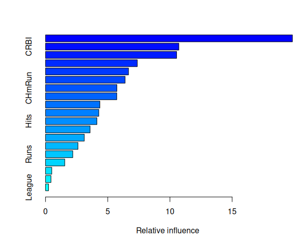

# M4: Chapter 8

## Question 1:

### Draw an example (of your own invention) of a partition of two-dimensional feature space that could result from recursive binary splitting. Your example should contain at least six regions. Draw a decision tree corresponding to this partition. Be sure to label all aspects of your figures, including the regions R1, R2, . . ., the cutpoints t1, t2, . . ., and so forth.




## Question 3:

### Consider the Gini index, classification error, and entropy in a simple classification setting with two classes. Create a single plot that displays each of these quantities as a function of ˆpm1. The x-axis should display ˆpm1, ranging from 0 to 1, and the y-axis should display the value of the Gini index, classification error, and entropy.

```r
library(ISLR2)
library(MASS)
library(randomForest)
library(tree)
library(BART)
library(gbm)
library(glmnet)
set.seed(1)

prange = seq(0, 1, 0.01)
gini = prange * (1 - prange) * 2
entropy = -(prange * log(prange) + (1 - prange) * log(1 - prange))
class.err = 1 - pmax(prange, 1 - prange)
matplot(prange, cbind(gini, entropy, class.err), type = "l", lty = 1, col = c("red" ,"green", "blue"))
```


## Question 4:

### (a) Sketch the tree corresponding to the partition of the predictor space illustrated in the left-hand panel of Figure 8.14. The numbers inside the boxes indicate the mean of Y within each region.



### (b) Create a diagram similar to the left-hand panel of Figure 8.14, using the tree illustrated in the right-hand panel of the same figure. You should divide up the predictor space into the correct regions, and indicate the mean for each region.


## Question 6:

### Provide a detailed explanation of the algorithm that is used to fit a regression tree.

To build a regression tree you first use recursive binary splitting to divide the predictor space into distinct regions choosing boundaries which minimize RSS, and then take the mean of each region to make a prediction. Then the tree is pruned using cost-complexity pruning to get a sequence of best subtrees, and then choose α using k-fold cross-validation

## Question 7: 
### In the lab, we applied random forests to the Boston data using mtry = 6 and using ntree = 25 and ntree = 500. Create a plot displaying the test error resulting from random forests on this data set for a more comprehensive range of values for mtry and ntree. You can model your plot after Figure 8.10. Describe the results obtained.

```r
boston_train <- sample(nrow(Boston), nrow(Boston) / 2)
x_train <- Boston[boston_train, -14]
x_test  <- Boston[-boston_train, -14]
y_train <- Boston[boston_train, 14]
y_test  <- Boston[-boston_train, 14]

p <- ncol(Boston) - 1
mtry_grid <- sort(unique(c(1:6, floor(sqrt(p)), floor(p/2), p)))
mtry_grid <- mtry_grid[mtry_grid >= 1 & mtry_grid <= p]

rf_list <- lapply(mtry_grid, function(m) {
  randomForest(x_train, y_train, xtest = x_test, ytest = y_test, mtry = as.integer(m), ntree = 500)
})

mse_mat <- sapply(rf_list, function(mod) mod$test$mse)

par(mfrow=c(1,1))
matplot(1:500, mse_mat, type = "l", lty = 1, lwd = 1.5,
        xlab = "tree count", ylab = "test MSE")
legend("topright", legend = paste0("mtry=", mtry_grid), lty = 1, cex = 0.8, bty = "n")

final_mse <- sapply(rf_list, function(mod) tail(mod$test$mse, 1))
mtry_grid[which.min(final_mse)]
# 4
```



## Question 8:

### In the lab, a classification tree was applied to the Carseats data set after converting Sales into a qualitative response variable. Now we will seek to predict Sales using regression trees and related approaches, treating the response as a quantitative variable.

### (a) Split the data set into a training set and a test set.

```r
seats = sample(dim(Carseats)[1], dim(Carseats)[1]/2)
seatsTrain = Carseats[seats, ]
seatsTest = Carseats[-seats, ]
```

### (b) Fit a regression tree to the training set. Plot the tree, and interpret the results. What test MSE do you obtain?

```r
# b.
seatsTree = tree(Sales ~ ., data = seatsTrain)
summary(seatsTree)
# Regression tree:
# tree(formula = Sales ~ ., data = seatsTrain)
# Variables actually used in tree construction:
# [1] "ShelveLoc"   "Price"       "Advertising" "CompPrice"   "Income"      "Age"         "Education"  
# Number of terminal nodes:  15 
# Residual mean deviance:  2.257 = 417.6 / 185 
# Distribution of residuals:
#     Min.  1st Qu.   Median     Mean  3rd Qu.     Max. 
# -4.11800 -1.03600 -0.09598  0.00000  0.93210  3.92200 
plot(seatsTree)
text(seatsTree, pretty=0)
```


```r
seatsPred = predict(seatsTree, seatsTest)
mean((seatsTest$Sales - seatsPred)^2)
```
4.467

### (c) Use cross-validation in order to determine the optimal level of tree complexity. Does pruning the tree improve the test MSE?

```r
seatsCV = cv.tree(seatsTree, FUN = prune.tree)
par(mfrow = c(1, 2))
plot(seatsCV$size, seatsCV$dev, type = "b")
plot(seatsCV$k, seatsCV$dev, type = "b")
```


```r
seatsPruned = prune.tree(seatsTree, best = 9)
par(mfrow = c(1, 1))
plot(seatsPruned)
text(seatsPruned, pretty = 0)
```



```r
seatsPredPruned = predict(seatsPruned, seatsTest)
mean((seatsTest$Sales - seatsPredPruned)^2)
```

4.930, slightly worse

### (d) Use the bagging approach in order to analyze this data. What test MSE do you obtain? Use the importance() function to determine which variables are most important.

```r
seatsBagging = randomForest(Sales ~ ., data = seatsTrain, mtry = 10, ntree = 500, importance = T)
seatsPred = predict(seatsBagging, seatsTest)
mean((seatsTest$Sales - seatsPred)^2)
# 2.657, significant improvement
importance(seatsBagging)
#                %IncMSE IncNodePurity
# CompPrice   22.6573129    163.197222
# Income       5.3467058     70.033569
# Advertising 17.6655056    114.550361
# Population  -2.0496276     50.400235
# Price       55.8564641    440.222018
# ShelveLoc   55.8246534    487.249416
# Age         16.9697585    173.575879
# Education   -0.8291257     36.219946
# Urban       -1.3600581      6.537491
# US           4.5260236     14.009189
```

Price and ShelveLoc are the most important

### (e) Use random forests to analyze this data. What test MSE do you obtain? Use the importance() function to determine which variables are most important. Describe the effect of m, the number of variables considered at each split, on the error rate obtained.

```r
seatsForest = randomForest(Sales ~ ., data = seatsTrain, mtry = 5, ntree = 500, importance = T)
seatsPredForest = predict(seatsForest, seatsTest)
mean((seatsTest$Sales - seatsPredForest)^2)
# 2.526 also good
importance(seatsForest)
```

Price and ShelveLoc are still most important

### (f) Now analyze the data using BART, and report your results.

```r
full_x = rbind(subset(seatsTrain, select = -Sales), subset(seatsTest, select = -Sales))
mm = model.matrix(~ . - 1, data = full_x)
ntrain = nrow(seatsTrain)
bartTrain = mm[1:ntrain, , drop = FALSE]
bartTest  = mm[(ntrain + 1):nrow(mm), , drop = FALSE]
salesTrain = seatsTrain$Sales

seatsBart <- gbart(
  x.train = bartTrain,
  y.train = salesTrain,
  x.test  = bartTest,
  ntree   = 200,
  ndpost  = 2000,
  nskip   = 500
)
seatsBartPred = seatsBart$yhat.test.mean
seatsBartMSE = mean((seatsTest$Sales - seatsBartPred)^2)
print(seatsBartMSE)
# 1.451
```

significant improvement

## Question 9:

### This problem involves the OJ data set which is part of the ISLR2 package.

### (a) Create a training set containing a random sample of 800 observations, and a test set containing the remaining observations.

```r
?OJ
ntrain <- sample(1:nrow(OJ), 800)
ojTrain <- OJ[ntrain, ]
ojTest <- OJ[-ntrain, ]
```

### (b) Fit a tree to the training data, with Purchase as the response and the other variables as predictors. Use the summary() function to produce summary statistics about the tree, and describe the results obtained. What is the training error rate? How many terminal nodes does the tree have?

```r
orangeTree <- tree(Purchase ~ ., ojTrain)
summary(orangeTree)
# Classification tree:
# tree(formula = Purchase ~ ., data = ojTrain)
# Variables actually used in tree construction:
# [1] "LoyalCH"       "PriceDiff"     "SpecialCH"     "ListPriceDiff" "PctDiscMM"    
# Number of terminal nodes:  9 
# Residual mean deviance:  0.7432 = 587.8 / 791 
# Misclassification error rate: 0.1588 = 127 / 800 
```

15.88% error, 9 terminal nodes

### (c) Type in the name of the tree object in order to get a detailed text output. Pick one of the terminal nodes, and interpret the information displayed.

```r
orangeTree
# node), split, n, deviance, yval, (yprob)
#       * denotes terminal node

#  1) root 800 1073.00 CH ( 0.60625 0.39375 )  
#    2) LoyalCH < 0.5036 365  441.60 MM ( 0.29315 0.70685 )  
#      4) LoyalCH < 0.280875 177  140.50 MM ( 0.13559 0.86441 )  
#        8) LoyalCH < 0.0356415 59   10.14 MM ( 0.01695 0.98305 ) *
#        9) LoyalCH > 0.0356415 118  116.40 MM ( 0.19492 0.80508 ) *
#      5) LoyalCH > 0.280875 188  258.00 MM ( 0.44149 0.55851 )  
#       10) PriceDiff < 0.05 79   84.79 MM ( 0.22785 0.77215 )  
#         20) SpecialCH < 0.5 64   51.98 MM ( 0.14062 0.85938 ) *
#         21) SpecialCH > 0.5 15   20.19 CH ( 0.60000 0.40000 ) *
#       11) PriceDiff > 0.05 109  147.00 CH ( 0.59633 0.40367 ) *
#    3) LoyalCH > 0.5036 435  337.90 CH ( 0.86897 0.13103 )  
#      6) LoyalCH < 0.764572 174  201.00 CH ( 0.73563 0.26437 )  
#       12) ListPriceDiff < 0.235 72   99.81 MM ( 0.50000 0.50000 )  
#         24) PctDiscMM < 0.196196 55   73.14 CH ( 0.61818 0.38182 ) *
#         25) PctDiscMM > 0.196196 17   12.32 MM ( 0.11765 0.88235 ) *
#       13) ListPriceDiff > 0.235 102   65.43 CH ( 0.90196 0.09804 ) *
#      7) LoyalCH > 0.764572 261   91.20 CH ( 0.95785 0.04215 ) *
```

2) LoyalCH is one of 8 times LoyalCH appears in the tree. It has a splitting value of .504, there are 365 points below it, the deviance for all points below it is 441.6, and the prediction for this subset is MM at 70.69% compared to 29.32% CH.

### (d) Create a plot of the tree, and interpret the results.

```r
plot(orangeTree)
text(orangeTree, pretty=0)
```



LoyalCH is quite important being all over the upper half of the tree, PriceDiff is also important, not much else matters. Loyalty to Citrus Hill matters much more than to Minute Maid, and the only other thing that matters is price.

### (e) Predict the response on the test data, and produce a confusion matrix comparing the test labels to the predicted test labels. What is the test error rate?

```r
ojPred <- predict(orangeTree, ojTest, type="class")
ojTable <- table(ojTest$Purchase, ojPred)
ojTable
#     ojPred
#       CH  MM
#   CH 160   8
#   MM  38  64
1-sum(diag(ojTable)/sum(ojTable))
#  0.1703704
```

### (f) Apply the cv.tree() function to the training set in order to determine the optimal tree size.

```r
ojCV <- cv.tree(orangeTree)
ojCV
# $size
# [1] 9 8 7 6 5 4 3 2 1

# $dev
# [1]  685.6493  698.8799  702.8083  702.8083  714.1093  725.4734  780.2099  790.0301 1074.2062

# $k
# [1]      -Inf  12.62207  13.94616  14.35384  26.21539  35.74964  43.07317  45.67120 293.15784
```
9 has the smallest standard deviance at 685, 9 is the size of the original tree, next best is 8 at 699

### (g) Produce a plot with tree size on the x-axis and cross-validated classification error rate on the y-axis.

```r
plot(ojCV$size, ojCV$dev, type = "b", xlab = "size", ylab = "deviance")
```



### (h) Which tree size corresponds to the lowest cross-validated classification error rate?

8 is the lowest aside from 9

### (i) Produce a pruned tree corresponding to the optimal tree size obtained using cross-validation. If cross-validation does not lead to selection of a pruned tree, then create a pruned tree with five terminal nodes.

```r
prunedOrangeTree <- prune.tree(orangeTree, best = 8)
plot(prunedOrangeTree)
text(prunedOrangeTree, pretty=0)
```



### (j) Compare the training error rates between the pruned and unpruned trees. Which is higher?

```r
summary(prunedOrangeTree)
# Classification tree:
# snip.tree(tree = orangeTree, nodes = 10L)
# Variables actually used in tree construction:
# [1] "LoyalCH"       "PriceDiff"     "ListPriceDiff" "PctDiscMM"    
# Number of terminal nodes:  8 
# Residual mean deviance:  0.7582 = 600.5 / 792 
# Misclassification error rate: 0.1625 = 130 / 800 
```

The misclassification error rate is 16.25% slightly worse than the original 15.88%

### (k) Compare the test error rates between the pruned and unpruned trees. Which is higher?

```r
ojPredUnpruned = predict(orangeTree, ojTest, type = "class")
unprunedMisclass = sum(ojTest$Purchase != ojPredUnpruned)
unprunedMisclass/length(ojPredUnpruned)
```

.1704

```r
ojPredPruned = predict(prunedOrangeTree, ojTest, type = "class")
prunedMisclass = sum(ojTest$Purchase != ojPredPruned)
prunedMisclass/length(ojPredPruned)
```

.1630

Improved error rate by .0074

## Question 10:

### We now use boosting to predict Salary in the Hitters data set.

### (a) Remove the observations for whom the salary information is unknown, and then log-transform the salaries.

```r
sum(is.na(Hitters$Salary))
# 59
hitData <- Hitters
hitData <- hitData[!is.na(hitData$Salary), ]
hitData$Salary <- log(hitData$Salary)
```

### (b) Create a training set consisting of the first 200 observations, and a test set consisting of the remaining observations.

```r
trainRange = 1:200
hitTrain = hitData[trainRange, ]
hitTest = hitData[-trainRange, ]
```

### (c) Perform boosting on the training set with 1,000 trees for a range of values of the shrinkage parameter λ. Produce a plot with different shrinkage values on the x-axis and the corresponding training set MSE on the y-axis.

```r
lambdas <- 10^seq(-3, 0, by = 0.1)
trainMSE <- numeric(length(lambdas))
testMSE <- numeric(length(lambdas))

for (i in seq_along(lambdas)) {
  fit <- gbm(Salary ~ ., data = hitTrain, distribution = "gaussian", n.trees = 1000, shrinkage = lambdas[i])
  trainPred <- predict(fit, hitTrain, n.trees = 1000)
  testPred <- predict(fit, hitTest, n.trees = 1000)
  trainMSE[i] <- mean((hitTrain$Salary - trainPred)^2)
  testMSE[i] <- mean((hitTest$Salary - testPred)^2)
}

plot(lambdas, trainMSE, type = "l", xlab = "shrinkage", ylab = "MSE", log = "x")
```



### (d) Produce a plot with different shrinkage values on the x-axis and the corresponding test set MSE on the y-axis.



### (e) Compare the test MSE of boosting to the test MSE that results from applying two of the regression approaches seen in Chapters 3 and 6.

```r
min(testMSE)
```
.2607
```r
# multiple linear regression
hitLinReg <- lm(Salary ~ ., data = hitData[trainRange, ])
mean((predict(hitLinReg, hitData[trainRange, ]) - hitData[trainRange, "Salary"])^2)
```
.3204
```r
# lasso regression
x = model.matrix(Salary ~ ., data = hitTrain)
y = hitTrain$Salary
xTest = model.matrix(Salary ~ ., data = hitTest)
lasso.fit = glmnet(x, y, alpha = 1)
lasso.pred = predict(lasso.fit, s = 0.01, newx = xTest)
mean((hitTest$Salary - lasso.pred)^2)
```

.4701

both methods performed worse

### (f) Which variables appear to be the most important predictors in the boosted model?

```r
summary(gbm(Salary ~ ., data = hitTrain, distribution = "gaussian", n.trees = 1000, shrinkage = lambdas[which.min(testMSE)]))
#                 var    rel.inf
# CAtBat       CAtBat 19.8456563
# CRBI           CRBI 10.7163146
# CRuns         CRuns 10.5363405
# PutOuts     PutOuts  7.3753394
# Walks         Walks  6.6704111
# Years         Years  6.3951423
# CHmRun       CHmRun  5.7359320
# CWalks       CWalks  5.7264858
# AtBat         AtBat  4.3676384
# Assists     Assists  4.2802909
# Hits           Hits  4.1289721
# HmRun         HmRun  3.5822107
# RBI             RBI  3.1148206
# Errors       Errors  2.6071210
# Runs           Runs  2.1898575
# CHits         CHits  1.5450082
# Division   Division  0.5017094
# NewLeague NewLeague  0.4382925
# League       League  0.2424567
```



CAtBat and CRBI are most important predictors

### (g) Now apply bagging to the training set. What is the test set MSE for this approach?

```r
hitRF = randomForest(Salary ~ ., data = hitTrain, ntree = 500, mtry = 19)
hitPred = predict(hitRF, hitTest)
mean((hitTest$Salary - hitPred)^2)
```

.2286

## Question 12:

### Apply boosting, bagging, random forests, and BART to a data set of your choice. Be sure to fit the models on a training set and to evaluate their performance on a test set. How accurate are the results compared to simple methods like linear or logistic regression? Which of these approaches yields the best performance?

```r
collegeData = na.omit(College)
collegeData$logApps = log(collegeData$Apps)
collegeData$Apps = NULL

n = nrow(collegeData)
trainIdx = sample(1:n, n/2)
collegeTrain = collegeData[trainIdx, ]
collegeTest = collegeData[-trainIdx, ]

# Boosting
collegeBoost = gbm(logApps ~ ., data = collegeTrain, distribution = "gaussian", n.trees = 1000, shrinkage = 0.01)
boostPred = predict(collegeBoost, newdata = collegeTest, n.trees = 1000)
mean((collegeTest$logApps - boostPred)^2)
# .0466

# bagging
predCount = ncol(collegeTrain) - 1
collegeBag = randomForest(logApps ~ ., data = collegeTrain, mtry = predCount, ntree = 500)
bagPred = predict(collegeBag, newdata = collegeTest)
mean((collegeTest$logApps - bagPred)^2)
# .0482

# random forest
collegeRF = randomForest(logApps ~ ., data = collegeTrain, mtry = floor(sqrt(predCount)), ntree = 500)
rfPred = predict(collegeRF, newdata = collegeTest)
mean((collegeTest$logApps - rfPred)^2)
# .0611

# BART
allX = rbind(subset(collegeTrain, select = -logApps), subset(collegeTest, select = -logApps))
allMM = model.matrix(~ . - 1, data = allX)
nTrain = nrow(collegeTrain)
bartTrainX = allMM[1:nTrain, , drop = FALSE]
bartTestX = allMM[(nTrain + 1):nrow(allMM), , drop = FALSE]
bartY = collegeTrain$logApps

collegeBART = gbart(bartTrainX, bartY, x.test = bartTestX, ntree = 200, ndpost = 1000, nskip = 200)
bartPred = collegeBART$yhat.test.mean
mean((collegeTest$logApps - bartPred)^2)
# .0582
```

boosting and bagging performed best