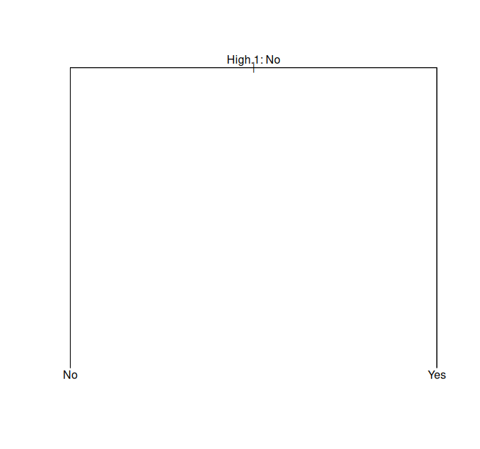
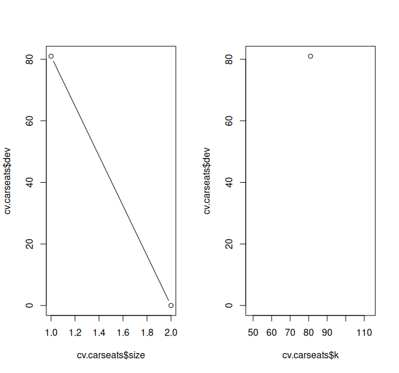
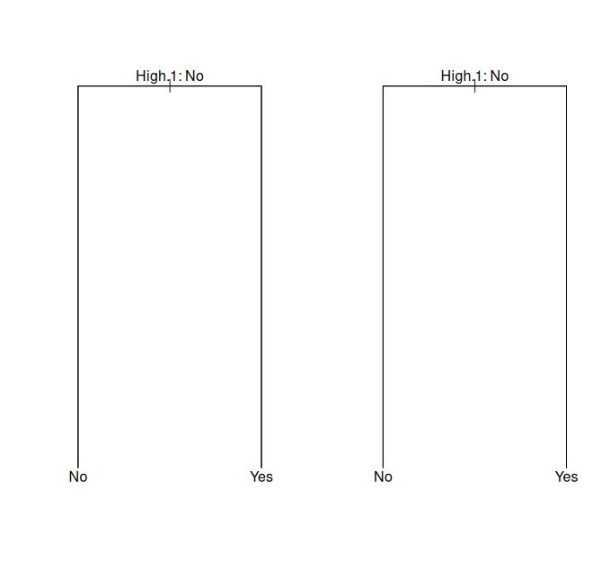
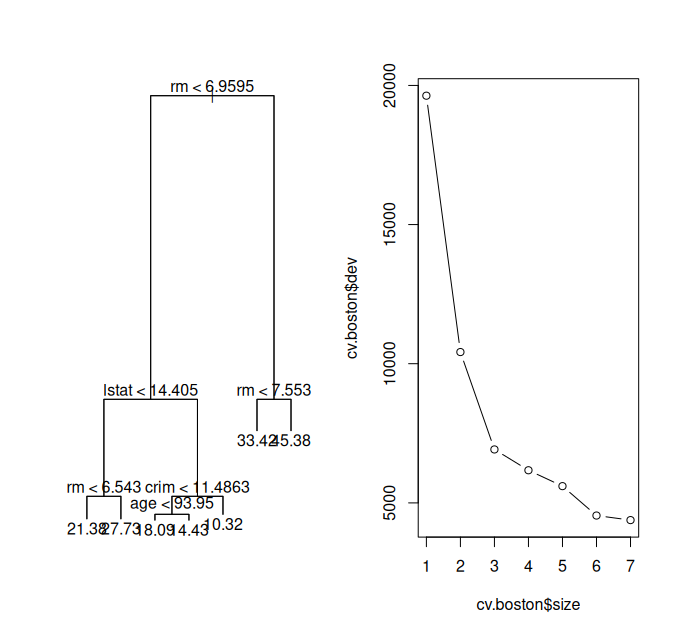
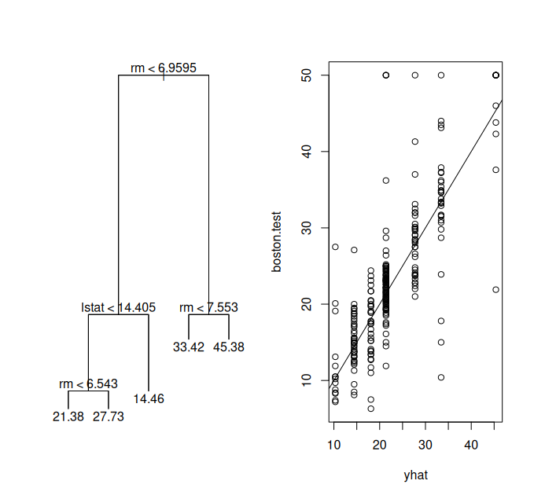
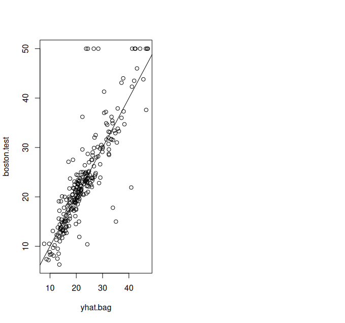
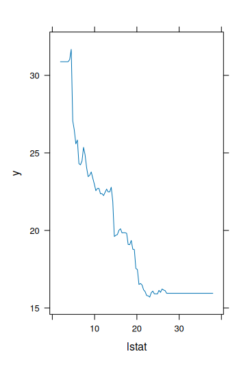

```r
## 8.3.1 Fitting Classification Trees

library(tree)

library(ISLR2)
attach(Carseats)
High <- factor(ifelse(Sales <= 8, "No", "Yes"))

Carseats <- data.frame(Carseats, High)

tree.carseats <- tree(High ~ . - Sales, Carseats)

summary(tree.carseats)
# Classification tree:
# tree(formula = High ~ . - Sales, data = Carseats)
# Variables actually used in tree construction:
# [1] "ShelveLoc"   "Price"       "Income"      "CompPrice"
# [5] "Population"  "Advertising" "Age"         "US"
# Number of terminal nodes: 27
# Residual mean deviance: 0.4575 = 170.7 / 373
# Misclassification error rate: 0.09 = 36 / 400

plot(tree.carseats)
text(tree.carseats, pretty = 0)

```



```r
tree.carseats
# node), split, n, deviance, yval, (yprob)
#       * denotes terminal node
# 1) root 400 541.5 No (0.590 0.410)
#   2) ShelveLoc: Bad, Medium 315 390.6 No (0.689 0.311)
#     4) Price < 92.5 46 56.53 Yes (0.304 0.696)
#       8) Income < 57 10 12.22 No (0.700 0.300)

set.seed(2)
train <- sample(1:nrow(Carseats), 200)
Carseats.test <- Carseats[-train, ]
High.test <- High[-train]
tree.carseats <- tree(High ~ . - Sales, Carseats, subset = train)
tree.pred <- predict(tree.carseats, Carseats.test, type = "class")
table(tree.pred, High.test)
#          High.test
# tree.pred  No Yes
#       No  104  33
#       Yes  13  50
(104 + 50) / 200
# [1] 0.77

set.seed(7)
cv.carseats <- cv.tree(tree.carseats, FUN = prune.misclass)
names(cv.carseats)
# [1] "size"   "dev"    "k"      "method"
cv.carseats
# $size
# [1] 21 19 14 9 8 5 3 2 1
#
# $dev
# [1] 75 75 75 74 82 83 83 85 82
#
# $k
# [1] -Inf 0.0 1.0 1.4 2.0 3.0 4.0 9.0 18.0
#
# $method
# [1] "misclass"
#
# attr(,"class")
# [1] "prune"         "tree.sequence"

par(mfrow = c(1, 2))
plot(cv.carseats$size, cv.carseats$dev, type = "b")
plot(cv.carseats$k, cv.carseats$dev, type = "b")

```



```r
prune.carseats <- prune.misclass(tree.carseats, best = 9)
plot(prune.carseats)
text(prune.carseats, pretty = 0)

tree.pred <- predict(prune.carseats, Carseats.test, type = "class")
table(tree.pred, High.test)
#          High.test
# tree.pred  No Yes
#       No   97  25
#       Yes  20  58
(97 + 58) / 200
# [1] 0.775

prune.carseats <- prune.misclass(tree.carseats, best = 14)
plot(prune.carseats)
text(prune.carseats, pretty = 0)
tree.pred <- predict(prune.carseats, Carseats.test, type = "class")
table(tree.pred, High.test)
#          High.test
# tree.pred  No Yes
#       No  102  31
#       Yes  15  52
(102 + 52) / 200
# [1] 0.77

```



```r

## 8.3.2 Fitting Regression Trees

set.seed(1)
train <- sample(1:nrow(Boston), nrow(Boston) / 2)
tree.boston <- tree(medv ~ ., Boston, subset = train)
summary(tree.boston)
# Regression tree:
# tree(formula = medv ~ ., data = Boston, subset = train)
# Variables actually used in tree construction:
# [1] "rm"    "lstat" "crim"  "age"
# Number of terminal nodes: 7
# Residual mean deviance: 10.4 = 2550 / 246
# Distribution of residuals:
#    Min. 1st Qu. Median   Mean 3rd Qu.   Max.
# -10.200 -1.780 -0.177  0.000   1.920 16.600

plot(tree.boston)
text(tree.boston, pretty = 0)

cv.boston <- cv.tree(tree.boston)
plot(cv.boston$size, cv.boston$dev, type = "b")
```



```r

prune.boston <- prune.tree(tree.boston, best = 5)
plot(prune.boston)
text(prune.boston, pretty = 0)

yhat <- predict(tree.boston, newdata = Boston[-train, ])
boston.test <- Boston[-train, "medv"]
plot(yhat, boston.test)
abline(0, 1)
```



```r
mean((yhat - boston.test)^2)
# [1] 35.29


## 8.3.3 Bagging and Random Forests

library(randomForest)
set.seed(1)
bag.boston <- randomForest(medv ~ ., data = Boston,
	subset = train, mtry = 12, importance = TRUE)
bag.boston
# Call:
# randomForest(formula = medv ~ ., data = Boston, mtry = 12,
#   importance = TRUE, subset = train)
#               Type of random forest: regression
#                     Number of trees: 500
# No. of variables tried at each split: 12
#
#           Mean of squared residuals: 11.40
#                     % Var explained: 85.17

yhat.bag <- predict(bag.boston, newdata = Boston[-train, ])
plot(yhat.bag, boston.test)
abline(0, 1)
```



```r
mean((yhat.bag - boston.test)^2)
# [1] 23.42

bag.boston <- randomForest(medv ~ ., data = Boston,
	subset = train, mtry = 12, ntree = 25)
yhat.bag <- predict(bag.boston, newdata = Boston[-train, ])
mean((yhat.bag - boston.test)^2)
# [1] 25.75

set.seed(1)
rf.boston <- randomForest(medv ~ ., data = Boston,
	subset = train, mtry = 6, importance = TRUE)
yhat.rf <- predict(rf.boston, newdata = Boston[-train, ])
mean((yhat.rf - boston.test)^2)
# [1] 20.07

importance(rf.boston)
#         %IncMSE IncNodePurity
# crim     19.436       1070.42
# zn        3.092         82.19
# indus     6.141        590.10
# chas      1.370         36.70
# nox      13.263        859.97
# rm       35.095       8270.34
# age      15.145        634.31
# dis       9.164        684.88
# rad       4.794         83.19
# tax       4.411        292.21
# ptratio   8.613        902.20
# lstat    28.725       5813.05

varImpPlot(rf.boston)


## 8.3.4 Boosting

library(gbm)
set.seed(1)
boost.boston <- gbm(medv ~ ., data = Boston[train, ],
	distribution = "gaussian", n.trees = 5000,
	interaction.depth = 4)

summary(boost.boston)
#            var rel.inf
# rm          rm  44.482
# lstat    lstat  32.703
# crim      crim   4.851
# dis        dis   4.487
# nox        nox   3.752
# age        age   3.198
# ptratio ptratio  2.814
# tax        tax   1.544
# indus    indus   1.034
# rad        rad   0.876
# zn          zn   0.162
# chas      chas   0.097

plot(boost.boston, i = "rm")
plot(boost.boston, i = "lstat")
```



```r
yhat.boost <- predict(boost.boston,
	newdata = Boston[-train, ], n.trees = 5000)
mean((yhat.boost - boston.test)^2)
# [1] 18.39

boost.boston <- gbm(medv ~ ., data = Boston[train, ],
	distribution = "gaussian", n.trees = 5000,
	interaction.depth = 4, shrinkage = 0.2, verbose = FALSE)
yhat.boost <- predict(boost.boston,
	newdata = Boston[-train, ], n.trees = 5000)
mean((yhat.boost - boston.test)^2)
# [1] 16.55


## 8.3.5 Bayesian Additive Regression Trees

library(BART)
x <- Boston[, 1:12]
y <- Boston[, "medv"]
xtrain <- x[train, ]
ytrain <- y[train]
xtest <- x[-train, ]
ytest <- y[-train]
set.seed(1)
bartfit <- gbart(xtrain, ytrain, x.test = xtest)

yhat.bart <- bartfit$yhat.test.mean
mean((ytest - yhat.bart)^2)
# [1] 15.95
```