## Question 1:

### This problem involves hyperplanes in two dimensions.

### (a) Sketch the hyperplane 1 + 3X1 − X2 = 0. Indicate the set of points for which 1 + 3X1 − X2 > 0, as well as the set of points for which 1 + 3X1 − X2 < 0.

```r
library(ggplot2)
library(e1071)
set.seed(1)

xlim <- c(-10, 10)
ylim <- c(-30, 30)

points <- expand.grid(
  X1 = seq(xlim[1], xlim[2], length.out = 80),
  X2 = seq(ylim[1], ylim[2], length.out = 80)
)

points$region1 <- ifelse(1 + 3 * points$X1 - points$X2 > 0, "1 + 3X1 - X2 > 0", "1 + 3X1 - X2 < 0")
points$region2 <- ifelse(-2 + points$X1 + 2 * points$X2 > 0, "-2 + X1 + 2X2 > 0", "-2 + X1 + 2X2 < 0")

ggplot(points, aes(X1, X2)) +
  geom_point(aes(color = region1), size = 1.2, alpha = 0.55) +
  geom_abline(intercept = 1, slope = 3, linewidth = 1) +
  coord_cartesian(xlim = xlim, ylim = ylim) +
  labs(x = "X1", y = "X2") +
  theme_bw()
```

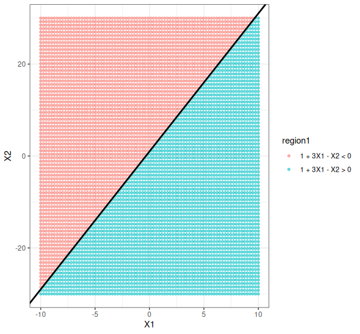

### (b) On the same plot, sketch the hyperplane −2 + X1 + 2X2 = 0. Indicate the set of points for which −2 + X1 + 2X2 > 0, as well as the set of points for which −2 + X1 + 2X2 < 0.

```r
ggplot(points, aes(X1, X2)) +
  geom_point(aes(color = region1, shape = region2), size = 1.2, alpha = 0.55) +
  geom_abline(intercept = 1, slope = 3, linewidth = 1) +
  geom_abline(intercept = 1, slope = -0.5, linetype = "dashed", linewidth = 1) +
  scale_color_manual(values = c("1 + 3X1 - X2 > 0" = "red", "1 + 3X1 - X2 < 0" = "blue")) +
  scale_shape_manual(values = c("-2 + X1 + 2X2 > 0" = 16, "-2 + X1 + 2X2 < 0" = 1)) +
  coord_cartesian(xlim = xlim, ylim = ylim) +
  labs(x = "X1", y = "X2") +
  theme_bw()

```

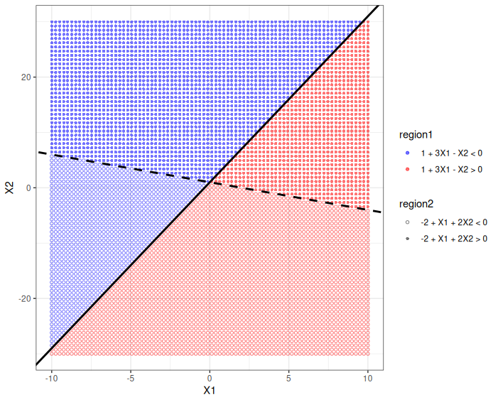

## Question 2:

### We have seen that in p = 2 dimensions, a linear decision boundary takes the form β0 +β1X1 +β2X2 = 0. We now investigate a non-linear decision boundary.

### (a) Sketch the curve (1 + X1)2 + (2 − X2)2 = 4.

```r
points <- expand.grid(
  X1 = seq(-4, 2, length.out = 100),
  X2 = seq(-1, 5, length.out = 100)
)
plotb <- ggplot(points, aes(x = X1, y = X2, z = (1 + X1)^2 + (2 - X2)^2 - 4)) + geom_contour(breaks = 0, colour = "black") + theme_bw()
plotb
```

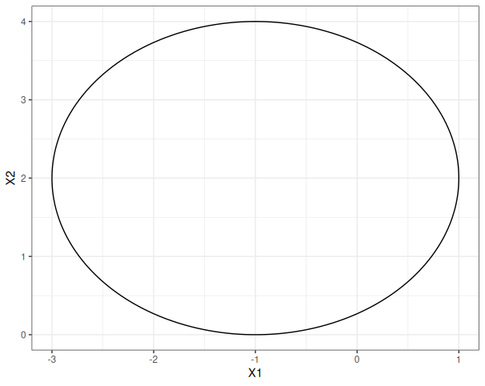

### (b) On your sketch, indicate the set of points for which (1 + X1)2 + (2 − X2)2 > 4, as well as the set of points for which (1 + X1)2 + (2 − X2)2 ≤ 4.

```r
plotb + geom_point(aes(color = (1 + X1)^2 + (2 - X2)^2 - 4 > 0), size = 0.1)
```

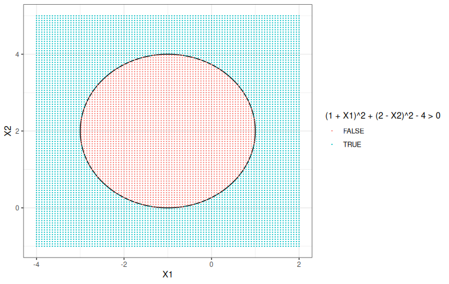

### (c) Suppose that a classifier assigns an observation to the blue class if (1 + X1)2 + (2 − X2)2 > 4, and to the red class otherwise. To what class is the observation (0, 0) classified? (−1, 1)? (2, 2)? (3, 8)?

(0, 0): blue
(-1, 1): red
(2, 2): blue
(3, 8): blue

### (d) Argue that while the decision boundary in (c) is not linear in terms of X1 and X2, it is linear in terms of X1, X2 1 , X2, and X22 X2 2 .

After adding forms of the original variables as new features the equation becomes a weighted sum of features, making it linear.

## Question 3:

### Here we explore the maximal margin classifier on a toy data set.

### (a) We are given n = 7 observations in p = 2 dimensions. For each observation, there is an associated class label.

```
Obs. X1 X2 Y
1 3 4 Red
2 2 2 Red
3 4 4 Red
4 1 4 Red
5 2 1 Blue
6 4 3 Blue
7 4 1 Blue
```

### Sketch the observations.

```r
x1 <- c(3, 2, 4, 1, 2, 4, 4)
x2 <- c(4, 2, 4, 4, 1, 3, 1)
y  = factor(c(rep("Red", 4), rep("Blue", 3)))

svm_training_data <- data.frame(x1 = x1, x2 = x2, y = y)

svmPoints <- ggplot(svm_training_data, aes(x = x1, y = x2, color = y)) +
  geom_point(size = 3) +
  coord_cartesian(xlim = c(0, 5), ylim = c(0, 5)) +
  scale_color_identity()
svmPoints
```

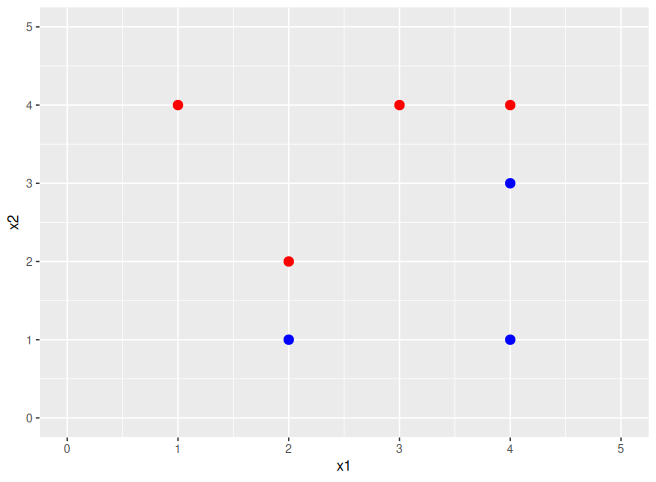

### (b) Sketch the optimal separating hyperplane, and provide the equation for this hyperplane (of the form (9.1)).

```r
svmModel <- svm(y ~ x1 + x2, data = svm_training_data, kernel = "linear", cost = 1e5, scale = FALSE)
hyperplaneWeights <- drop(t(svmModel$coefs) %*% as.matrix(svm_training_data[svmModel$index, c("x1", "x2")]))
hyperplaneIntercept <- -svmModel$rho

cat(sprintf("%.4f + %.4f*x1 + %.4f*x2 = 0\n", hyperplaneIntercept, hyperplaneWeights[1], hyperplaneWeights[2]))
# 1.0004 + -1.9998*x1 + 1.9997*x2 = 0

svmPoints + geom_abline(intercept = -hyperplaneIntercept / hyperplaneWeights[2], slope = -hyperplaneWeights[1] / hyperplaneWeights[2], linetype = "dashed")
```

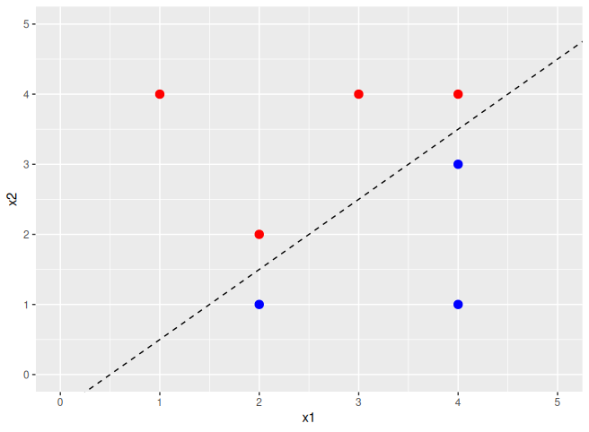

### (c) Describe the classification rule for the maximal margin classifier. It should be something along the lines of “Classify to Red if β0 + β1X1 + β2X2 > 0, and classify to Blue otherwise.” Provide the values for β0, β1, and β2.

Classify to Red if 0.5 + X1 + X2 > 0, and classify to Blue otherwise

### (d) On your sketch, indicate the margin for the maximal margin hyperplane.

```r
decisionBoundarySlope <- -hyperplaneWeights[1] / hyperplaneWeights[2]
decisionBoundaryIntercept <- -hyperplaneIntercept / hyperplaneWeights[2]
upperMarginIntercept <- (1 - hyperplaneIntercept) / hyperplaneWeights[2]
lowerMarginIntercept <- (-1 - hyperplaneIntercept) / hyperplaneWeights[2]

supportVectorData <- svm_training_data[svmModel$index, ]

svmWithMMH <- svmPoints +
  geom_abline(intercept = decisionBoundaryIntercept, slope = decisionBoundarySlope, linetype = "dashed") +
  geom_abline(intercept = upperMarginIntercept, slope = decisionBoundarySlope, linetype = "dotted") +
  geom_abline(intercept = lowerMarginIntercept, slope = decisionBoundarySlope, linetype = "dotted")
svmWithMMH
```
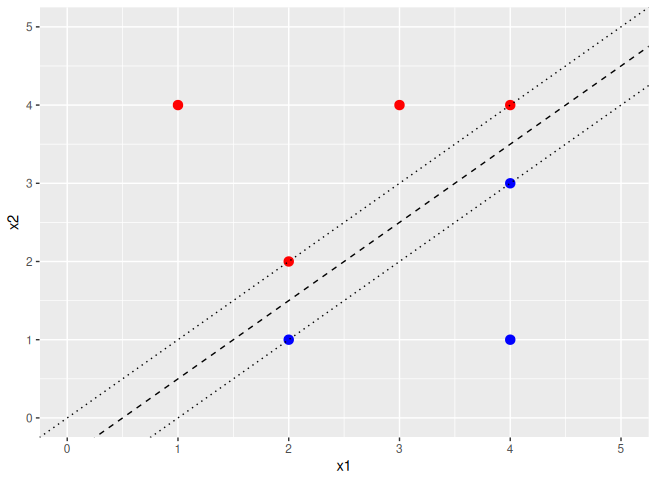

### (e) Indicate the support vectors for the maximal margin classifier.

```r
svmFinal <- svmWithMMH + geom_point(data = supportVectorData, aes(x = x1, y = x2), size = 5)
svmFinal
```

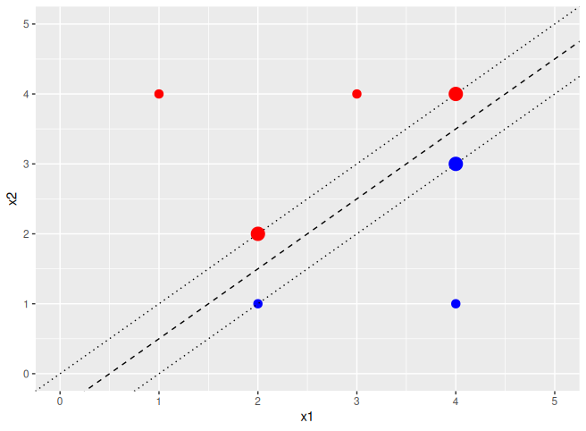

### (f) Argue that a slight movement of the seventh observation would not affect the maximal margin hyperplane.

the 7th data point is at (4,1) which is far from the margin making it not a support vector, therefore small changes will not affect the hyperplane calculation.

### (g) Sketch a hyperplane that is not the optimal separating hyperplane, and provide the equation for this hyperplane.

```r
svmPoints + geom_abline(intercept = -0.1, slope = 1)
```

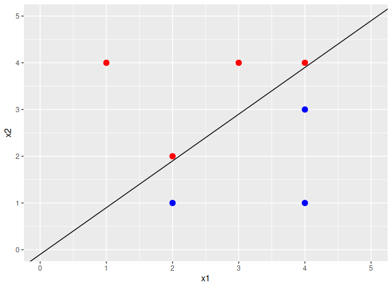

0.1 - x1 + x2 = 0

### (h) Draw an additional observation on the plot so that the two classes are no longer separable by a hyperplane.

```r
svmPoints + geom_point(aes(x = 3, y = 1), color = "red", size = 3)
```

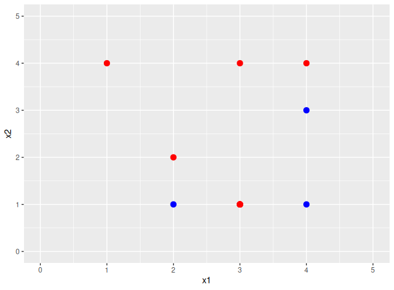

## Question 4:

### Generate a simulated two-class data set with 100 observations and two features in which there is a visible but non-linear separation between the two classes. Show that in this setting, a support vector machine with a polynomial kernel (with degree greater than 1) or a radial kernel will outperform a support vector classifier on the training data. Which technique performs best on the test data? Make plots and report training and test error rates in order to back up your assertions.

```r
simData <- data.frame(
  x = runif(100),
  y = runif(100)
)

score <- (2 * simData$x)^2 + (simData$y)^2 - 1
simData$class <- factor(ifelse(score > 0, "red", "blue"))

simPlot <- ggplot(simData, aes(x = x, y = y, color = class)) +
  geom_point(size = 2) +
  scale_colour_identity()
simPlot
```

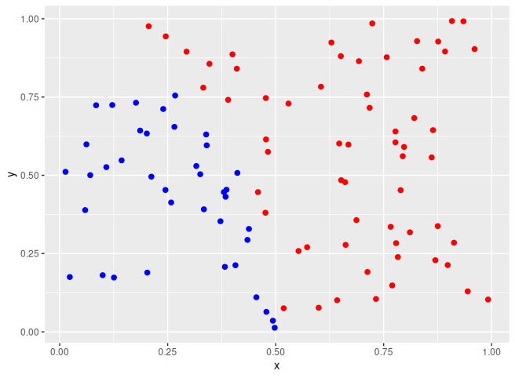

```r
train <- 1:50
test <- 51:100

err <- function(model, dat) {
  pred <- predict(model, dat)
  mean(pred != dat$class)
}

simRadial <- svm(class ~ ., data = simData[train, ], kernel = "radial")
simRadialPred <- predict(simRadial, simData[test, ])
err(simRadial, simData[train, ])
# 0 training error
err(simRadial, simData[test, ])
# .08
plot(simRadial, simData)
```

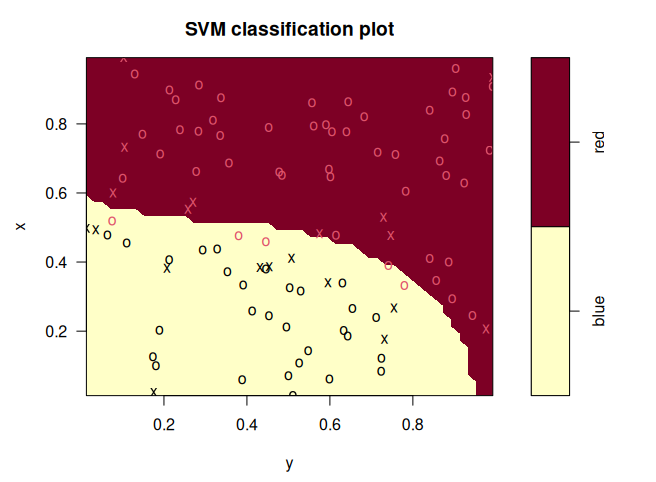

```r
simPolynomial <- svm(class ~ ., data = simData[train, ], kernel = "polynomial", degree = 2)
simPolynomialPred <- predict(simPolynomial, simData[test, ])
err(simPolynomial, simData[train, ])
# .28
err(simPolynomial, simData[test, ])
# .28
plot(simPolynomial, simData)
```

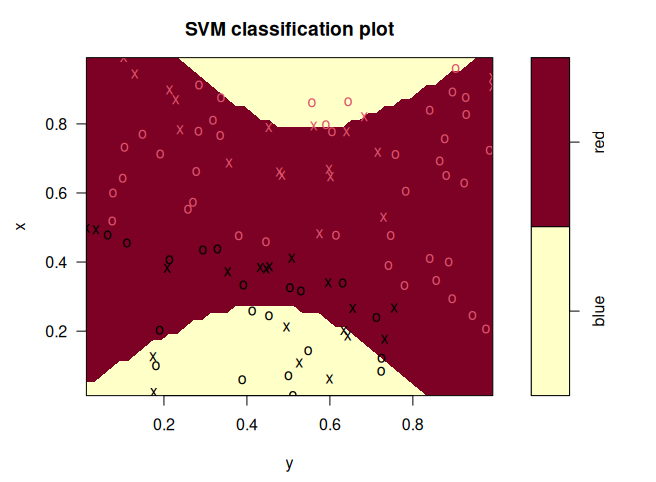

```r
simLinear <- svm(class ~ ., data = simData[train, ], kernel = "linear")
simLinearPred <- predict(simLinear, simData[test, ])
err(simLinear, simData[train, ])
# .04
err(simLinear, simData[train, ])
# .04
plot(simLinear, simData)
```
Radial performs best closely followed by linear, Polynomial did the worst. SVM performs better with polynomial or radial kernels on nonlinear data than support vector classifiers, in this case polynomial didn't perform well.

## Question 5:

### We have seen that we can fit an SVM with a non-linear kernel in order to perform classification using a non-linear decision boundary. We will now see that we can also obtain a non-linear decision boundary by performing logistic regression using non-linear transformations of the features.

### (a) Generate a data set with n = 500 and p = 2, such that the observations belong to two classes with a quadratic decision boundary between them. For instance, you can do this as follows:
```r
> x1 <- runif (500) - 0.5
> x2 <- runif (500) - 0.5
> y <- 1 * (x1^2 - x2^2 > 0)
```

```r
x1 <- runif (500) - 0.5
x2 <- runif (500) - 0.5
y <- 1 * (x1^2 - x2^2 > 0)
df <- data.frame(x1, x2, y = factor(y))
```

### (b) Plot the observations, colored according to their class labels. Your plot should display X1 on the x-axis, and X2 on the y-axis.

p <- ggplot(df, aes(x = x1, y = x2, color = y)) + geom_point()
p

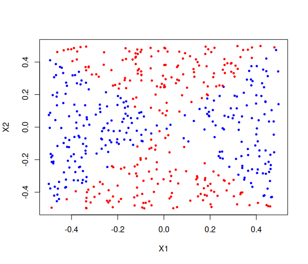

### (c) Fit a logistic regression model to the data, using X1 and X2 as predictors.

```r
lrfit <- glm(y ~ x1 + x2, data = df, family = "binomial")
summary(lrfit)
# Call:
# glm(formula = y ~ x1 + x2, family = "binomial", data = df)

# Coefficients:
#              Estimate Std. Error z value Pr(>|z|)  
# (Intercept)  0.008422   0.090062   0.094   0.9255  
# x1          -0.399277   0.308026  -1.296   0.1949  
# x2          -0.510898   0.300358  -1.701   0.0889 .
# ---
# Signif. codes:  0 ‘***’ 0.001 ‘**’ 0.01 ‘*’ 0.05 ‘.’ 0.1 ‘ ’ 1

# (Dispersion parameter for binomial family taken to be 1)

#     Null deviance: 693.12  on 499  degrees of freedom
# Residual deviance: 688.43  on 497  degrees of freedom
# AIC: 694.43

# Number of Fisher Scoring iterations: 3
```

### (d) Apply this model to the training data in order to obtain a predicted class label for each training observation. Plot the observations, colored according to the predicted class labels. The decision boundary should be linear.

```r
lrprob <- predict(lrfit, newdata = df, type = "response")
lrpred <- factor(ifelse(lrprob > 0.5, 1, 0), levels = c(0, 1))
plot(df$x1, df$x2, col = ifelse(lrpred == "1", "blue", "red"), xlab = "X1", ylab = "X2", pch = 19, cex = 0.5)
```

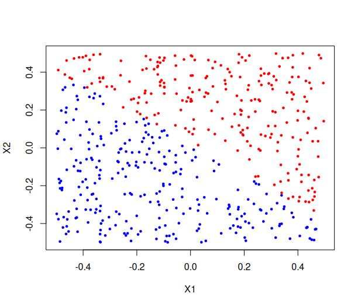

Looks linear

### (e) Now fit a logistic regression model to the data using non-linear functions of X1 and X2 as predictors (e.g. X2 1 , X1 ×X2, log(X2), and so forth).

```r
nlfit = glm(y ~ poly(x1, 2) + poly(x2, 2) + I(x1 * x2), data = df, family = binomial)
```

### (f) Apply this model to the training data in order to obtain a predicted class label for each training observation. Plot the observations, colored according to the predicted class labels. The decision boundary should be obviously non-linear. If it is not, then repeat (a)-(e) until you come up with an example in which the predicted class labels are obviously non-linear.

```r
nlprob = predict(nlfit, df, type = "response")
nlpred = factor(ifelse(nlprob > 0.5, 1, 0))
plot(df$x1, df$x2, col = ifelse(nlpred == "1", "blue", "red"), xlab = "X1", ylab = "X2", pch = 19, cex = 0.5)
```


Clearly non-linear, better resembles correct results

### (g) Fit a support vector classifier to the data with X1 and X2 as predictors. Obtain a class prediction for each training observation. Plot the observations, colored according to the predicted class labels.

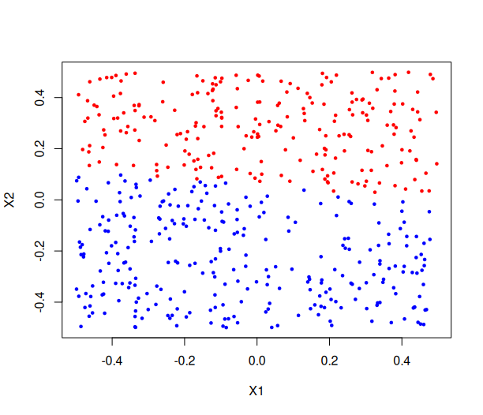

### (h) Fit a SVM using a non-linear kernel to the data. Obtain a class prediction for each training observation. Plot the observations, colored according to the predicted class labels.

```r
svmnlfit = svm(as.factor(y) ~ x1 + x2, df, kernel = "polynomial", degree = 2)
svmnlpred = predict(svmnlfit, df)
plot(df$x1, df$x2, col = ifelse(svmnlpred == "1", "blue", "red"), xlab = "X1", ylab = "X2", pch = 19, cex = 0.5)
```

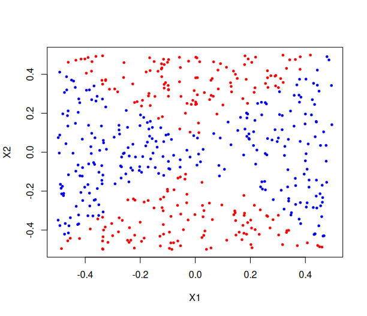

Only works with degree = 2 because of the quadratic decision boundary

much better result

### (i) Comment on your results.

Non-linear kernels are required to get meaningful results from non-linear data, the quadratic svm kernel was able to produce much more accurate results than the linear regression and linear svm attempts.

## Question 7:

### In this problem, you will use support vector approaches in order to predict whether a given car gets high or low gas mileage based on the Auto data set.

### (a) Create a binary variable that takes on a 1 for cars with gas mileage above the median, and a 0 for cars with gas mileage below the median.

```r
data = Auto
gasmed = median(data$mpg)
gasvar = ifelse(data$mpg > gasmed, 1, 0)
data$mpgvar = as.factor(gasvar)
```

### (b) Fit a support vector classifier to the data with various values of cost, in order to predict whether a car gets high or low gas mileage. Report the cross-validation errors associated with different values of this parameter. Comment on your results. Note you will need to fit the classifier without the gas mileage variable to produce sensible results.

```r
costs <- 10^seq(-4, 3, by = 0.5)
linear = tune(svm,
              mpgvar ~ displacement + horsepower + weight,
              data = data, 
              kernel = "linear",
              ranges = list(cost = costs)
)
summary(linear)
# Parameter tuning of ‘svm’:

# - sampling method: 10-fold cross validation 

# - best parameters:
#        cost
#  0.03162278

# - best performance: 0.1017308 

# - Detailed performance results:
#            cost     error dispersion
# 1  1.000000e-04 0.6019231 0.06346118
# 2  3.162278e-04 0.6019231 0.06346118
# 3  1.000000e-03 0.2142949 0.09219785
# 4  3.162278e-03 0.1298077 0.08327702
# 5  1.000000e-02 0.1145513 0.07100711
# 6  3.162278e-02 0.1017308 0.06174885
# 7  1.000000e-01 0.1119872 0.06444641
# 8  3.162278e-01 0.1044872 0.05699964
# 9  1.000000e+00 0.1069872 0.05852708
# 10 3.162278e+00 0.1069872 0.05852708
# 11 1.000000e+01 0.1044872 0.05699964
# 12 3.162278e+01 0.1069872 0.05852708
# 13 1.000000e+02 0.1069872 0.05852708
# 14 3.162278e+02 0.1069872 0.05852708
# 15 1.000000e+03 0.1069872 0.05852708
```

best cost: 0.03162278

best performance: 0.1017308 

### (c) Now repeat (b), this time using SVMs with radial and polynomial basis kernels, with different values of gamma and degree and cost. Comment on your results.

```r
polynomial = tune(svm, 
                  mpgvar ~ displacement + horsepower + weight,
                  data = data, 
                  kernel = "polynomial",
                  ranges = list(cost = costs, degree = 1:3)
                  )
summary(polynomial)
# Parameter tuning of ‘svm’:

# - sampling method: 10-fold cross validation 

# - best parameters:
#      cost degree
#  3.162278      1

# - best performance: 0.1047436 

# - Detailed performance results:
#            cost degree     error dispersion
# 1  1.000000e-04      1 0.5946154 0.08083319
# 2  3.162278e-04      1 0.5946154 0.08083319
# 3  1.000000e-03      1 0.5920513 0.08405843
# 4  3.162278e-03      1 0.2197436 0.07145690
# 5  1.000000e-02      1 0.1328846 0.04649295
# 6  3.162278e-02      1 0.1099359 0.03854129
# 7  1.000000e-01      1 0.1048077 0.04280683
# 8  3.162278e-01      1 0.1073718 0.04170473
# 9  1.000000e+00      1 0.1073077 0.03781411
# 10 3.162278e+00      1 0.1047436 0.03710229
# 11 1.000000e+01      1 0.1047436 0.03710229
# 12 3.162278e+01      1 0.1047436 0.03710229
# 13 1.000000e+02      1 0.1047436 0.03710229
# 14 3.162278e+02      1 0.1047436 0.03710229
# 15 1.000000e+03      1 0.1047436 0.03710229
# 16 1.000000e-04      2 0.5946154 0.08083319
# 17 3.162278e-04      2 0.5946154 0.08083319
# 18 1.000000e-03      2 0.5946154 0.08083319
# 19 3.162278e-03      2 0.5135897 0.12583195
# 20 1.000000e-02      2 0.4825641 0.11068203
# 21 3.162278e-02      2 0.3725000 0.06539052
# 22 1.000000e-01      2 0.3648718 0.06431148
# 23 3.162278e-01      2 0.3598718 0.07068756
# 24 1.000000e+00      2 0.3521795 0.07172056
# 25 3.162278e+00      2 0.3573077 0.06999890
# 26 1.000000e+01      2 0.3292308 0.07434190
# 27 3.162278e+01      2 0.3266026 0.08424076
# 28 1.000000e+02      2 0.3137821 0.09038600
# 29 3.162278e+02      2 0.3111538 0.09589814
# 30 1.000000e+03      2 0.3086538 0.09060799
# 31 1.000000e-04      3 0.5946154 0.08083319
# 32 3.162278e-04      3 0.5209615 0.11238100
# 33 1.000000e-03      3 0.3750641 0.07566785
# 34 3.162278e-03      3 0.3038462 0.07396990
# 35 1.000000e-02      3 0.2681410 0.06410118
# 36 3.162278e-02      3 0.2401282 0.07650838
# 37 1.000000e-01      3 0.2023077 0.09362203
# 38 3.162278e-01      3 0.1683333 0.06947317
# 39 1.000000e+00      3 0.1529487 0.06353035
# 40 3.162278e+00      3 0.1428205 0.06174940
# 41 1.000000e+01      3 0.1454487 0.05934823
# 42 3.162278e+01      3 0.1454487 0.05420149
# 43 1.000000e+02      3 0.1403205 0.04720670
# 44 3.162278e+02      3 0.1403205 0.04563299
# 45 1.000000e+03      3 0.1326923 0.03795969
```

best cost: 3.162278, best degree: 1

best performance: 0.1047436 

```r
radial = tune(svm, 
              mpgvar ~ displacement + horsepower + weight,
              data = data, 
              kernel = "radial",
              ranges = list(cost = costs, gamma = 10^(-2:1))
)
summary(radial)
# Parameter tuning of ‘svm’:

# - sampling method: 10-fold cross validation 

# - best parameters:
#  cost gamma
#    10     1

# - best performance: 0.08153846 

# - Detailed performance results:
#            cost gamma      error dispersion
# 1  1.000000e-04  0.01 0.55096154 0.03903332
# 2  3.162278e-04  0.01 0.55096154 0.03903332
# 3  1.000000e-03  0.01 0.55096154 0.03903332
# 4  3.162278e-03  0.01 0.55096154 0.03903332
# 5  1.000000e-02  0.01 0.55096154 0.03903332
# 6  3.162278e-02  0.01 0.23967949 0.11661126
# 7  1.000000e-01  0.01 0.15051282 0.05047513
# 8  3.162278e-01  0.01 0.11480769 0.03850715
# 9  1.000000e+00  0.01 0.10967949 0.04135645
# 10 3.162278e+00  0.01 0.10967949 0.04135645
# 11 1.000000e+01  0.01 0.10967949 0.04135645
# 12 3.162278e+01  0.01 0.10711538 0.04430292
# 13 1.000000e+02  0.01 0.10711538 0.04430292
# 14 3.162278e+02  0.01 0.10461538 0.04839996
# 15 1.000000e+03  0.01 0.10205128 0.04612792
# 16 1.000000e-04  0.10 0.55096154 0.03903332
# 17 3.162278e-04  0.10 0.55096154 0.03903332
# 18 1.000000e-03  0.10 0.55096154 0.03903332
# 19 3.162278e-03  0.10 0.55096154 0.03903332
# 20 1.000000e-02  0.10 0.15801282 0.05314051
# 21 3.162278e-02  0.10 0.11230769 0.04202921
# 22 1.000000e-01  0.10 0.10967949 0.04135645
# 23 3.162278e-01  0.10 0.10967949 0.04135645
# 24 1.000000e+00  0.10 0.11224359 0.04337812
# 25 3.162278e+00  0.10 0.10711538 0.04430292
# 26 1.000000e+01  0.10 0.10711538 0.04087228
# 27 3.162278e+01  0.10 0.10711538 0.04087228
# 28 1.000000e+02  0.10 0.09948718 0.03469812
# 29 3.162278e+02  0.10 0.08673077 0.03435330
# 30 1.000000e+03  0.10 0.08160256 0.03115272
# 31 1.000000e-04  1.00 0.55096154 0.03903332
# 32 3.162278e-04  1.00 0.55096154 0.03903332
# 33 1.000000e-03  1.00 0.55096154 0.03903332
# 34 3.162278e-03  1.00 0.55096154 0.03903332
# 35 1.000000e-02  1.00 0.12993590 0.06555202
# 36 3.162278e-02  1.00 0.10961538 0.03952010
# 37 1.000000e-01  1.00 0.11474359 0.03810854
# 38 3.162278e-01  1.00 0.11224359 0.04166004
# 39 1.000000e+00  1.00 0.09942308 0.04190045
# 40 3.162278e+00  1.00 0.08410256 0.03768543
# 41 1.000000e+01  1.00 0.08153846 0.04265034
# 42 3.162278e+01  1.00 0.08923077 0.04001698
# 43 1.000000e+02  1.00 0.09173077 0.05085151
# 44 3.162278e+02  1.00 0.09410256 0.06388410
# 45 1.000000e+03  1.00 0.10192308 0.06655494
# 46 1.000000e-04 10.00 0.55096154 0.03903332
# 47 3.162278e-04 10.00 0.55096154 0.03903332
# 48 1.000000e-03 10.00 0.55096154 0.03903332
# 49 3.162278e-03 10.00 0.55096154 0.03903332
# 50 1.000000e-02 10.00 0.55096154 0.03903332
# 51 3.162278e-02 10.00 0.19878205 0.10927412
# 52 1.000000e-01 10.00 0.11967949 0.07565675
# 53 3.162278e-01 10.00 0.10942308 0.06401422
# 54 1.000000e+00 10.00 0.09929487 0.06329437
# 55 3.162278e+00 10.00 0.10442308 0.06450051
# 56 1.000000e+01 10.00 0.11455128 0.07214129
# 57 3.162278e+01 10.00 0.12224359 0.06693326
# 58 1.000000e+02 10.00 0.13987179 0.07477643
# 59 3.162278e+02 10.00 0.14250000 0.07421150
# 60 1.000000e+03 10.00 0.16057692 0.05861657
```

best cost: 10, best gamma: 1

best performance: 0.08153846 

Radial did best with 0.08153846, support vector classifier second with 0.1017308, last was polynomial with 0.1047436. This tells me the relationship between MPG and displacement, horsepower, and weight is nonlinear but smooth. Parameter tuning is important, and more complexity isn't always better.

### (d) Make some plots to back up your assertions in (b) and (c).

### Hint: In the lab, we used the plot() function for svm objects only in cases with p = 2. When p > 2, you can use the plot() function to create plots displaying pairs of variables at a time. Essentially, instead of typing

```r
> plot(svmfit , dat)
```

### where svmfit contains your fitted model and dat is a data frame containing your data, you can type

```r
> plot(svmfit , dat , x1 ∼ x4)
```

### in order to plot just the first and fourth variables. However, you must replace x1 and x4 with the correct variable names. To find out more, type ?plot.svm.

linear:

```r
plot(linear$best.model, data, displacement ~ horsepower)
plot(linear$best.model, data, weight ~ horsepower)
plot(linear$best.model, data, weight ~ displacement)
```

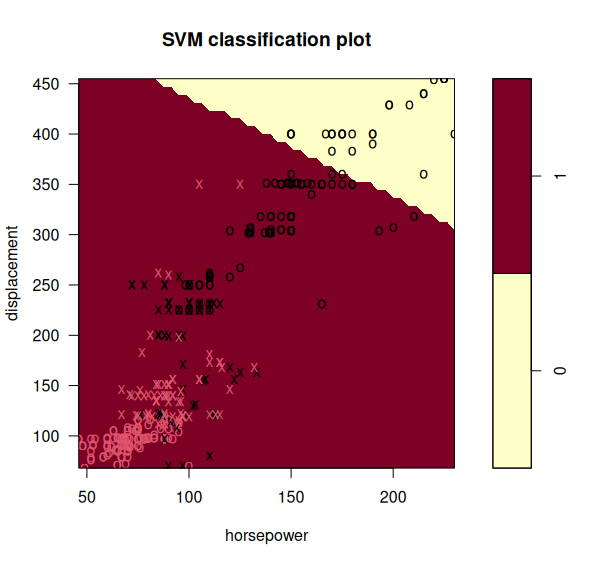


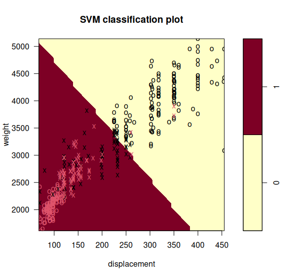

polynomial:

```r
plot(polynomial$best.model, data, displacement ~ horsepower)
plot(polynomial$best.model, data, weight ~ horsepower)
plot(polynomial$best.model, data, weight ~ displacement)
```

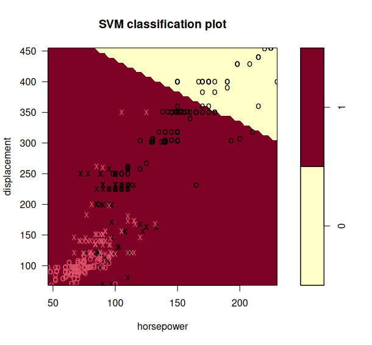

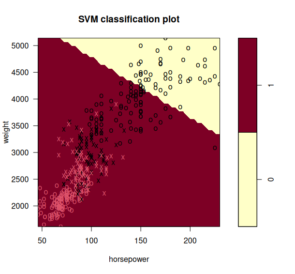

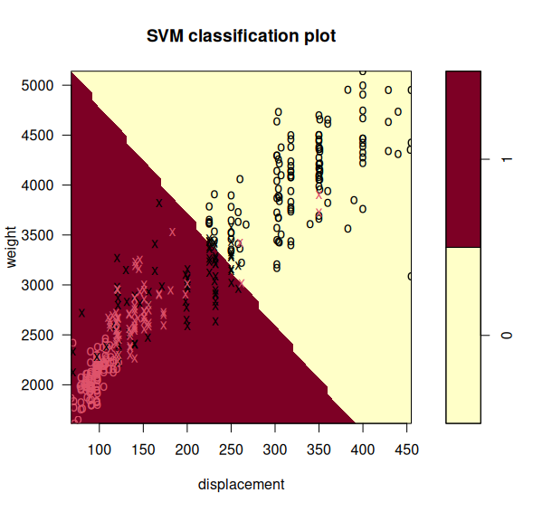

radial:

```r
plot(radial$best.model, data, displacement ~ horsepower)
plot(radial$best.model, data, weight ~ horsepower)
plot(radial$best.model, data, weight ~ displacement)
```

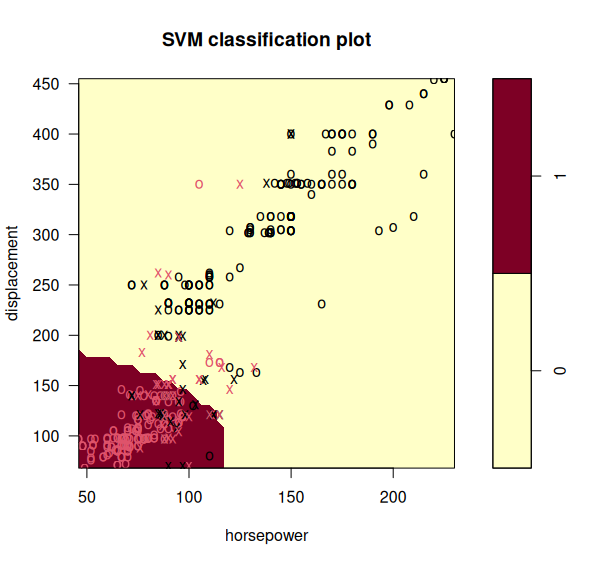

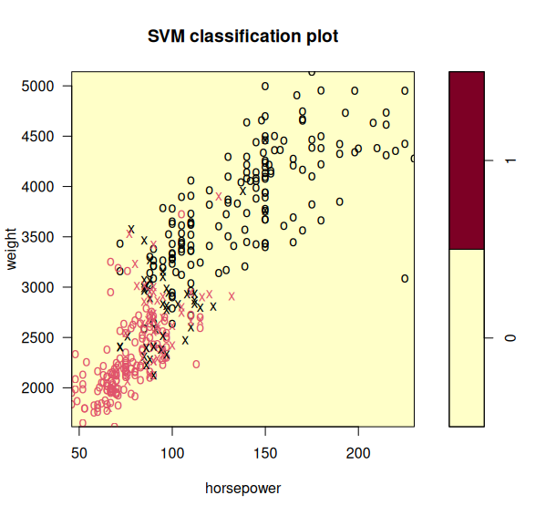

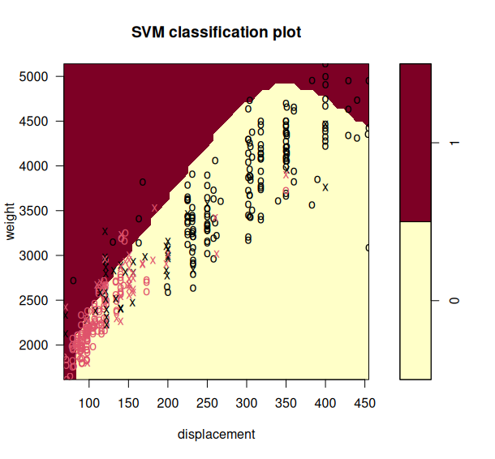

The displacement and horsepower plots seem most accurate, the linear and polynomial plots are very similar, and the radial plots are all incorrect in different ways. The linear and polynomial plots tend to misclassify false positives more than false negatives, including the displacement and horsepower plots.