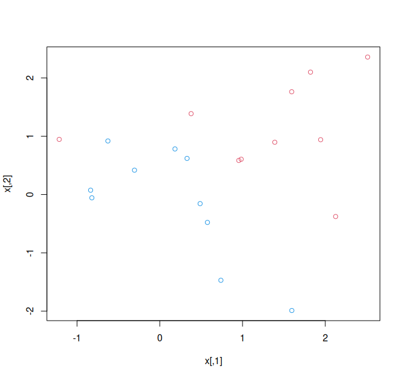
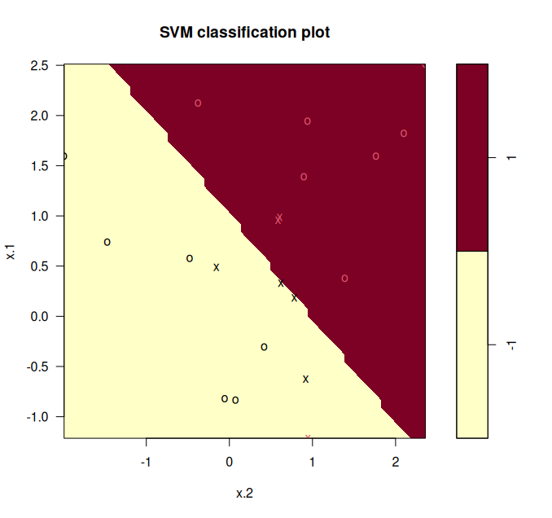
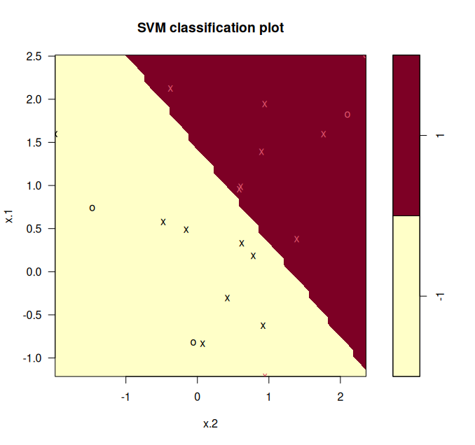
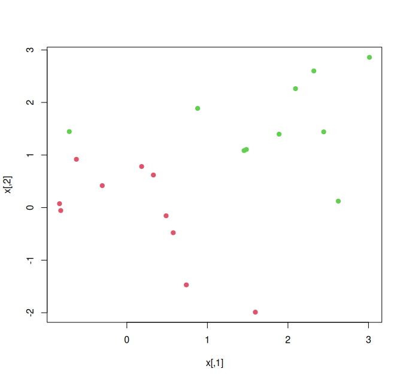
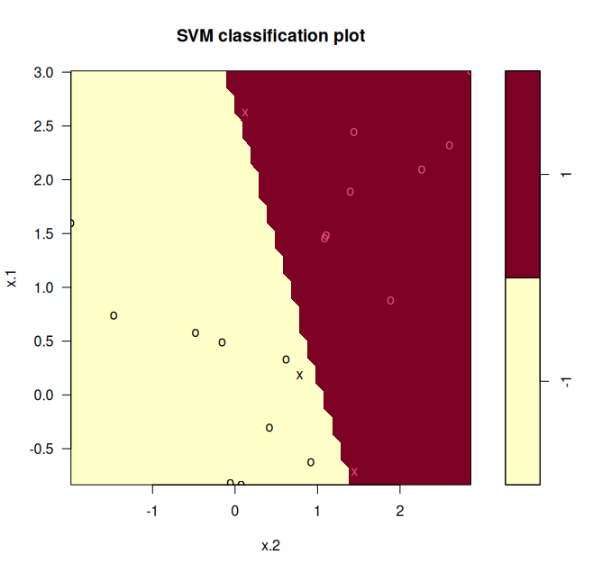
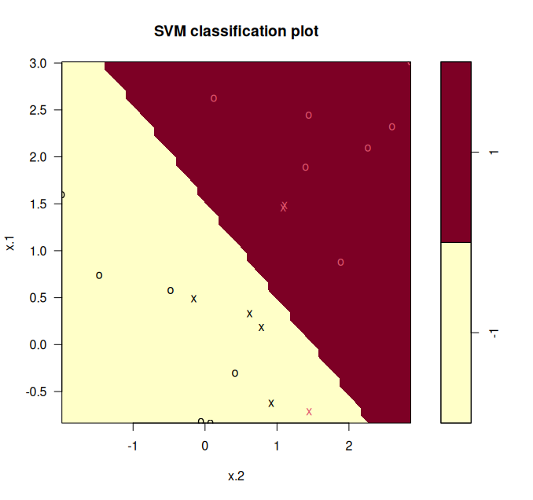
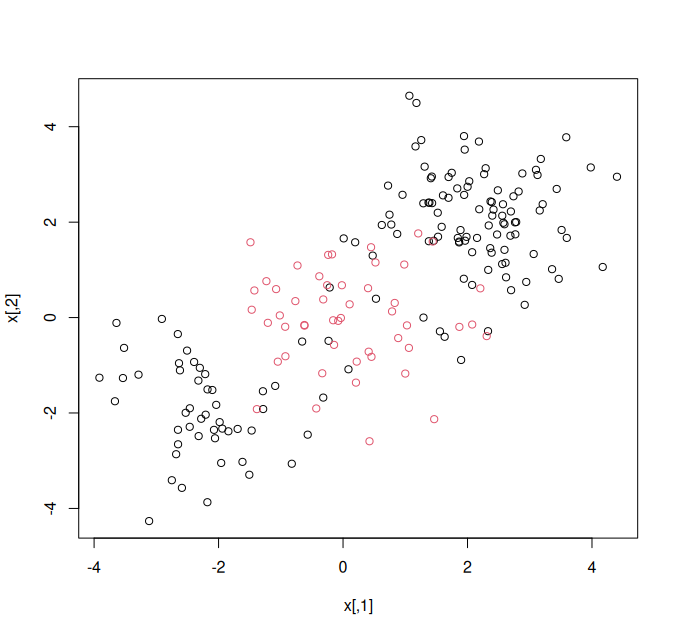
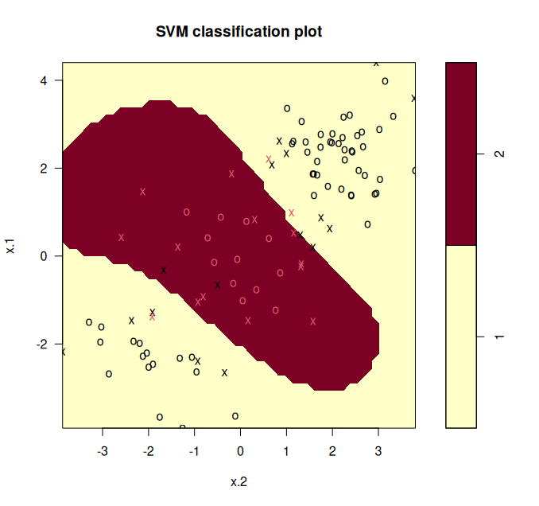
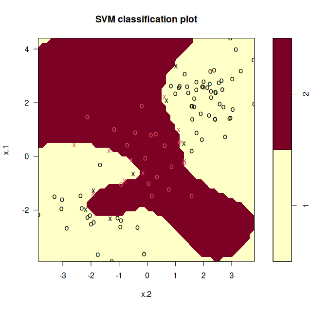
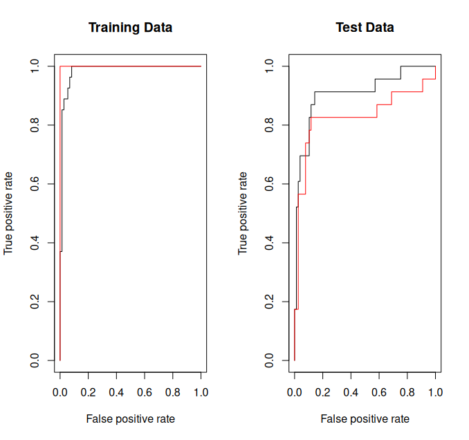

```r
## 9.6.1 Support Vector Classifier

set.seed(1)
x <- matrix(rnorm(20 * 2), ncol = 2)
y <- c(rep(-1, 10), rep(1, 10))
x[y == 1, ] <- x[y == 1, ] + 1
plot(x, col = (3 - y))
```



```r
dat <- data.frame(x = x, y = as.factor(y))
library(e1071)
svmfit <- svm(y ~ ., data = dat, kernel = "linear",
  cost = 10, scale = FALSE)

plot(svmfit, dat)
```



```r

svmfit$index
# [1] 1 2 5 7 14 16 17

summary(svmfit)
# Call:
# svm(formula = y ~ ., data = dat, kernel = "linear", cost = 10,
#      scale = FALSE)
# Parameters:
#    SVM-Type:  C-classification
#  SVM-Kernel:  linear
#        cost:  10
# Number of Support Vectors:  7
#  ( 4 3 )
# Number of Classes:  2
# Levels:
#  -1 1

svmfit <- svm(y ~ ., data = dat, kernel = "linear",
  cost = 0.1, scale = FALSE)
plot(svmfit, dat)
```



```r
svmfit$index
# [1] 1 2 3 4 5 7 9 10 12 13 14 15 16 17 18 20

set.seed(1)
tune.out <- tune(svm, y ~ ., data = dat, kernel = "linear",
  ranges = list(cost = c(0.001, 0.01, 0.1, 1, 5, 10, 100)))

summary(tune.out)
# Parameter tuning of 'svm':
# - sampling method: 10-fold cross validation
# - best parameters:
#  cost
#   0.1
# - best performance: 0.05
# - Detailed performance results:
#    cost error dispersion
# 1 1e-03  0.55      0.438
# 2 1e-02  0.55      0.438
# 3 1e-01  0.05      0.158
# 4 1e+00  0.15      0.242
# 5 5e+00  0.15      0.242
# 6 1e+01  0.15      0.242
# 7 1e+02  0.15      0.242

bestmod <- tune.out$best.model
summary(bestmod)

xtest <- matrix(rnorm(20 * 2), ncol = 2)
ytest <- sample(c(-1, 1), 20, rep = TRUE)
xtest[ytest == 1, ] <- xtest[ytest == 1, ] + 1
testdat <- data.frame(x = xtest, y = as.factor(ytest))

ypred <- predict(bestmod, testdat)
table(predict = ypred, truth = testdat$y)
#        truth
# predict -1 1
#      -1  9 1
#       1  2 8

svmfit <- svm(y ~ ., data = dat, kernel = "linear",
  cost = .01, scale = FALSE)
ypred <- predict(svmfit, testdat)
table(predict = ypred, truth = testdat$y)
#        truth
# predict -1  1
#      -1 11  6
#       1  0  3

x[y == 1, ] <- x[y == 1, ] + 0.5
plot(x, col = (y + 5) / 2, pch = 19)
```



```r

dat <- data.frame(x = x, y = as.factor(y))
svmfit <- svm(y ~ ., data = dat, kernel = "linear", cost = 1e5)
summary(svmfit)
# Call:
# svm(formula = y ~ ., data = dat, kernel = "linear", cost = 1e+05)
# Parameters:
#    SVM-Type:  C-classification
#  SVM-Kernel:  linear
#        cost:  1e+05
# Number of Support Vectors:  3
#  ( 1 2 )
# Number of Classes:  2
# Levels:
#  -1 1
plot(svmfit, dat)
```



```r

svmfit <- svm(y ~ ., data = dat, kernel = "linear", cost = 1)
summary(svmfit)
plot(svmfit, dat)
```



```r


## 9.6.2 Support Vector Machine

set.seed(1)
x <- matrix(rnorm(200 * 2), ncol = 2)
x[1:100, ] <- x[1:100, ] + 2
x[101:150, ] <- x[101:150, ] - 2
y <- c(rep(1, 150), rep(2, 50))
dat <- data.frame(x = x, y = as.factor(y))

plot(x, col = y)
```



```r

train <- sample(200, 100)
svmfit <- svm(y ~ ., data = dat[train, ], kernel = "radial",
  gamma = 1, cost = 1)
plot(svmfit, dat[train, ])
```



```r

summary(svmfit)
# Call:
# svm(formula = y ~ ., data = dat[train, ], kernel = "radial",
#   gamma = 1, cost = 1)
# Parameters:
#    SVM-Type:  C-classification
#  SVM-Kernel:  radial
#        cost:  1
# Number of Support Vectors:  31
#  ( 16 15 )
# Number of Classes:  2
# Levels:
#  1 2

svmfit <- svm(y ~ ., data = dat[train, ], kernel = "radial",
  gamma = 1, cost = 1e5)
plot(svmfit, dat[train, ])
```



```r

set.seed(1)
tune.out <- tune(svm, y ~ ., data = dat[train, ],
  kernel = "radial",
  ranges = list(
    cost = c(0.1, 1, 10, 100, 1000),
    gamma = c(0.5, 1, 2, 3, 4)
  )
)
summary(tune.out)
# Parameter tuning of 'svm':
# - sampling method: 10-fold cross validation
# - best parameters:
#  cost gamma
#     1   0.5
# - best performance: 0.07
# - Detailed performance results:
#     cost gamma error dispersion
# 1  1e-01   0.5  0.26      0.158
# 2  1e+00   0.5  0.07      0.082
# 3  1e+01   0.5  0.07      0.082
# 4  1e+02   0.5  0.14      0.151
# 5  1e+03   0.5  0.11      0.074
# 6  1e-01   1.0  0.22      0.162
# 7  1e+00   1.0  0.07      0.082
# . . .

table(
  true = dat[-train, "y"],
  pred = predict(
    tune.out$best.model, newdata = dat[-train, ]
  )
)


## 9.6.3 ROC Curves

library(ROCR)
rocplot <- function(pred, truth, ...) {
  predob <- prediction(pred, truth)
  perf <- performance(predob, "tpr", "fpr")
  plot(perf, ...)
}

svmfit.opt <- svm(y ~ ., data = dat[train, ],
  kernel = "radial", gamma = 2, cost = 1,
  decision.values = TRUE)
fitted <- attributes(
  predict(svmfit.opt, dat[train, ], decision.values = TRUE)
)$decision.values

par(mfrow = c(1, 2))
rocplot(-fitted, dat[train, "y"], main = "Training Data")

svmfit.flex <- svm(y ~ ., data = dat[train, ],
  kernel = "radial", gamma = 50, cost = 1,
  decision.values = TRUE)
fitted <- attributes(
  predict(svmfit.flex, dat[train, ], decision.values = TRUE)
)$decision.values
rocplot(-fitted, dat[train, "y"], add = TRUE, col = "red")

fitted <- attributes(
  predict(svmfit.opt, dat[-train, ], decision.values = TRUE)
)$decision.values
rocplot(-fitted, dat[-train, "y"], main = "Test Data")
fitted <- attributes(
  predict(svmfit.flex, dat[-train, ], decision.values = TRUE)
)$decision.values
rocplot(-fitted, dat[-train, "y"], add = TRUE, col = "red")

```



```r

## 9.6.4 SVM with Multiple Classes

set.seed(1)
x <- rbind(x, matrix(rnorm(50 * 2), ncol = 2))
y <- c(y, rep(0, 50))
x[y == 0, 2] <- x[y == 0, 2] + 2
dat <- data.frame(x = x, y = as.factor(y))
par(mfrow = c(1, 1))
plot(x, col = (y + 1))

svmfit <- svm(y ~ ., data = dat, kernel = "radial",
  cost = 10, gamma = 1)
plot(svmfit, dat)


## 9.6.5 Application to Gene Expression Data

library(ISLR2)
names(Khan)
# [1] "xtrain" "xtest"  "ytrain" "ytest"
dim(Khan$xtrain)
# [1]  63 2308
dim(Khan$xtest)
# [1]  20 2308
length(Khan$ytrain)
# [1] 63
length(Khan$ytest)
# [1] 20

table(Khan$ytrain)
#  1  2  3  4
#  8 23 12 20
table(Khan$ytest)
# 1 2 3 4
# 3 6 6 5

dat <- data.frame(
  x = Khan$xtrain,
  y = as.factor(Khan$ytrain)
)
out <- svm(y ~ ., data = dat, kernel = "linear", cost = 10)
summary(out)
# Call:
# svm(formula = y ~ ., data = dat, kernel = "linear", cost = 10)
# Parameters:
#     SVM-Type:  C-classification
#  SVM-Kernel:  linear
#         cost:  10
# Number of Support Vectors:  58
#  ( 20 20 11 7 )
# Number of Classes:  4
# Levels:
#  1 2 3 4
table(out$fitted, dat$y)
#   1  2  3  4
# 1 8  0  0  0
# 2 0 23  0  0
# 3 0  0 12  0
# 4 0  0  0 20

dat.te <- data.frame(
  x = Khan$xtest,
  y = as.factor(Khan$ytest)
)
pred.te <- predict(out, newdata = dat.te)
table(pred.te, dat.te$y)
# pred.te 1 2 3 4
#       1 3 0 0 0
#       2 0 6 2 0
#       3 0 0 4 0
#       4 0 0 0 5
```