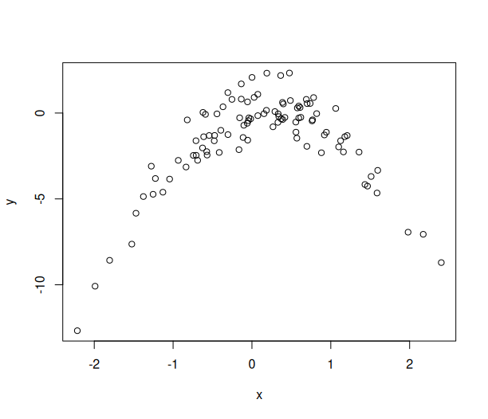

# M6: Chapter 5

## Question 3:

### We now review k-fold cross-validation.

### (a) Explain how k-fold cross-validation is implemented.

The data is divided into K subsets, that subset acts as the testing data and for each group the model is trained on the rest of the data. The MSE of each group is averaged to get an estimated MSE for the model.

### (b) What are the advantages and disadvantages of k-fold cross-validation relative to:

### i. The validation set approach?

Because we're only testing once with the validation set approach the error rate depends on which data is in which segment which can lead to some uncertainty, but only testing once is easier to set up and takes less processing time.

### ii. LOOCV?

LOOCV is very computationally expensive because we have to train the model for every observation, and since the trained models are effectively the same because they're only missing the one observation used for training it leads to high variance, but it does reduce bias by training on almost the whole data set.

## Question 4:

### Suppose that we use some statistical learning method to make a prediction for the response Y for a particular value of the predictor X. Carefully describe how we might estimate the standard deviation of our prediction.

We can do this using bootstrapping, we take many samples with replacement and fit a model to each sample and collect standard deviations from those models, and then take an average of standard deviations to estimate the overall standard deviation.

## Question 5:

## In Chapter 4, we used logistic regression to predict the probability of default using income and balance on the Default data set. We will now estimate the test error of this logistic regression model using the validation set approach. Do not forget to set a random seed before beginning your analysis

```r
library(ISLR2)
library(boot)
set.seed(1)
```

### (a) Fit a logistic regression model that uses income and balance to predict default.

```r
attach(Default)
fit = glm(default ~ income + balance, data = Default, family = "binomial")
```

### (b) Using the validation set approach, estimate the test error of this model. In order to do this, you must perform the following steps:

### i. Split the sample set into a training set and a validation set.

```r
train = sample(nrow(Default), nrow(Default) / 2)
test = -train
```

### ii. Fit a multiple logistic regression model using only the training observations.

```r
fit = glm(default ~ income + balance, data = Default, family = "binomial", subset = train)
```

### iii. Obtain a prediction of default status for each individual in the validation set by computing the posterior probability of default for that individual, and classifying the individual to the default category if the posterior probability is greater than 0.5.

```r
pred = ifelse(predict(fit, newdata = Default[test, ]) > 0.5, "Yes", "No")
table(pred, Default$default[test])
# pred    No  Yes
#   No  4833  122
#   Yes   10   35
```

### iv. Compute the validation set error, which is the fraction of the observations in the validation set that are misclassified.

```r
mean(pred != Default$default[test])
# 0.0264
```

### (c) Repeat the process in (b) three times, using three different splits of the observations into a training set and a validation set. Comment on the results obtained.

```r
anotherone = function() {
  # i.
  train = sample(nrow(Default), nrow(Default) / 2)
  test = -train
  # ii.
  fit = glm(default ~ income + balance, data = Default, family = "binomial", subset = train)
  # iii.
  pred = ifelse(predict(fit, newdata = Default[test, ]) > 0.5, "Yes", "No")
  table(pred, Default$default[test])
  # iv.
  mean(pred != Default$default[test])
}
mean(
  anotherone(),
  anotherone(),
  anotherone()
)
# 0.0264
```
### (d) Now consider a logistic regression model that predicts the probability of default using income, balance, and a dummy variable for student. Estimate the test error for this model using the validation set approach. Comment on whether or not including a dummy variable for student leads to a reduction in the test error rate.

```r
logreg = function() {
  train = sample(nrow(Default), nrow(Default) / 2)
  test = -train
  fit = glm(default ~ income + balance + student, data = Default, family = "binomial", subset = train)
  pred = ifelse(predict(fit, newdata = Default[test, ]) > 0.5, "Yes", "No")
  mean(pred != Default$default[test])
}
mean(
  logreg(),
  logreg(),
  logreg()
)
# 0.028
```

student doesn't seem to have an effect

## Question 6:

### We continue to consider the use of a logistic regression model to predict the probability of default using income and balance on the Default data set. In particular, we will now compute estimates for the standard errors of the income and balance logistic regression coefficients in two different ways: (1) using the bootstrap, and (2) using the standard formula for computing the standard errors in the glm() function. Do not forget to set a random seed before beginning your analysis.

### (a) Using the summary() and glm() functions, determine the estimated standard errors for the coefficients associated with income and balance in a multiple logistic regression model that uses both predictors.

```r
fit = glm(default ~ income + balance, data = Default, family = "binomial")
summary(fit)
# Call:
# glm(formula = default ~ income + balance, family = "binomial", 
#     data = Default)

# Coefficients:
#               Estimate Std. Error z value Pr(>|z|)    
# (Intercept) -1.154e+01  4.348e-01 -26.545  < 2e-16 ***
# income       2.081e-05  4.985e-06   4.174 2.99e-05 ***
# balance      5.647e-03  2.274e-04  24.836  < 2e-16 ***
# ---
# Signif. codes:  0 ‘***’ 0.001 ‘**’ 0.01 ‘*’ 0.05 ‘.’ 0.1 ‘ ’ 1

# (Dispersion parameter for binomial family taken to be 1)

#     Null deviance: 2920.6  on 9999  degrees of freedom
# Residual deviance: 1579.0  on 9997  degrees of freedom
# AIC: 1585

# Number of Fisher Scoring iterations: 8
```

### (b) Write a function, boot.fn(), that takes as input the Default data set as well as an index of the observations, and that outputs the coefficient estimates for income and balance in the multiple logistic regression model.

```r
boot.fn <- function(db, sample) {
  fit <- glm(default ~ income + balance, data = db[sample, ], family = "binomial")
  coef(fit)[-1]
}
```

### (c) Use the boot() function together with your boot.fn() function to estimate the standard errors of the logistic regression coefficients for income and balance.

```r
boot(Default, boot.fn, R = 1000)
# ORDINARY NONPARAMETRIC BOOTSTRAP


# Call:
# boot(data = Default, statistic = boot.fn, R = 1000)


# Bootstrap Statistics :
#         original       bias     std. error
# t1* 2.080898e-05 1.680317e-07 4.866284e-06
# t2* 5.647103e-03 1.855765e-05 2.298949e-04
```
### (d) Comment on the estimated standard errors obtained using the glm() function and using your bootstrap function.

Income had a std error of 4.985e-06 in the glm model and 4.866284e-06 in the bootstrap model, balance had 2.274e-04 in glm and 2.298949e-04 in bootstrap. These are very similar results.

## Question 8:

### We will now perform cross-validation on a simulated data set.

### (a) Generate a simulated data set as follows:

```r
> set.seed (1)
> x <- rnorm (100)
> y <- x - 2 * x^2 + rnorm (100)
```

### In this data set, what is n and what is p? Write out the model used to generate the data in equation form.

```r
x = rnorm (100)
y = x - 2 * x^2 + rnorm (100)
```

n = 100

p = 1
 
y = x - 2x^2 + ϵ

### (b) Create a scatterplot of X against Y . Comment on what you find.

```r
plot(x, y)
```



### (c) Set a random seed, and then compute the LOOCV errors that result from fitting the following four models using least squares:

```r
df = data.frame(x, y)
```

### i. Y = β0 + β1X + ϵ

```r
fit = glm(y ~ x)
cv.glm(df, fit)$delta
```

7.288162 7.284744

### ii. Y = β0 + β1X + β2X2 + ϵ

```r
fit = glm(y ~ poly(x, 2, raw = TRUE))
cv.glm(df, fit)$delta
```

0.9374236 0.9371789

### iii. Y = β0 + β1X + β2X2 + β3X3 + ϵ

```r
fit = glm(y ~ poly(x, 3, raw = TRUE))
cv.glm(df, fit)$delta
```

0.9566218 0.9562538

### iv. Y = β0 + β1X + β2X2 + β3X3 + β4X4 + ϵ.

```r
fit = glm(y ~ poly(x, 4, raw = TRUE))
cv.glm(df, fit)$delta
```

0.9539049 0.9534453

Large improvement with degree 2, very similar results after. the data is quadratic so going three and four don't add much.

### (d) Repeat (c) using another random seed, and report your results. Are your results the same as what you got in (c)? Why?

```r
set.seed(2)
x = rnorm (100)
y = x - 2 * x^2 + rnorm (100)
# i.
fit = glm(y ~ x)
cv.glm(df, fit)$delta
```

12.166870  9.528366

```r
# ii.
fit = glm(y ~ poly(x, 2, raw = TRUE))
cv.glm(df, fit)$delta
```

14.5460205  0.9869664

```r
# iii.
fit = glm(y ~ poly(x, 3, raw = TRUE))
cv.glm(df, fit)$delta
```

14.603789  1.030223

```r
# iv.
fit = glm(y ~ poly(x, 4, raw = TRUE))
cv.glm(df, fit)$delta
```

14.4971034  0.8518971

Very different, raw cv estimate is much worse, more varied results than the first one.

### (e) Which of the models in (c) had the smallest LOOCV error? Is this what you expected? Explain your answer.

The degree of 2 produced the best results, which makes sense because the equation used to generate the data was quadratic.

### (f) Comment on the statistical significance of the coefficient estimates that results from fitting each of the models in (c) using least squares. Do these results agree with the conclusions drawn based on the cross-validation results?

```r
summary(fit)
# Call:
# glm(formula = y ~ poly(x, 4, raw = TRUE))

# Coefficients:
#                         Estimate Std. Error t value Pr(>|t|)    
# (Intercept)             -0.03008    0.16417  -0.183    0.855    
# poly(x, 4, raw = TRUE)1  0.98184    0.20180   4.865 4.53e-06 ***
# poly(x, 4, raw = TRUE)2 -1.96901    0.23512  -8.374 4.86e-13 ***
# poly(x, 4, raw = TRUE)3 -0.01033    0.06292  -0.164    0.870    
# poly(x, 4, raw = TRUE)4  0.00451    0.05212   0.087    0.931    
# ---
# Signif. codes:  0 ‘***’ 0.001 ‘**’ 0.01 ‘*’ 0.05 ‘.’ 0.1 ‘ ’ 1

# (Dispersion parameter for gaussian family taken to be 1.001533)

#     Null deviance: 1013.122  on 99  degrees of freedom
# Residual deviance:   95.146  on 95  degrees of freedom
# AIC: 290.81

# Number of Fisher Scoring iterations: 2
```

The linear and quadratic terms are the only statistically significant ones, which supports the results of cross validation.