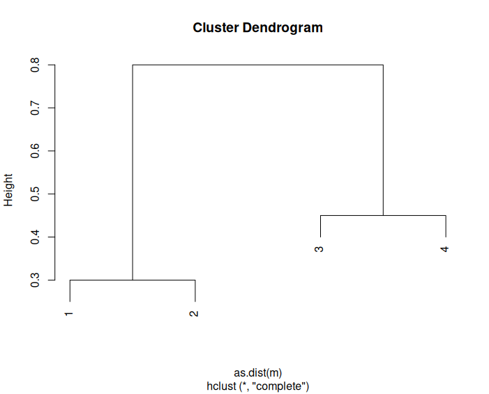
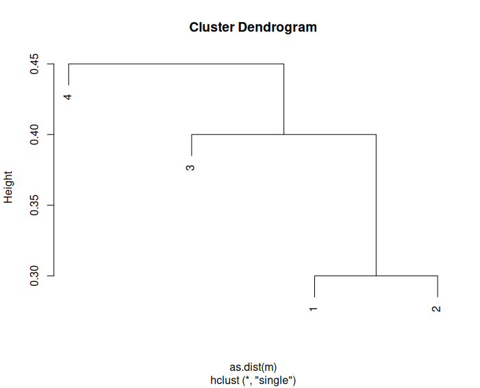
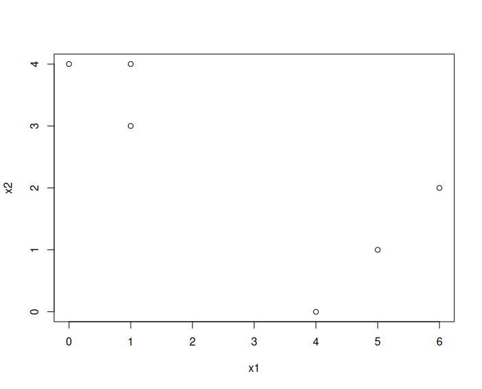
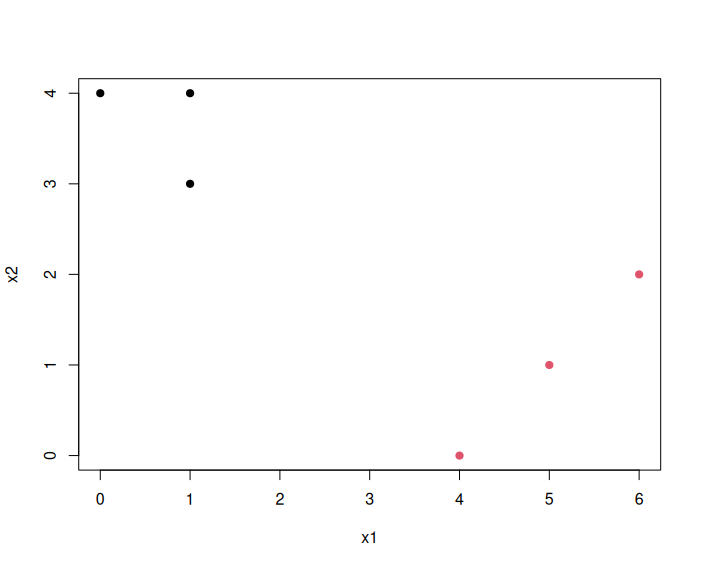
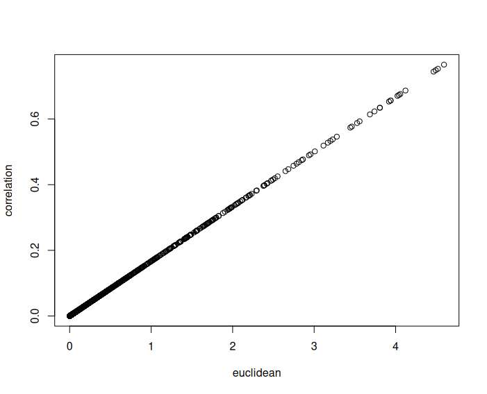
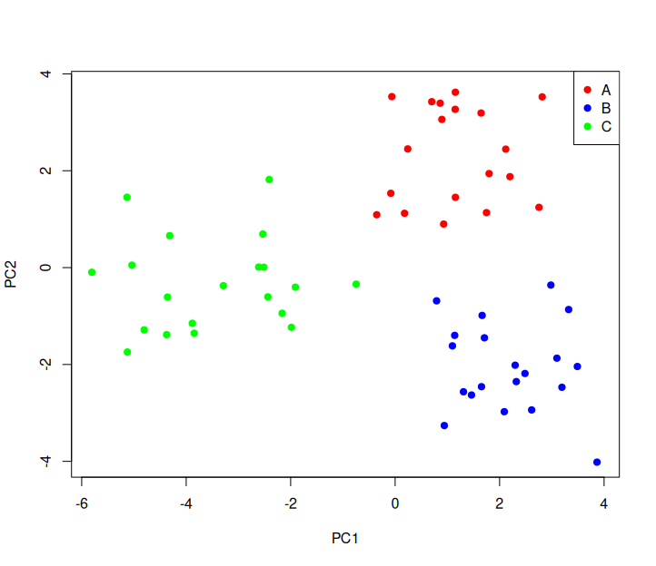

## Question 2:

### Suppose that we have four observations, for which we compute a dissimilarity matrix, given by

```
⎡    0.3 0.4 0.7 ⎤
⎢0.3     0.5 0.8 ⎥
⎢0.4 0.5     0.45⎥
⎣0.7 0.8 0.45    ⎦ .
```

### For instance, the dissimilarity between the first and second observations is 0.3, and the dissimilarity between the second and fourth observations is 0.8

### (a) On the basis of this dissimilarity matrix, sketch the dendrogram that results from hierarchically clustering these four observations using complete linkage. Be sure to indicate on the plot the height at which each fusion occurs, as well as the observations corresponding to each leaf in the dendrogram.

```r
m = matrix(c(0, 0.3, 0.4, 0.7, 0.3, 0, 0.5, 0.8, 0.4, 0.5, 0., 0.45, 0.7, 0.8, 0.45, 0), ncol = 4)
complete = hclust(as.dist(m))
plot(complete)
```



### (b) Repeat (a), this time using single linkage clustering

```r
single = hclust(as.dist(m), method = "single")
plot(single)
```



### (c) Suppose that we cut the dendrogram obtained in (a) such that two clusters result. Which observations are in each cluster? 

```r
cutree(complete, k = 2)
# 1 1 2 2
```

Observations 1 and 2 are in cluster 1, observations 3 and 4 are in cluster 2, 

### (d) Suppose that we cut the dendrogram obtained in (b) such that two clusters result. Which observations are in each cluster?

```r
cutree(single, k = 2)
# 1 1 1 2
```

Observations 1, 2, and 3 are in cluster 1, observation 4 is in cluster 2

### (e) It is mentioned in the chapter that at each fusion in the dendrogram, the position of the two clusters being fused can be swapped without changing the meaning of the dendrogram. Draw a dendrogram that is equivalent to the dendrogram in (a), for which two or more of the leaves are repositioned, but for which the meaning of the dendrogram is the same.

```r
plot(complete, labels = c(2, 1, 3, 4))
```


## Question 3:

### In this problem, you will perform K-means clustering manually, with K = 2, on a small example with n = 6 observations and p = 2 features. The observations are as follows.

```
Obs. X1 X2
1 1 4
2 1 3
3 0 4
4 5 1
5 6 2
6 4 0
```

### (a) Plot the observations

```r
df = data.frame(
  x1 = c(1, 1, 0, 5, 6, 4),
  x2 = c(4, 3, 4, 1, 2, 0)
)
plot(df)
```



### (b) Randomly assign a cluster label to each observation. You can use the sample() command in R to do this. Report the cluster labels for each observation.

```r
clusters = sample(c(1, 2), size = nrow(df), replace = TRUE)
clusters
# 1 2 1 1 2 1
```

### (c) Compute the centroid for each cluster.

```r
centroids <- sapply(c(1, 2), function(i) colMeans(df[clusters == i, 1:2]))
centroids
#    [,1] [,2]
# x1 2.50  3.5
# x2 2.25  2.5
```

### (d) Assign each observation to the centroid to which it is closest, in terms of Euclidean distance. Report the cluster labels for each observation.

```r
dist1 = sqrt((df$x1 - centroids[1, 1])^2 + (df$x2 - centroids[2, 1])^2)
dist2 = sqrt((df$x1 - centroids[1, 2])^2 + (df$x2 - centroids[2, 2])^2)
new_clusters = ifelse(dist1 < dist2, 1, 2)
new_clusters
# 1 1 1 2 2 2
```

### (e) Repeat (c) and (d) until the answers obtained stop changing

```r
centroider <- function(df, clusters) {
  n = 0
  repeat {
    n=n+1
    centroids = sapply(c(1, 2), function(i) colMeans(df[clusters == i, 1:2]))
    dist1 = sqrt((df$x1 - centroids[1, 1])^2 + (df$x2 - centroids[2, 1])^2)
    dist2 = sqrt((df$x1 - centroids[1, 2])^2 + (df$x2 - centroids[2, 2])^2)
    new_clusters = ifelse(dist1 < dist2, 1, 2)
    
    if (all(new_clusters == clusters)) {
      return(list(centroids = centroids, clusters = new_clusters, attempts = n))
    }
    
    clusters = new_clusters
  }
}
centroider(df, clusters)
# $centroids
#         [,1] [,2]
# x1 0.6666667    5
# x2 3.6666667    1

# $clusters
# [1] 1 1 1 2 2 2

# $attempts
# [1] 2
```

### (f) In your plot from (a), color the observations according to the cluster labels obtained

```r
plot(df, col = new_clusters, pch = 19)
```



## Question 5:

### In words, describe the results that you would expect if you performed K-means clustering of the eight shoppers in Figure 12.16, on the basis of their sock and computer purchases, with K = 2. Give three answers, one for each of the variable scalings displayed. Explain.

The scale and spread of each variable dramatically change the clustering outcome because K-means use euclidean distance. The first scaling would split shoppers based mostly on socks because the scale of computers is so small. The second would consider both, but because computers has very little spread clustering would still depend more on socks. The third would only consider computers because the scale of socks is very small.

## Quesiton 7:

### In the chapter, we mentioned the use of correlation-based distance and Euclidean distance as dissimilarity measures for hierarchical clustering. It turns out that these two measures are almost equivalent: if each observation has been centered to have mean zero and standard deviation one, and if we let rij denote the correlation between the ith and jth observations, then the quantity 1 − rij is proportional to the squared Euclidean distance between the ith and jth observations. On the USArrests data, show that this proportionality holds.

```r
data = t(scale(t(USArrests)))
euclidean = dist(data)^2
correlation = as.dist(1 - cor(t(data)))
plot(euclidean, correlation)
```



## Question 9:

### Consider the USArrests data. We will now perform hierarchical clustering on the states.

### (a) Using hierarchical clustering with complete linkage and Euclidean distance, cluster the states.

```r
clustered = hclust(dist(USArrests))
```

### (b) Cut the dendrogram at a height that results in three distinct clusters. Which states belong to which clusters?

```r
cut = cutree(clustered, 3)
split(names(cut), cut)
# $`1`
#  [1] "Alabama"        "Alaska"         "Arizona"        "California"     "Delaware"       "Florida"        "Illinois"       "Louisiana"      "Maryland"      
# [10] "Michigan"       "Mississippi"    "Nevada"         "New Mexico"     "New York"       "North Carolina" "South Carolina"

# $`2`
#  [1] "Arkansas"      "Colorado"      "Georgia"       "Massachusetts" "Missouri"      "New Jersey"    "Oklahoma"      "Oregon"        "Rhode Island"  "Tennessee"    
# [11] "Texas"         "Virginia"      "Washington"    "Wyoming"      

# $`3`
#  [1] "Connecticut"   "Hawaii"        "Idaho"         "Indiana"       "Iowa"          "Kansas"        "Kentucky"      "Maine"         "Minnesota"     "Montana"      
# [11] "Nebraska"      "New Hampshire" "North Dakota"  "Ohio"          "Pennsylvania"  "South Dakota"  "Utah"          "Vermont"       "West Virginia" "Wisconsin" 
```

### (c) Hierarchically cluster the states using complete linkage and Euclidean distance, after scaling the variables to have standard deviation one.

```r
clusteredsd = hclust(dist(scale(USArrests)))
```

### (d) What effect does scaling the variables have on the hierarchical clustering obtained? In your opinion, should the variables be scaled before the inter-observation dissimilarities are computed? Provide a justification for your answer.

```r
cutsd <- cutree(clusteredsd, 3)
sapply(1:3, function(i) names(cutsd)[cutsd == i])
# $`1`
# [1] "Alabama"        "Alaska"         "Georgia"        "Louisiana"      "Mississippi"    "North Carolina" "South Carolina" "Tennessee"     

# $`2`
#  [1] "Arizona"    "California" "Colorado"   "Florida"    "Illinois"   "Maryland"   "Michigan"   "Nevada"     "New Mexico" "New York"   "Texas"     

# $`3`
#  [1] "Arkansas"      "Connecticut"   "Delaware"      "Hawaii"        "Idaho"         "Indiana"       "Iowa"          "Kansas"        "Kentucky"      "Maine"        
# [11] "Massachusetts" "Minnesota"     "Missouri"      "Montana"       "Nebraska"      "New Hampshire" "New Jersey"    "North Dakota"  "Ohio"          "Oklahoma"     
# [21] "Oregon"        "Pennsylvania"  "Rhode Island"  "South Dakota"  "Utah"          "Vermont"       "Virginia"      "Washington"    "West Virginia" "Wisconsin"    
# [31] "Wyoming"

stats <- data.frame(
  variable = colnames(USArrests),
  min = apply(USArrests, 2, min),
  max = apply(USArrests, 2, max),
  range = apply(USArrests, 2, function(x) max(x) - min(x)),
  sd = apply(USArrests, 2, sd)
)
stats
#          variable  min   max range        sd
# Murder     Murder  0.8  17.4  16.6  4.355510
# Assault   Assault 45.0 337.0 292.0 83.337661
# UrbanPop UrbanPop 32.0  91.0  59.0 14.474763
# Rape         Rape  7.3  46.0  38.7  9.366385
```

Assault has a much larger max value and much wider range compared to the other predictors, which means scaling the values is very important with this data set. Since the effects of scale and range discrepancies occur when inter-observation dissimilarities are computed, scaling should be done before this stage.

## Question 10:

### In this problem, you will generate simulated data, and then perform PCA and K-means clustering on the data

### (a) Generate a simulated data set with 20 observations in each of three classes (i.e. 60 observations total), and 50 variables. 
### Hint: There are a number of functions in R that you can use to generate data. One example is the rnorm() function; runif() is another option. Be sure to add a mean shift to the observations in each class so that there are three distinct classes.

```r
set.seed(2) # 1 not separated
db <- matrix(rnorm(60 * 50), nrow = 60, ncol = 50)
classes <- factor(rep(c("A", "B", "C"), each = 20))
db[class == "B", 1:10] <- db[class == "B", 1:10] + 1.2
db[class == "C", 5:30] <- db[class == "C", 5:30] + 1.0
```

### (b) Perform PCA on the 60 observations and plot the first two principal component score vectors. Use a different color to indicate the observations in each of the three classes. If the three classes appear separated in this plot, then continue on to part (c). If not, then return to part (a) and modify the simulation so that there is greater separation between the three classes. Do not continue to part (c) until the three classes show at least some separation in the first two principal component score vectors

```r
pca <- prcomp(db)
class_factor <- factor(classes)

plot(
  pca$x[, 1], pca$x[, 2],
  col = c("red", "blue", "green")[class_factor],
  pch = 19,
  xlab = "PC1",
  ylab = "PC2",
)

legend(
  "topright",
  legend = levels(class_factor),
  col = c("red", "blue", "green"),
  pch = 19,
)
```



### (c) Perform K-means clustering of the observations with K = 3. How well do the clusters that you obtained in K-means clustering compare to the true class labels?

### Hint: You can use the table() function in R to compare the true class labels to the class labels obtained by clustering. Be careful how you interpret the results: K-means clustering will arbitrarily number the clusters, so you cannot simply check whether the true class labels and clustering labels are the same.

```r
km <- kmeans(db, 3)$cluster
table(km, classes)
#    classes
# km   A  B  C
#   1  0 20  0
#   2  0  0 20
#   3 20  0  0
```

Perfect separation, since the clusters are distanced relatively far apart in this instance k-mean clustering was very successful.

### (d) Perform K-means clustering with K = 2. Describe your results.

```r
km <- kmeans(db, 3)$cluster
table(km, classes)
#    classes
# km   A  B  C
#   1  0  0 20
#   2 20 20  0
```

K-means did a good job again, A and B are on the same side of the plot and closer together so grouping them in this case makes sense.

### (e) Now perform K-means clustering with K = 4, and describe your results.

```r
km <- kmeans(db, 4)$cluster
table(km, classes)
#    classes
# km   A  B  C
#   1 20  0  0
#   2  0 20  0
#   3  0  0  8
#   4  0  0 12
```

A and B were grouped normally, C was split almost down the middle likely because C is the least closely clustered of the three groups.

### (f) Now perform K-means clustering with K = 3 on the first two principal component score vectors, rather than on the raw data. That is, perform K-means clustering on the 60 × 2 matrix of which the first column is the first principal component score vector, and the second column is the second principal component score vector. Comment on the results.

```r
km_2pc = kmeans(pca$x[, 1:2], 3)$cluster
table(km_2pc, classes)
#       classes
# km_2pc  A  B  C
#      1  0  0 20
#      2  0 20  0
#      3 20  0  0
```

Still splits perfectly

### (g) Using the scale() function, perform K-means clustering with K = 3 on the data after scaling each variable to have standard deviation one. How do these results compare to those obtained in (b)? Explain.

```r
km = kmeans(scale(db), 3)$cluster
table(km, classes)
#    classes
# km   A  B  C
#   1  0 20  0
#   2  0  0 20
#   3 20  0  0
```

Still splits perfectly, scale shouldn't have an effect because the variables are on the same scale.