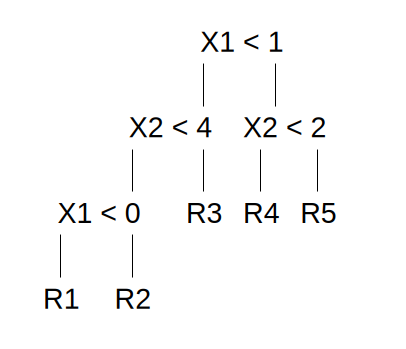
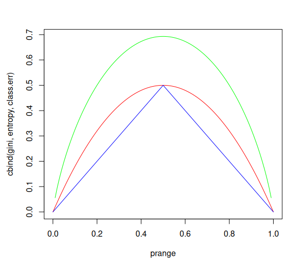
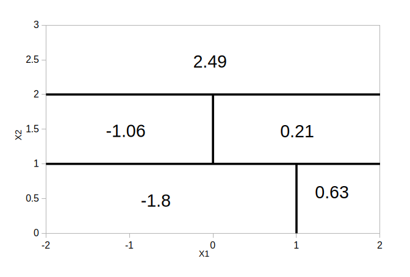
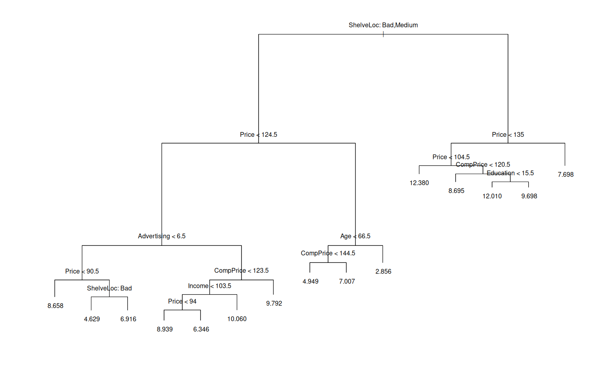
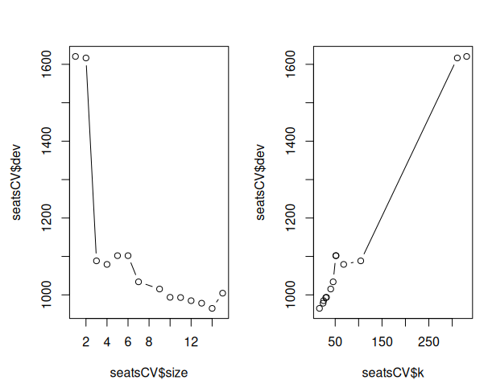

## Question 1:

### Draw an example (of your own invention) of a partition of two-dimensional feature space that could result from recursive binary splitting. Your example should contain at least six regions. Draw a decision tree corresponding to this partition. Be sure to label all aspects of your figures, including the regions R1, R2, . . ., the cutpoints t1, t2, . . ., and so forth.




## Question 3:

### Consider the Gini index, classification error, and entropy in a simple classification setting with two classes. Create a single plot that displays each of these quantities as a function of ˆpm1. The x-axis should display ˆpm1, ranging from 0 to 1, and the y-axis should display the value of the Gini index, classification error, and entropy.

```r
library(ISLR2)
library(MASS)
library(randomForest)
library(tree)
library(BART)
library(gbm)
library(glmnet)
set.seed(1)

prange = seq(0, 1, 0.01)
gini = prange * (1 - prange) * 2
entropy = -(prange * log(prange) + (1 - prange) * log(1 - prange))
class.err = 1 - pmax(prange, 1 - prange)
matplot(prange, cbind(gini, entropy, class.err), type = "l", lty = 1, col = c("red" ,"green", "blue"))
```



## Question 4:

### (a) Sketch the tree corresponding to the partition of the predictor space illustrated in the left-hand panel of Figure 8.14. The numbers inside the boxes indicate the mean of Y within each region.


### (b) Create a diagram similar to the left-hand panel of Figure 8.14, using the tree illustrated in the right-hand panel of the same figure. You should divide up the predictor space into the correct regions, and indicate the mean for each region.



## Question 6:

### Provide a detailed explanation of the algorithm that is used to fit a regression tree.

To build a regression tree you first use recursive binary splitting to divide the predictor space into distinct regions choosing boundaries which minimize RSS, and then take the mean of each region to make a prediction. Then the tree is pruned using cost-complexity pruning to get a sequence of best subtrees, and then choose α using k-fold cross-validation

## Question 7: 
### In the lab, we applied random forests to the Boston data using mtry = 6 and using ntree = 25 and ntree = 500. Create a plot displaying the test error resulting from random forests on this data set for a more comprehensive range of values for mtry and ntree. You can model your plot after Figure 8.10. Describe the results obtained.

```r
boston_train <- sample(nrow(Boston), nrow(Boston) / 2)
x_train <- Boston[boston_train, -14]
x_test  <- Boston[-boston_train, -14]
y_train <- Boston[boston_train, 14]
y_test  <- Boston[-boston_train, 14]

p <- ncol(Boston) - 1
mtry_grid <- sort(unique(c(1:6, floor(sqrt(p)), floor(p/2), p)))
mtry_grid <- mtry_grid[mtry_grid >= 1 & mtry_grid <= p]

rf_list <- lapply(mtry_grid, function(m) {
  randomForest(x_train, y_train, xtest = x_test, ytest = y_test, mtry = as.integer(m), ntree = 500)
})

mse_mat <- sapply(rf_list, function(mod) mod$test$mse)

par(mfrow=c(1,1))
matplot(1:500, mse_mat, type = "l", lty = 1, lwd = 1.5,
        xlab = "tree count", ylab = "test MSE")
legend("topright", legend = paste0("mtry=", mtry_grid), lty = 1, cex = 0.8, bty = "n")

final_mse <- sapply(rf_list, function(mod) tail(mod$test$mse, 1))
mtry_grid[which.min(final_mse)]
# 4
```


## Question 8:

### In the lab, a classification tree was applied to the Carseats data set after converting Sales into a qualitative response variable. Now we will seek to predict Sales using regression trees and related approaches, treating the response as a quantitative variable.

### (a) Split the data set into a training set and a test set.

```r
seats = sample(dim(Carseats)[1], dim(Carseats)[1]/2)
seatsTrain = Carseats[seats, ]
seatsTest = Carseats[-seats, ]
```

### (b) Fit a regression tree to the training set. Plot the tree, and interpret the results. What test MSE do you obtain?

```r
# b.
seatsTree = tree(Sales ~ ., data = seatsTrain)
summary(seatsTree)
# Regression tree:
# tree(formula = Sales ~ ., data = seatsTrain)
# Variables actually used in tree construction:
# [1] "ShelveLoc"   "Price"       "Advertising" "CompPrice"   "Income"      "Age"         "Education"  
# Number of terminal nodes:  15 
# Residual mean deviance:  2.257 = 417.6 / 185 
# Distribution of residuals:
#     Min.  1st Qu.   Median     Mean  3rd Qu.     Max. 
# -4.11800 -1.03600 -0.09598  0.00000  0.93210  3.92200 
plot(seatsTree)
text(seatsTree, pretty=0)
```



```r
seatsPred = predict(seatsTree, seatsTest)
mean((seatsTest$Sales - seatsPred)^2)
# 4.467
```

### (c) Use cross-validation in order to determine the optimal level of tree complexity. Does pruning the tree improve the test MSE?

```r
seatsCV = cv.tree(seatsTree, FUN = prune.tree)
par(mfrow = c(1, 2))
plot(seatsCV$size, seatsCV$dev, type = "b")
plot(seatsCV$k, seatsCV$dev, type = "b")
```



```r
seatsPruned = prune.tree(seatsTree, best = 9)
par(mfrow = c(1, 1))
plot(seatsPruned)
text(seatsPruned, pretty = 0)
seatsPredPruned = predict(seatsPruned, seatsTest)
mean((seatsTest$Sales - seatsPredPruned)^2)
# 4.930
```

slightly worse


### (d) Use the bagging approach in order to analyze this data. What test MSE do you obtain? Use the importance() function to determine which variables are most important.

```r
seatsBagging = randomForest(Sales ~ ., data = seatsTrain, mtry = 10, ntree = 500, importance = T)
seatsPred = predict(seatsBagging, seatsTest)
mean((seatsTest$Sales - seatsPred)^2)
# 2.657, significant improvement
importance(seatsBagging)
#                %IncMSE IncNodePurity
# CompPrice   22.6573129    163.197222
# Income       5.3467058     70.033569
# Advertising 17.6655056    114.550361
# Population  -2.0496276     50.400235
# Price       55.8564641    440.222018
# ShelveLoc   55.8246534    487.249416
# Age         16.9697585    173.575879
# Education   -0.8291257     36.219946
# Urban       -1.3600581      6.537491
# US           4.5260236     14.009189
```

Price and ShelveLoc are the most important

### (e) Use random forests to analyze this data. What test MSE do you obtain? Use the importance() function to determine which variables are most important. Describe the effect of m, the number of variables considered at each split, on the error rate obtained.

```r
seatsForest = randomForest(Sales ~ ., data = seatsTrain, mtry = 5, ntree = 500, importance = T)
seatsPredForest = predict(seatsForest, seatsTest)
mean((seatsTest$Sales - seatsPredForest)^2)
# 2.526 also good
importance(seatsForest)
```

Price and ShelveLoc are still most important

### (f) Now analyze the data using BART, and report your results.

```r
full_x = rbind(subset(seatsTrain, select = -Sales), subset(seatsTest, select = -Sales))
mm = model.matrix(~ . - 1, data = full_x)
ntrain = nrow(seatsTrain)
bartTrain = mm[1:ntrain, , drop = FALSE]
bartTest  = mm[(ntrain + 1):nrow(mm), , drop = FALSE]
salesTrain = seatsTrain$Sales

seatsBart <- gbart(
  x.train = bartTrain,
  y.train = salesTrain,
  x.test  = bartTest,
  ntree   = 200,
  ndpost  = 2000,
  nskip   = 500
)
seatsBartPred = seatsBart$yhat.test.mean
seatsBartMSE = mean((seatsTest$Sales - seatsBartPred)^2)
print(seatsBartMSE)
# 1.451
```

significant improvement

9. This problem involves the OJ data set which is part of the ISLR2
package.
(a) Create a training set containing a random sample of 800 obser-
vations, and a test set containing the remaining observations.
(b) Fit a tree to the training data, with Purchase as the response
and the other variables as predictors. Use the summary() function
to produce summary statistics about the tree, and describe the
results obtained. What is the training error rate? How many
terminal nodes does the tree have?
(c) Type in the name of the tree object in order to get a detailed
text output. Pick one of the terminal nodes, and interpret the
information displayed.
(d) Create a plot of the tree, and interpret the results.
(e) Predict the response on the test data, and produce a confusion
matrix comparing the test labels to the predicted test labels.
What is the test error rate?
364 8. Tree-Based Methods
(f) Apply the cv.tree() function to the training set in order to
determine the optimal tree size.
(g) Produce a plot with tree size on the x-axis and cross-validated
classification error rate on the y-axis.
(h) Which tree size corresponds to the lowest cross-validated classi-
fication error rate?
(i) Produce a pruned tree corresponding to the optimal tree size
obtained using cross-validation. If cross-validation does not lead
to selection of a pruned tree, then create a pruned tree with five
terminal nodes.
(j) Compare the training error rates between the pruned and un-
pruned trees. Which is higher?
(k) Compare the test error rates between the pruned and unpruned
trees. Which is higher?
10. We now use boosting to predict Salary in the Hitters data set.
(a) Remove the observations for whom the salary information is
unknown, and then log-transform the salaries.
(b) Create a training set consisting of the first 200 observations, and
a test set consisting of the remaining observations.
(c) Perform boosting on the training set with 1,000 trees for a range
of values of the shrinkage parameter λ. Produce a plot with
different shrinkage values on the x-axis and the corresponding
training set MSE on the y-axis.
(d) Produce a plot with different shrinkage values on the x-axis and
the corresponding test set MSE on the y-axis.
(e) Compare the test MSE of boosting to the test MSE that results
from applying two of the regression approaches seen in
Chapters 3 and 6.
(f) Which variables appear to be the most important predictors in
the boosted model?
(g) Now apply bagging to the training set. What is the test set MSE
for this approach?