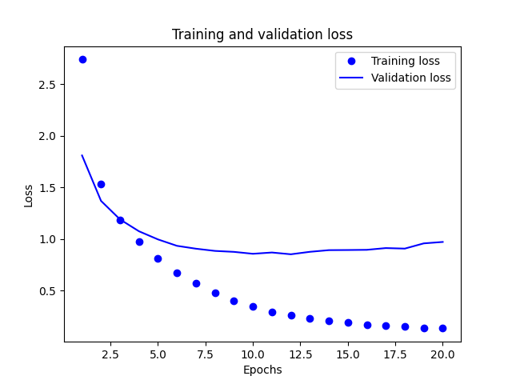
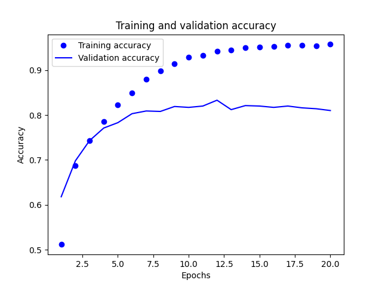

# Neural Network Implementations and Techniques

This repository contains a collection of neural network implementations and experiments exploring various deep learning architectures and techniques using Python, TensorFlow, and Keras. The project demonstrates proficiency in both implementing neural networks from scratch and using modern deep learning frameworks.

## Key Features

### Custom Neural Network Implementation
- Implementation of a deep neural network from scratch (`dnn.py`)
  - Backpropagation algorithm with stochastic gradient descent
  - Custom layer initialization and weight management
  - Cross-validation and accuracy metrics
  - Flexible architecture supporting multiple hidden layers

### Deep Learning Applications

#### Natural Language Processing
- IMDB Movie Review Sentiment Analysis (`imdb.py`, `rnns.py`)
  - Text classification using dense neural networks
  - RNN implementation for sequence processing
  - Word embedding techniques

#### Computer Vision
- Cats vs Dogs Image Classification (`catsvsdogs.py`)
  - Convolutional Neural Networks (CNN) implementation
  - Data augmentation techniques
  - Transfer learning approaches
  - Advanced CNN architectures with multiple layers

```python
test_model = keras.models.load_model("convnet_from_scratch.keras")
test_loss, test_acc = test_model.evaluate(test_dataset)
print(f"Test accuracy: {test_acc:.3f}")
# Test accuracy: 0.812

test_model = keras.models.load_model("convnet_from_scratch_with_augmentation.keras")
test_loss, test_acc = test_model.evaluate(test_dataset)
print(f"Test accuracy: {test_acc:.3f}")
# Test accuracy: 0.868
```

#### Time Series Analysis
- Advanced RNN Applications (`advancedrnns.py`)
  - Bidirectional LSTM networks
  - Time series prediction
  - Temperature forecasting implementation
  - Complex sequence processing

#### Text Classification
- News Wire Classification (`newswires.py`)
  - Multi-class text classification
  - Dense neural network architecture
  - Information bottleneck analysis





```python
results = model.evaluate(x_test, y_test)
print(results)
# [0.9253113269805908, 0.800979495048523]
```
#### Regression
- Housing Prices (`housingprices.py`)
  - Regression on the Boston Housing dataset using a small feed-forward network (2×64 ReLU hidden layers)
  - Per-feature normalization, MSE loss, MAE metric, and K-fold validation
  - Model training, evaluation, and example prediction generation

```python
test_mse_score, test_mae_score = model.evaluate(test_data, test_targets)
print("mean absolute error:", test_mae_score)
# Processing fold #1
# Processing fold #2
# Processing fold #3
# Processing fold #0
# Processing fold #1
# Processing fold #2
# Processing fold #3
# 4/4 ━━━━━━━━━━━━━━━━━━━━ 0s 6ms/step - loss: 13.4129 - mae: 2.5851 
# mean absolute error: 2.747966766357422
predictions = model.predict(test_data)
print(predictions[0])
# 4/4 ━━━━━━━━━━━━━━━━━━━━ 0s 7ms/step 
# [9.514192]
```

### Advanced Deep Learning Concepts
- Implementation of various neural network architectures:
  - Feed-forward Neural Networks
  - Convolutional Neural Networks (CNN)
  - Recurrent Neural Networks (RNN)
  - Long Short-Term Memory Networks (LSTM)
  - Bidirectional RNNs

## Technical Skills Demonstrated

1. **Deep Learning Framework Expertise**
   - TensorFlow/Keras implementation
   - Custom model architecture design
   - Model training and optimization

2. **Neural Network Fundamentals**
   - Backpropagation implementation
   - Gradient descent optimization
   - Weight initialization techniques
   - Activation functions (ReLU, Sigmoid, Softmax)

3. **Advanced Deep Learning Concepts**
   - Sequence modeling
   - Convolutional architectures
   - Transfer learning
   - Data augmentation
   - Model regularization

4. **Data Processing**
   - Text preprocessing for NLP
   - Image data handling
   - Time series data processing
   - Data normalization and scaling

5. **Model Evaluation**
   - Cross-validation implementation
   - Performance metrics calculation
   - Learning curve analysis
   - Model validation techniques

## Project Structure

```
neural_networks/
├── advancedrnns.py      # Advanced RNN implementations
├── catsvsdogs.py        # CNN for image classification
├── convnets.py          # Convolutional neural networks
├── dnn.py              # Deep Neural Network from scratch
├── housingprices.py    # Regression problem implementation
├── imdb.py             # Sentiment analysis
├── newswires.py        # Text classification
├── rnns.py             # Recurrent neural networks
└── seqwithcovnets.py   # Sequential data with CNNs
```